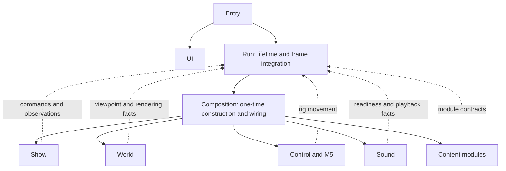

# Architecture

This document defines the binding architecture for current and future work.
The code may still contain issue-backed migration debt; new work must not add
exceptions. GitHub issues own the removal sequence and acceptance evidence.

## Integration star

The existing Run and Level Composition form one two-phase integration centre.
Composition constructs and connects once. Run owns the live experience lifetime
and frame integration. This is not a reason to introduce another application
owner.



The centre is deliberately small:

- `level-composition.ts` may import concrete leaf factories and connect their
  narrow contracts. It owns no clock, frame loop, runtime policy, or persistent
  domain state.
- `level.runtime.ts` owns startup, frame integration, handoff, cancellation,
  restart, and complete end. It contains no geometry, audio, UI, or content
  algorithms.
- No `Application`, coordinator, command bus, event bus, service locator,
  plugin system, or global mutable store is added around these owners.

## Import rules

Concrete leaves never import concrete peers. Forbidden examples include
Content to Content, Start to Control, Show to Start, Sound to Content, UI to an
Engine implementation, and World to Content. A type-only import from another
leaf's implementation file is still a peer dependency.

| From | Allowed production dependencies |
| --- | --- |
| Entry | UI, the public Run contract, deployment contracts, selected presets |
| UI | Pure view queries and public handle types; no Engine implementation |
| Run | Composition and public contracts for Show, World, Control, M5, and Sound |
| Composition | Level recipes, concrete factories, and neutral contracts |
| Show | Dramaturgy and Sound contracts; no concrete Content or World |
| World | World internals and narrow technical utilities; no Content, Show, or UI |
| Content | Its own domain, World/WorldSurface contracts, and neutral module contracts |
| Control and M5 | Their own internals plus rig, surface, and wire contracts; no Start or Show |
| Sound | Sound internals and Dramaturgy queries; no concrete Content |
| Station | Platform-neutral contracts under `shared/` only |

External libraries may be imported where the owning implementation uses them.
They do not provide a route around project boundaries.

## Contracts and data flow

- Put a contract at the owner of the fact or at an existing neutral boundary,
  never inside an unrelated consumer implementation.
- Composition injects concrete implementations. Leaves receive only the
  commands, observations, read-only facts, or resource capabilities they use.
- A public handle exposes the smallest current consumer surface. Do not pass a
  broad owner and rely on convention, create a forwarding wrapper, or hide
  dependencies behind a re-export barrel.
- World-only facts are not sufficient to justify a shared contract. Add one only
  for a real production boundary with an identified owner and consumer.
- Reused mutable buffers are borrowed for the documented validity window. Their
  consumers do not retain or mutate them.

The principal live flow is:

```text
input -> Control -> viewer rig movement
Show -> presentation and playback decisions
Run -> one shared frame sample and integration
World -> publish viewpoint -> update active modules -> bounded stream work
World -> render once
```

Every flight input source exposes only `forwardTilt` and `rightTilt`, normalized
to −1..1. Control reads every connected source on each live frame, adds the axes
in the fixed order wired by Composition, and clamps each sum to −1..1. Neutral,
disconnected, or stale sources return zero axes. This is the complete conflict
rule: desktop and M5 input remain simultaneous, with no exclusive mode or
priority policy. A later source such as a gamepad can implement the same
contract without changing Run or the flight model.

Only the desktop adapter has source-local response state: key presses reach full
tilt immediately, while released axes return linearly to zero over 0.25 seconds
from the supplied frame delta. Pointer-lock loss, blur, and unload neutralize it
immediately. The M5 adapter adds no rebound and leaves its existing processing
unchanged. This behavior runs inside the same source read and creates no timer,
runtime, or second loop.

Control owns the one flight model that mutates the viewer rig. Each live update
applies constant speed along a path whose pitch is set by the combined forward
tilt (±45 degrees); neutral tilt flies level. Side tilt sets the yaw rate.
Circular-arc integration preserves the same held-input path across frame rates.
Mouse and headset pose change only the camera's local view and publish no flight axes, so looking around
cannot alter the trajectory. Run owns frame integration, active speed, and
height limits; Composition owns source construction and wiring. World publishes
the resulting `worldFlightPosition` and `worldFlightDirection` alongside local
eye facts. Direction is the normalized displacement captured within the current
frame after height limits, with rig heading as the stationary fallback. Resets
between frames do not become flight displacement. Start guidance approximates continued steering from heading change per meter
of actual rig movement. Its arc preview owns no flight model or loop. Show owns time, language, narration, and
presentation policy. Content and Sound consume injected facts without reaching
into those implementations.

## Local domain stars

Each substantial domain repeats the same pattern: one domain owner connects
specialised components, while those components do not import one another.

Start owns procedural lessons, particle presentation and tutorial atmosphere through
its local star. It exposes only completion and a presentation-presence input to
Run; it never imports Show or Control. Completion requires both the last course
exit and the naturally completed closing voice.

For the audience route, Run prepares the main composition and then deactivates it
while Start is active. Both borrow the same spatial-audio owner. Run fades Start,
releases its sources, resets the existing flight rig to a terrain-relative arrival,
reactivates the main composition and starts Show. The renderer, XR session and
controls survive this transition. Show transport becomes available only afterward.
Conductor continues to provide direct Show rehearsal.

## Owners and lifetime

- Entry resolves browser/deployment input, starts or cancels one Run, mounts UI,
  and connects page exit to cleanup.
- UI owns declared DOM, gestures, display state, listeners, and UI cleanup. It
  invokes owner commands and reads observations; it defines no experience policy.
- Show owns one clock, transport, language, narration, and dramaturgy.
- World owns one renderer, one animation loop, XR, resize, viewpoint publication,
  module execution, bounded streaming, and renderer disposal.
- Control owns input mapping and locomotion. The viewer rig separates locomotion
  from desktop or headset-local pose.
- Content modules own their CPU/GPU resources and participate in the shared
  load/activate/update/deactivate/unload lifecycle.
- Sound owners release their nodes before the owner of a shared audio context
  closes it.
- Station serves files, deployment facts, and process health. It owns no Show
  clock, browser Run, transport command, or visitor state.

The creator of a resource releases it. Run stops live work before releasing
children and shared sources. Partial startup, cancellation, late asynchronous
results, handoff, and repeated end calls follow the same ownership path.

## Configuration and bounded work

Authored application configuration is typed TypeScript. Each level is one
self-contained literal parameter object with type-only imports, no spreads,
inheritance, helpers, or hidden override order. JSON under `public/` records
asset or firmware provenance only.

Runtime memory and work remain bounded through fixed capacities, pooling,
recycling, assignment revisions, and frame-budgeted jobs. There is one renderer,
one render loop, one Show-time authority, and one Run lifetime per application.

## Enforcement and migration

`.fallowrc.jsonc` must encode this matrix. Split broad zones such as `levels`
into Run, Composition, Show, presets, and contracts as their issue-backed
refactors remove current violations. Auto-discovered content and local-domain
zones must reject sibling imports. Activate each stricter rule in the same
coherent change that removes its existing violations; do not add baselines or
suppressions.

Fallow is the import-boundary authority. Focused tests may protect public
capability shapes and meaningful negative examples, but no second dependency
analyser is introduced. Architectural completion requires zero forbidden
production imports and a passing intentional-negative boundary probe.
