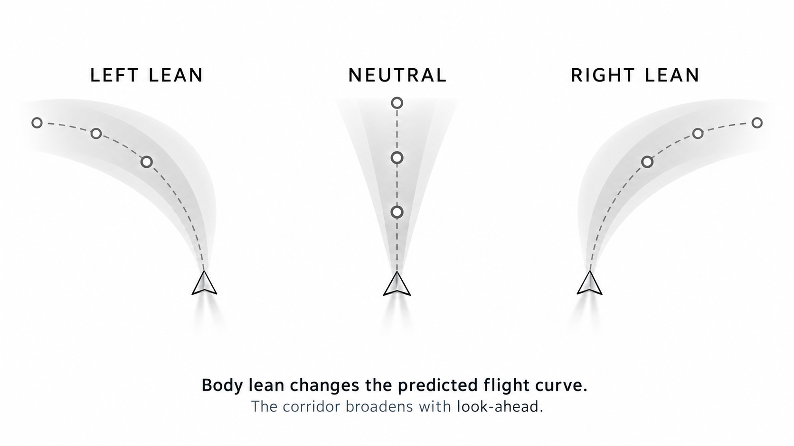
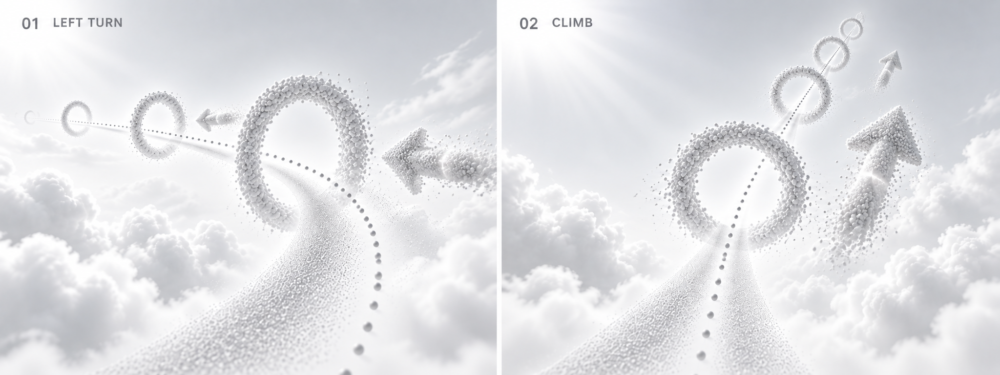
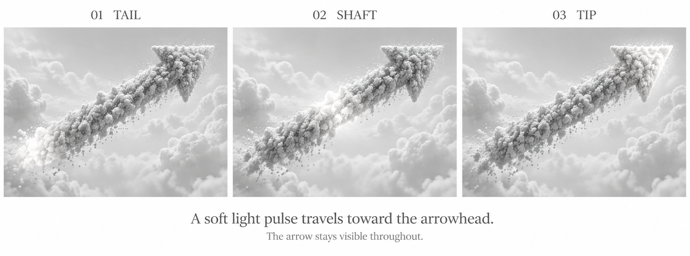
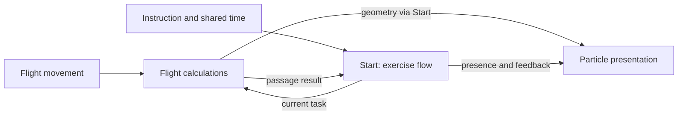

# Start level: flight in a white sky

Consolidated target concept, 2026-09-10. This document combines the discussion,
original sketches, corrected visualizations and color explorations. It describes
future behavior, not the current implementation or measured VR acceptance.
Application code is unchanged by this document.

The current structural refactor remains governed by the
[target architecture](../architecture.md). This concept does not bring
deferred visual features into that behavior-preserving work. Existing narration,
learning order, timing and handoff contracts remain authoritative unless changed
by a separate explicit product decision.

## 1. Experience

The visitor starts in complete white. Gradually, the space becomes legible as an
open sky. A soft horizon gives orientation; sparse clouds and small surrounding
particles make movement perceptible. A curved particle route leads through rings.
Large cloudlike arrows anticipate changes of direction. A short prediction shows
how the visitor's present flight motion will continue.

The visitor learns through bodily movement and visible consequences. The space
should feel calm, light and traversable. There is no landscape: no ground, hills,
trees, rocks, animals or continuous cloud floor. Landscape references contribute
only palette, restraint and atmospheric softness.

## 2. Composition and sequence

These are presentation beats within the existing tutorial, not a new state
machine or a second timeline. Exact fade durations require visual tuning.

| Beat | What becomes visible | Purpose |
| --- | --- | --- |
| White opening | Complete white initially; sparse neutral particles emerge gradually. | Establish a quiet beginning. |
| Spatial orientation | A very light grayscale sky gradient, diffuse horizon and a few clouds appear. | Make above, below and movement readable. |
| First instruction | A large full arrow appears visibly before the required turn; the route and reachable rings become legible. | Give enough time and space to understand and turn. |
| Guided flight | Route, rings and a short movement-dependent prediction coexist. | Connect steering with the trajectory it produces. |
| Passage and continuation | A crossed ring gives restrained local feedback and releases its particles; upcoming guidance remains readable. | Confirm passage without interrupting flight. |
| Ending and transition | Exclusive guidance recedes through the existing Show/Run transition. | Preserve a coherent handoff to the experience. |

Retain the existing right/left/up/down learning sequence and separately approved
practice/closing policy. This visual concept neither rewrites narration nor
chooses a new tutorial duration. The separately planned calm ending remains
separate work; visual fades follow whichever closing policy is implemented.

### Spoken instructions are the staging anchor

The [direct audio transcription](start-audio-transcript.md) records all five
installed clips and their approximate local timestamps. The introduction first
establishes a beginning, the visitor and a room; directional guidance starts with
“Lehn dich mal nach rechts.” The next cue, “zur anderen Seite”, means left because
it follows right. Keep this order and avoid presenting an unexplained left cue.

For vertical movement the voice names body action: leaning backward causes a
climb, leaning forward causes descent. Arrows show the resulting flight direction
(up/forward or down/forward), while prediction follows actual motion. Head gaze
is not the requested control. The participant must have enough time after the
spoken instruction to move; audio timestamps are not passage deadlines.

The closing clip confirms the completed movements, then says “Warte kurz, ich
hole ihn mal.” Its directional list is retrospective, not another sequence of
commands. Let guidance release into a quiet waiting transition. Preserve the
existing success/timeout distinction: this completion speech is not neutral
failure or timeout copy. Exact cue timing belongs to the existing Show owner;
transcription does not create another timer or change the movement model.

## 3. Sky, light and clouds

**Sky.** Use the spatial character of the
[Three.js Sky example](https://threejs.org/examples/#webgl_shaders_sky): a broad
atmospheric gradient and softly implied horizon. The lower region stays white;
the upper sky becomes slightly darker gray. Avoid a hard horizon or a dark dome.
The original direction specifies grayscale sky. Color studies explore accents;
a lavender atmospheric tint remains an option, not a replacement requirement.

**Light.** Use one coherent soft direction, proposed from diagonally above.
Clouds and particle forms have brighter upper faces and subdued gray undersides.
The sky's brighter side agrees with this direction. A visible sun disk is optional
and unresolved. No additional decorative spotlights or light shafts are needed.

**Clouds.** Use a few sparse, detached volumes below, beside and beyond the route.
They provide depth through parallax and occlusion while leaving substantial white
space. The next arrow and required ring stay readable. Clouds must not become a
landscape substitute or an enclosing tunnel of fog.

The requested [Volume Cloud example](https://threejs.org/examples/#webgl_volume_cloud)
is the technical reference for density, soft edges and volume. Its 3D noise is
sampled by raymarching. Its shading is calculated inside a custom shader; adding
a Three.js directional light alone does not illuminate that shader. The adapted
cloud shading must explicitly use the same light direction as the scene.
The demo rotates a static volume; slow drift is a proposed scene treatment.

Start with a bounded prototype of that technique and measure its stereo cost.
Do not silently replace the requested volumetric look with another technique.
If it cannot meet the budget, reduce visible coverage, sample count and volume
count first, then present any materially different alternative for discussion.
Whether visitors intentionally fly inside clouds remains open. The simplest
first composition keeps the instructional route in clear air.

## 4. Flight guidance: two different meanings

| Element | Meaning | Appearance | What changes it |
| --- | --- | --- | --- |
| Intended route | Where the course leads. | A narrow stream of many small points through ring centers. | A new or recycled course section. |
| Prediction | Where current flight motion is expected to lead. | A short, soft, curved particle corridor originating ahead of the flyer. | Body steering and actual flight motion. |
| Ring | A passage in the course. | A clear opening surrounded by a porous particle body. | Course placement and local appearance/passage feedback. |
| Arrow | The upcoming direction of travel. | One large full cloudlike arrow with shaft and one head. | Cue placement and a subtle traveling light pulse. |

The intended route and prediction can overlap, but they are not automatically
the same curve. Steering must not pull ring centers onto the prediction. Once a
cue is placed, its spatial anchors remain stable until that section is retired.
The existing policy may place a fresh spoken cue in the current view; this is
different from continuously attaching guidance to head gaze.

The route is a small point cloud, not a solid line or a string of large spheres.
The prediction is a volume of fine points, not a road, ribbon surface or tube wall.
Their meaning remains readable in grayscale through width, density and contrast.
Color may reinforce the distinction but is not required to understand it.

### Prediction behavior

- Left lean bends the forward prediction left; right lean bends it right.
- Neutral input shows the continuation implied by the actual motion model. In
  steady neutral flight this is straight; existing turn inertia must not be hidden.
- Vertical steering produces a rising or falling curve using the same principle.
- Head gaze alone does not change the predicted trajectory.
- The curve begins with the current flight direction and changes continuously.
  Avoid a separate visual smoothing model that contradicts the actual steering.
- A short bounded look-ahead keeps feedback local. Slight widening with distance
  follows the original sketch; it is a visual tolerance cue, not a calculated
  statistical confidence interval.
- No valid motion sample means no claimed trajectory. Hide the prediction until
  valid again and clear stale samples after a discontinuous reset or teleport.

Use the existing motion owner's prediction capability. If it needs extension,
make one bounded sampling operation there, using existing flight constraints.
Do not implement separate physics inside the particle effect. Keep sample count,
look-ahead and buffers fixed and reusable; numerical values are tuning decisions.

This standalone overhead explanation follows the original left/neutral/right
sketch. Its small circles are schematic sample markers. It is not an in-game HUD
and should not be mixed with a perspective view. The rejected understeer/aligned/
oversteer board is not a design reference.

## 5. Particle forms and animation

Use the [instanced billboard example](https://threejs.org/examples/#webgl_buffergeometry_instancing_billboards)
as the rendering reference: many small camera-facing particles, with inexpensive
variation in size and appearance. The demo's saturated colors and rotating whole
cloud are not part of the requested design.

Rings and arrows have coherent three-dimensional bodies built from particles,
with porous edges and a restrained amount of drift. Their shape stays legible.
Avoid solid toruses, paired chevrons, flat arrow icons, rocky clumps and excessive
foreground spray. Use the latest user point-cloud references for material and
the existing full-arrow references for silhouette.

**Arrow light.** A soft bright band travels from the back of the shaft to the
single arrowhead, then repeats gently. The underlying arrow remains visible.
Use one phase derived from shared Show time and particle position along the
arrow. No per-particle timers, binary full-arrow flashing or separate animation
controller. Pulse speed and strength remain to be tuned.

**Formation and passage.** Particles gently gather into the cue, remain readable
while approached, then release on retirement. A real ring passage may briefly
brighten or expand the local ring before it dissolves. These are presentation
responses; particle motion does not move the collision opening. A miss does not
trigger success feedback. Continue the existing forward-recycling and learning
rules rather than creating new scoring or punishment mechanics.

Ambient particles belong to the surrounding space. Reuse the existing bounded
Air chunk system so flight creates useful parallax. Do not attach a decorative
particle screen to the viewer or build another infinite particle world.

## 6. Color

The initial sketches used color only to distinguish elements. A later request
explicitly opened restrained color exploration using the game's palette.
No final palette has been selected.

| Option | Treatment | Role in the discussion |
| --- | --- | --- |
| White / turquoise | Neutral white space, turquoise route and selected particles. | Simplest proposed baseline. |
| Lavender / mint | Pale lavender shading with mint route and prediction. | Stronger connection to the landscape palette; optional sky tint. |
| Mint / soft gold | Muted mint with sparse gold on ring or arrow pulse. | Optional attention accent, not an approved success code. |

Recommend comparing white/turquoise first, with gold considered only if it improves
cue readability. Do not combine all palettes or add a user-facing theme system.
The chosen palette belongs in the existing literal level configuration. Keep the
sky and clouds near white and use color selectively on guidance.

[Compare the three color visuals](../moodboards/start-flight-guidance/README.md#color-exploration).
Images are composition proposals; apparent particle sizes, route width, ring
spacing and bloom are not implementation targets by measurement.

## 7. Simple architecture

The next refactor reduces stored state and dependencies before reducing file or
class counts. Keep one Start module with three clear responsibilities. These are
conceptual boundaries, not a requirement for exactly three files or new classes.

| Responsibility | Owns | Does not own |
| --- | --- | --- |
| Start: exercise flow | Current instruction/goal identity, local learning progress and passage decisions. | A second Show clock, flight physics or GPU resources. |
| Flight calculations | Rules for motion prediction, course sampling, ring placement and swept passage tests; only indispensable history/storage. | A competing exercise state machine or presentation timers. |
| Particle presentation | GPU resources and visual appearance of route, prediction, rings and full arrows. | Learning progress, steering decisions or narration policy. |

Start is the single owner of exercise state. Do not maintain duplicate versions
of active, completed, current goal or next instruction in several components.
World's loaded/active resource lifecycle remains distinct and authoritative.
Domain geometry may retain reusable buffers and stable course anchors; these are
not duplicate learning state. Prediction retains only necessary motion history.

Motion, Course and Crossing name useful calculations; they do not mandate
independent runtime objects. Prefer small functions with explicit facts and
results where possible. Keep necessary bounded state where its meaning is clear,
including previous position, stable placed geometry and interrupted-release data.
Remove a component or class only when its ownership is better expressed without it.

Arrow formation, pulse and visual retirement belong to particle presentation.
Start still decides when a cue becomes relevant or retires. Presentation derives
animation from shared Show time and the required event timestamps. Keep historical
release poses or velocities when needed to preserve continuity; do not replace a
stateful spring with a different visual formula during a structural refactor.
No separate arrow animation controller or per-particle timer is required by the
future concept. One presentation owner does not imply one GPU draw call: select
resource sharing and batching by simplicity and measured cost.

This diagram shows logical data flow, not concrete peer imports or a new event
bus. Start connects calculations and presentation directly through narrow domain
facts. Presentation does not import calculation implementations. Eliminate
forwarding-only objects and one-use adapters that provide no boundary or lifetime
value; retain contracts where real ownership separation requires them.

Existing infrastructure remains outside this local diagram: Run owns lifetime
and input integration; Show owns playback, narration and transition policy;
World owns the renderer and sole loop. Composition constructs and connects once.
UI and Station gain no learning or rendering responsibilities.

Air retains surrounding particles and its bounded world-space recycling. Sky
and clouds remain at the responsible background presentation boundary, with their
own material/resource lifetime and common light direction. These background
systems do not need the current learning goal. Start does not import their
implementations; Composition connects any needed narrow presence controls.

### Next refactor: one instruction through one passage

1. Trace an existing exercise from its spoken cue through formation, body movement,
   ring passage and local completion. Include pause, miss/retry and reset only
   where needed to understand that same state lifetime.
2. List the stored facts encountered, their actual owner and consumers. Identify
   duplicates, values derivable from other facts and required historical values.
3. Keep exercise decisions at Start; replace suitable calculation objects with
   direct functions and reuse existing bounded outputs. Remove redundant state
   and forwarding chains together with their obsolete contracts and consumers.
4. Consolidate equivalent visual animation work under presentation. Derive phases
   from shared time where equivalent; preserve necessary interrupted-animation
   history, audio anchors and existing rendered behavior.
5. Verify the unchanged exercise with existing targeted tests and browser checks.
   Report removed states, dependency edges, contract surface and total source delta,
   including displaced code. Fewer files or shorter wrappers alone do not pass.

This is a behavior-preserving refactor first. New clouds, color, visible route/
forecast and revised arrows follow as explicit product work on that simpler base.
The live acceptance belongs to [#121](https://github.com/Strehk/becoming-many/issues/121)
(local state/calculations), [#122](https://github.com/Strehk/becoming-many/issues/122)
(integration), [#123](https://github.com/Strehk/becoming-many/issues/123)
(readability) and [#124](https://github.com/Strehk/becoming-many/issues/124)
(presentation). Preserve their current function limits and resource contracts;
this proposal does not reopen Run/Show/World ownership.

### Minimal data and lifetime rules

- Course exposes its curve samples and ring poses; placement, visual route and
  passage checks use the same geometry facts, not independently reconstructed paths.
- Motion supplies prediction samples from current travel and constraints. These
  samples never mutate the intended route or actual player pose.
- The effect receives borrowed samples, cue presence, local passage feedback and
  shared time. It owns GPU data, not learning progress or flight equations.
- Reused samples are valid for the documented frame only. Consumers neither
  mutate nor retain borrowed storage beyond that lifetime.
- Pause freezes cue progression, particle animation and cloud drift through the
  shared time policy; XR head tracking continues normally.
- Reset invalidates old prediction/history and restores the local cue state.
  Do not introduce another reset path or duplicate active/loaded flags.
- On retirement, stop publication and release only owned resources. Borrowers
  end before shared sources. No independent animation loops or delayed callbacks
  may survive teardown.

Author the selected values in one self-contained typed Start level literal.
Only expose values that need tuning: palette, presence/fades, cue dimensions,
route density, prediction horizon/width, pulse and cloud budget. Keep technical
capacities near their owning implementation. No presets hierarchy, config merges,
generalized spline framework, theme registry or new dependency is required.

## 8. Performance and delivery

Stable 90 Hz on the Windows-PCVR USB-C installation remains the target. Use fixed
capacities, reused buffers and shared particle geometry/materials where their
semantics match. Adapt the billboard technique at the existing particle effect;
do not retain a competing renderer for the same arrows or rings.

Volume clouds are the main new rendering risk. Bound both volume count and screen
coverage; sample count and overlapping transparent layers matter more than a
small draw-call number. Validate eye-correct ray origins and camera-facing
particles in stereo. Avoid adding postprocessing, volumetric shadow systems,
temporal accumulation or dynamic quality infrastructure for this first version.

Deliver coherent small steps after the structural refactor:

1. Route and prediction: one clear geometric contract, grayscale readability,
   stable ring anchors and correct steering response.
2. Full particle arrows and subtle light pulse, preserving passage/learning rules.
3. White-to-sky reveal, shared light direction and a bounded volume-cloud prototype.
4. Evaluate the color options in the scene, select one, then tune fades and density.

Use existing issue/workflow ownership for each step. Replace superseded behavior
and its exclusive code together. Do not implement a parallel preview application.

Acceptance follows the [test plan](../development.md): targeted logic tests
for curve/passages where changed, repository lint, appropriate type/build checks,
real browser interaction and comparative rendering measurements. Final physical
checks must establish that visitors can distinguish route from prediction, see
the next cue early enough, steer both horizontally and vertically, and read the
scene comfortably in stereo. Successful desktop images do not establish 90 Hz.

## 9. Decisions still open

- Final palette; gold's exact meaning, if used at all.
- Visible sun disk versus directional illumination alone.
- Intentional cloud traversal versus clouds surrounding the clear flight space.
- Prediction horizon, width and density, including how closely the corridor
  should resemble the original layered sketch.
- Pulse speed/intensity, fade durations, ring spacing and cloud quality budget.

These are localized decisions, not reasons to introduce configurable frameworks.
The recommended simplest starting point is white space, a neutral soft sky,
sparse clouds, full arrows, one dotted route and one short prediction.

## References and authority

The [visual archive](../moodboards/start-flight-guidance/README.md) contains all ten
original references, corrected illustrations, three color studies and complete
image prompts. Original images are preserved unchanged. Earlier rejected images
remain labeled as superseded. Text embedded in reference sheets supplies visual
context only; it does not override the user's request or repository contracts.

Binding engineering boundaries remain in [Development](../development.md) and
[Architecture](../architecture.md). This concept adds product intent,
not a second architecture authority or a claim that the features are implemented.
