# Required flight tutorial — 2026-09-08

The spatial tutorial replaces the held-gesture Start MVP on its existing routes
and opens the full experience. The approved sequence is right → left → up → down,
without a deadline. Actual ring passages advance learning. The 2026-09-09 user
revision replaces the earlier persistent-miss behavior documented below: old
sections fade and recycle ahead, without awarding success. Show holds transport, language and completion
policy; Run retires training and releases the prepared main experience only after
the operator selects **Begin experience**. World, M5 and locomotion retain their
existing ownership. No second renderer, render loop or show clock was added.

## Forward recycling and original voice — 2026-09-09

The user approved higher particle density and requested continuously renewed
courses ahead of flight, explicit passage feedback and the original voice.
A missed plane (outside the aperture), overtaken formation or distant receding
target now retires its entire section over three seconds. The existing fixed
slots then generate ahead of the current rig heading, repeating the same direction.
No time limit or miss-based success is introduced. Four actual passages still
precede the operator handoff; preview rings never count. Targets use the existing
flight ceiling without changing locomotion. Pause holds both retirement and flight.

Success retains its local silver expansion/wake and raises the existing spatial
goal voice; misses fade without that success accent and lower the same voice.
The shared operator readout distinguishes Passed/Missed. No extra audio node,
particle buffer, renderer, loop or clock is created during recycling.

All five original German WAVs are installed unchanged with source revision,
SHA-256 and measured duration in `public/audio/tutorial/provenance.json`.
`/start?language=de` now honors the same language query as the full show.
The first counted goal forms ahead after the 20.726 s introduction; later short
instruction clips repeat on a retry without interrupting an active clip. Original
opening narration is not repeated after every first-goal miss. The first real
spoken completion run exposed an old Show bug: selection alternated between Down
and Complete while the final clip was playing, preventing handoff. The completion
cue now remains selected across intervening frames; its full duration still gates
handoff. A regression test covers the intermediate frames that the former test
skipped. German voice works through the existing narration player; EN policy is
still pending. Main narration and language behavior are unchanged.

Served-assets digest for the forward-recycling verification:
`c8c4a8609d7912aeffc24b616154078516a6eef8caac582668993e0389f52e15`.
[Performance](../../performance.md#forward-recycling-and-spoken-tutorial--2026-09-09)
records the comparable desktop measurements and their limits.

Validation: 45 focused logic, geometry, audio, Show, Run and UI tests pass;
build/typecheck and mandatory lint pass. This includes 100 repeated misses with
identical preview slots, paused retirement, overtaken formation, ceiling bounds,
actual passage-only success, distinct audio feedback and the final spoken cue latch.

Headed Chromium 151 / Apple M2 Max checks exercise real shared M5 input:

- Root: one intentional miss, a fresh forward section, four passages, all five
  audible-enabled media clips and operator handoff to the German main prologue.
- Conductor: the same complete flow twice, with Stop/recreation and held Ready
  after each handoff, using the final build. No console/HTTP/shader failures or
  warnings. Media `playing` events confirm all five unmuted volume-1 clips and
  main prologue in each course.
- Standalone `/start?language=de`: query selects DE; the intro plays, Pause holds
  its settled media position, language switching repeats the instruction, and
  real formation/input/turn/climb/reload/image-boundary checks pass. A first
  diagnostic sampled the pause before the next owner frame and failed; the
  corrected check waits for the media's actual paused state before measuring.

The strict diagnostic reports retain Chromium `net::ERR_ABORTED` media-range
requests, including startup preloads. They therefore have nonzero raw request-error
counts; no global error filter or repository assertion was weakened. All five
clips emit `playing` and advance close to their authored duration; the logs do
not prove native `ended` for every clip. Completion can start at readyState 3 and
subsequently reach 4. For example, one intro stops at 20.667 s of 20.726 s and
completion at 13.807 s of 13.861 s as the Show-selected interval ends. This proves
playback, not exact native-end delivery or physical audibility. Cancellations
persist before and after the Hold correction below; their precise cause is
unresolved and cannot be attributed to repeated seeks or source retirement. Local reports:
`benchmark-results/issue-50/recycling-final-conductor/probe.json` and
`recycling-final-standalone-settled/result.json`. The earlier failed completion
run is retained locally as `recycling-voice-de/probe.json`.

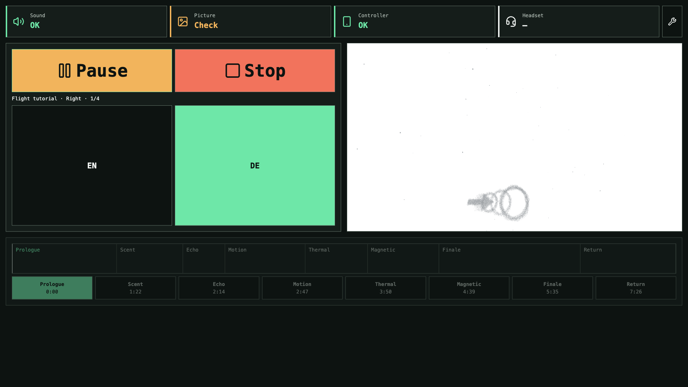
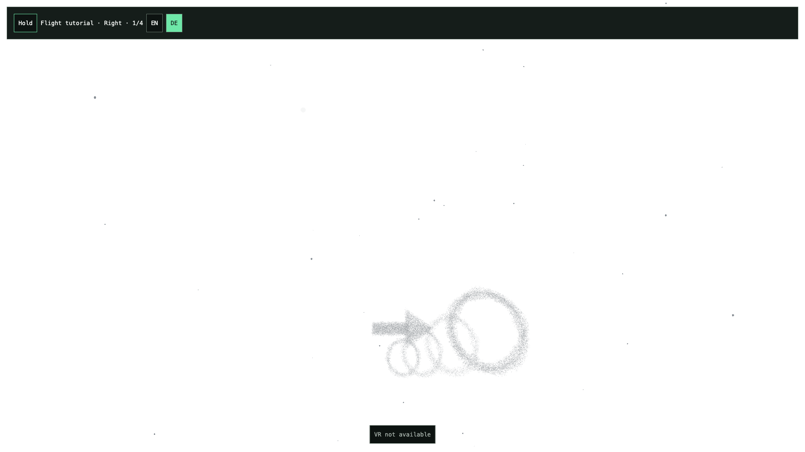

The generated bodies retain fine points, soft dense edges and a white composition;
the reference images remain inspiration, not a photographic rendering target.
Human speech intelligibility, localization, first-visitor comprehension and
Windows-PCVR USB-C 90 Hz remain physical acceptance.

## Final independent review and narration Hold correction — 2026-09-09

A separate read-only review of `4480d55` checked ownership, particle/audio pools,
frame work and the raw performance evidence. It confirmed the fixed capacities and
found no additional particle or granular-audio resource defect. It identified the
existing #93 narration bug as a direct tutorial dependency: every unchanged Hold
frame wrote native time and rate, and rejected play requests could repeat every
frame. The review also corrected the overly strong media-duration and cancellation
claims above. A focused second review of the final correction found no further
regression.

The existing narration player now applies changed native rate/held-seek intent
only and retains at most one pending/rejected play attempt per clip. Pause, cue
replacement and unload invalidate that attempt; Pause → Play retries a rejected
start. This is native operation state, not another playback clock. The sole-use
matching interface and forwarding/seek/drift helpers are removed. Show still owns
all transport and cue decisions. Native metadata gates seeking; a held target is
recorded only after it can actually be applied, preserving precise scrub values
when native getters round. There is no new listener, timer or input owner.

The matched 10 s Hold comparison records 600 → 0 unchanged time writes and
600 → 0 unchanged rate writes, both before first playback and after Pause.
Summed callback CPU p95 remains 0.5 ms initially and 0.4 ms after Pause; this is
an operation-count improvement, not an FPS claim. See the
[measurement and source identities](../../performance.md#narration-hold-and-independent-review--2026-09-09).
An explicitly injected first `NotAllowedError` produces one attempted play over
two seconds, followed by successful native playback after actual Pause/Play
controls. An earlier attempt to force browser autoplay policy instead allowed
playback; that diagnostic could not establish the blocked case. The final check
therefore identifies its injected failure rather than claiming a real policy block.

The final Station-served root course (`e4d58d70…`) completes one deliberate
miss, four passages, all five tutorial play requests and operator handoff.
Subsequent public Show controls seek a held German prologue to exactly
3.1234567890000005 s (native getter 3.123456 s), resume at rate 0.75, change to
Scent, switch to English while held, apply 2.234567889999994 s and resume there.
The requested values equal Show time minus the selected cue start; getter
rounding does not cause repeated writes. There are no functional assertion,
console, HTTP or shader failures and no warnings. The strict probe exits nonzero
because it retains three media `ERR_ABORTED` requests; it is not an all-green
request-error run. Local report:
`benchmark-results/issue-50/narration-final-integration/probe.json`.

Eleven focused narration/training-audio/organ tests, build/typecheck, mandatory
lint (336 files) and `git diff --check` pass.
These include delayed metadata, rounded native getters, exact stopped targets,
rejected/pending play, stale cancellation, cue replacement and unload. Existing
visual/course evidence above applies to unchanged geometry and flow. Physical
listening and Windows-PCVR USB-C 90 Hz, full decoder/driver memory plateau, and
the English tutorial voice decision remain open.

## Repeated forward recycling — memory observation, 2026-09-09

A further headed production-browser check closes the missing longer recycling
observation. On `295604f` the real M5 adapter receives a neutral forward flight
fixture: twelve missed sections retire and regenerate ahead, with zero awarded
passages. The last target is beyond world Z −1,132 m. The same point/material
resources remain allocated throughout the 232-second observation. After warmup,
retained JavaScript heap is 17.463/17.449/17.369 MiB at misses 6/9/12; backing
storage stays within 227 bytes of 74.357 MiB. The brief sample series shows no
continuing JS growth after warmup, not an installation-duration leak guarantee.

Ten seconds after Pause, observed AudioBufferSource/Gain counts return to their
initial values. These CDP counters include prepared main and offline-context
nodes; they are not the number of audible voices. Main assets remain prepared.
The [measurement details](../../performance.md#repeated-forward-recycling-memory--2026-09-09)
separate JS/backing storage from unmeasured decoder/driver memory and distinguish
forced-GC diagnostics from ordinary frame timing. The run has no functional,
console, HTTP or shader failure; its strict report retains two media preload
`ERR_ABORTED` requests. No production source or numerical reference changed.

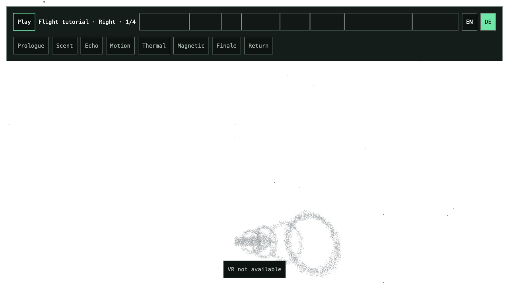

## Cloud revision — 2026-09-09

The latest visual handoff is implemented as independent procedural geometry,
not copied image geometry or backgrounds. All six selected references and the
four newer cloud studies were inspected. The rejected reduced studies are not
the design target. Thick torus volumes, a filled 7.2 m arrow, a dense core, soft
haze minority and visible fine grains replace the flat outlines. Three quieter
intermediate rings explain a smooth curve; only the four actual goal disks
advance the tutorial. Sections remain in place until their destination is passed.

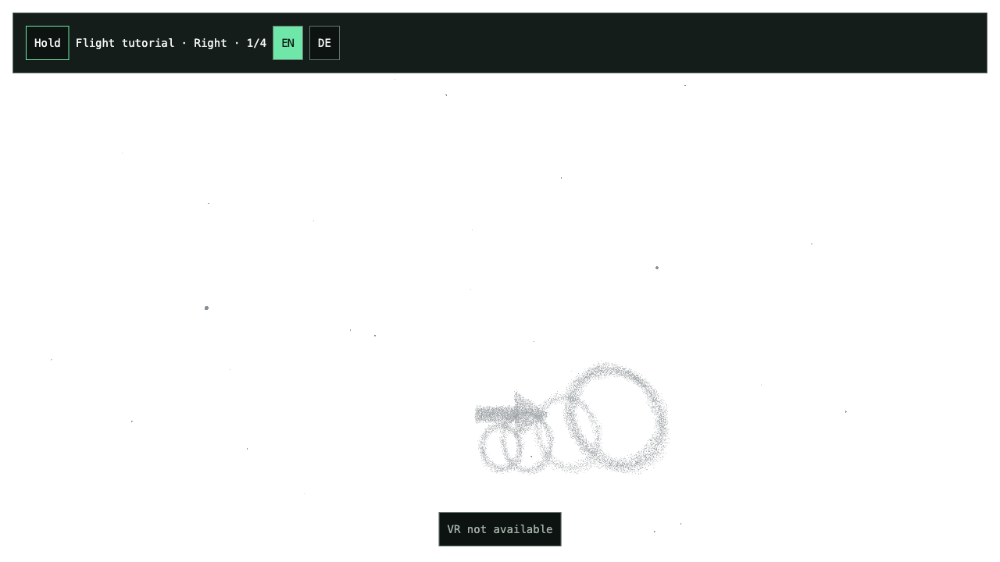

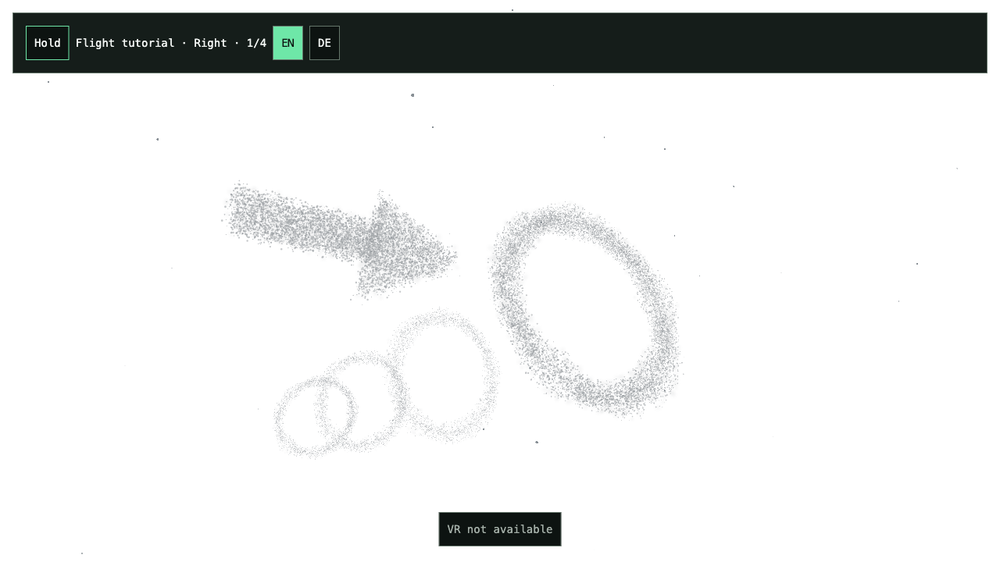

These are actual final-build screenshots at 1280×720 from `/start`, using the
existing M5 adapter with simulated firmware. The white composition, volumetric
particle bodies, softer edges and layered depth translate the references'
qualities. The result deliberately remains a visible particle material: it does
not reproduce photographic cloud lighting, depth of field, a cloud landscape or
image silhouettes. Fine-grain readability, softness and the quieter preview/active
hierarchy still need the user's visual acceptance, particularly in the headset.
The first target is 60–64 m away to accommodate the thicker body during formation
without changing flight, head-pitch assistance or renderer ownership.

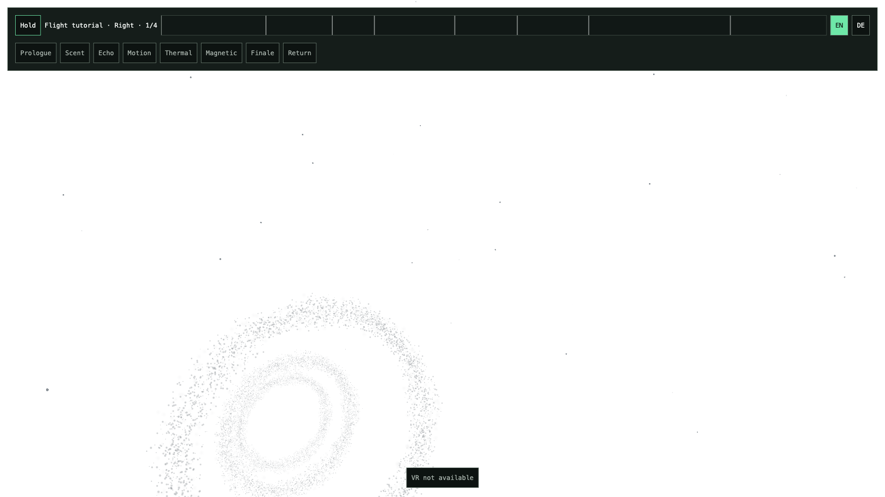

The last image records the crossing interval, but **does not show the silver
reaction itself**: the just-passed ring is behind the front-facing view. GPU
observations show its finite 0.9 s pulse and 6.5% expansion, followed by the 2.4 s
local trajectory wake. A side/head-turn view is still needed to judge their
strength and comfort. The next guide rings remain visible and do not react or
count as additional goals. No full-screen flash was added to hide this limitation.

Final served-assets digest:
`fca5507de4268d2d5853b297dc02347fbe04c3b1be9b586d93ba6e5a39278277`.
[Performance](../../performance.md#cloud-tutorial-revision--2026-09-09) records
CPU/GPU comparisons, point counts, buffer bytes, uploads and the user-accepted local
GPU-cost increase (2026-09-09). The final material was selected after 24k/32k and near-field
range comparisons; the result is not a performance improvement claim.

Validation: 41 focused Start/Air/chunk/audio/Run tests pass, including stationary
world poses, curve-preview non-completion and retention, finite wake, fixed arrays,
partial startup, pause and complete disposal. Build/typecheck and mandatory Biome
lint pass. Standalone Start passes real formation/input/turn/climb/reload and
image-boundary checks. Root completes all four targets and operator handoff. Conductor completes two
full courses, both handoffs and held Stop/recreations without errors or warnings.
The grayscale density inspector replaces the obsolete blue-color assumption;
it still checks actual visible bodies and image boundaries. Existing automated desktop
pointer-lock issue #83 is not resolved by M5 simulation.

The separate final coverage run observes **38,000 points in two desktop draws**.
Start's seven immutable buffers each upload once; all seven and both compiled
Start program variants are released at handoff. Projected point-square area /
viewport area is 0.110 at formation, 0.414 near the ring, 0.120 during crossing
and 0.143 during dissolution. This includes overlapping squares and clipping,
not measured fragment executions, alpha-weighted visibility or an exhaustive
worst-case bound. The largest point is capped at 16 px (Air 12 px), below the
observed hardware limit of 511 px. Stereo work and installation overdraw remain
unmeasured. Raw diagnostic evidence is local under
`benchmark-results/issue-50/cloud-final-coverage/`; it is separate from frame timing.
A first diagnostic attempt started its flight estimate after six seconds of
actual travel and failed; the corrected probe starts estimation with flight.
That failure was in the test setup, not treated as a passing course.

The two requested research subtasks started with Context7 and checked installed
Three.js **0.185.1 / r185** against official sources:

- [Buffer attributes and update ranges](https://threejs.org/docs/pages/BufferAttribute.html),
  [r185 point example](https://github.com/mrdoob/three.js/blob/r185/examples/webgl_buffergeometry_points.html)
  and [r185 attribute uploads](https://github.com/mrdoob/three.js/blob/r185/src/renderers/webgl/WebGLAttributes.js)
  support fixed buffers, GPU animation and partial recycled Air ranges.
- [Point material limits](https://threejs.org/docs/pages/PointsMaterial.html),
  [r185 point shader](https://github.com/mrdoob/three.js/blob/r185/src/renderers/shaders/ShaderLib/points.glsl.js)
  and [WebXR cameras](https://threejs.org/docs/pages/WebXRManager.html) support
  the existing perspective/per-eye path, soft point profiles and explicit caps.
- [Material depth/transparency](https://threejs.org/docs/pages/Material.html) and
  [resource cleanup](https://github.com/mrdoob/three.js/blob/r185/manual/en/cleanup.html)
  inform normal blending with depth test, no depth writes, conservative bounds
  and owner disposal. The renderer has no MSAA; alpha-to-coverage, WebGPU soft
  particles, bloom and global fog were not introduced.

#109/#110/#113 software presentation and passage behavior are extended; #111/#112
spatial audio ownership and existing granular content are preserved. #50 remains
open for visual/first-visitor/headset review,
narration use/EN policy, actual spatial listening and Windows-PCVR USB-C 90 Hz.
No issue is closed by these desktop results.

## Earlier implementation evidence

The screenshots and measurements below describe previous revisions, not the
current cloud material.

Implementation checkpoint: `1818a88155e6d0b82e2168171e8e67e4d2b765e6`.
The subsequent review correction prepares recreated GPU resources before reset
becomes ready, and retains preloaded main narration across the tutorial handoff.
[Performance](../../performance.md#flight-tutorial--2026-09-08) owns measurements
and their limits; [current status](../../current-status.md) owns current readiness.

## World-space correction

The user subsequently clarified that all particles must stay anchored in the
world rather than follow the player. The original near-field guide shown below
is superseded: all training particles now share the ring's world pose, and the
arrow forms beside that ring. Player translation or rotation cannot move either
particle cloud. Time-driven drift, formation and the local crossing wake remain.
Background Air already uses stable world-space chunk positions. The correction
passes 24 focused tests, build/lint, actual WebGL pose observations during flight
and turning, and a full four-goal browser course with handoff. Its measurements
are recorded in [Performance](../../performance.md#world-anchored-tutorial-particles).

## Browser evidence

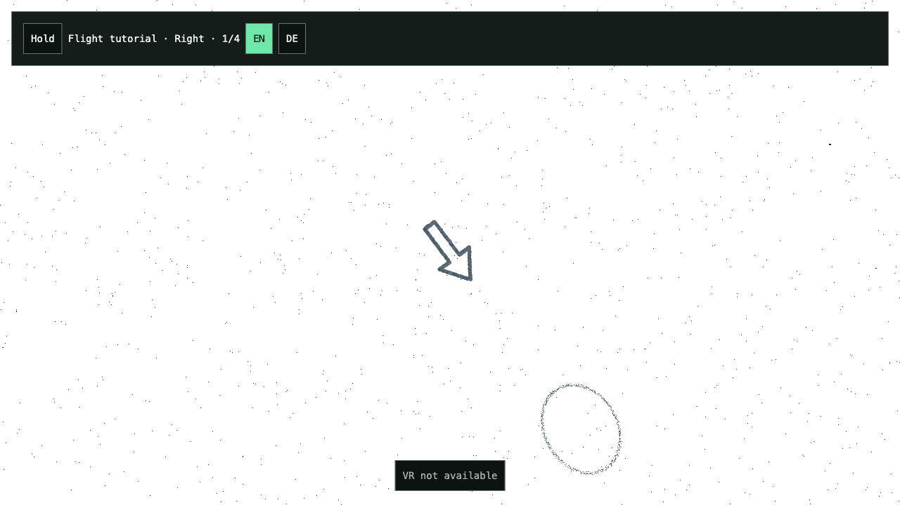

Standalone Start, 1280 × 720, headed Chromium on Apple M2 Max. The final 80-degree
desktop projection keeps the first ring visible below the existing assisted head
pitch. Capture from the implementation checkpoint before the preparation-only
review correction. The ring and arrow use the same fixed particle allocation.
This is a desktop view, not a headset readability or comfort assessment.

The retained functional suite passes seven combined scenarios (Root, Conductor,
Start, startup failures and UI-mount failures), plus four shared-UI scenarios
(Echo and Flash including their failure paths). Root and Conductor traverse all
four spatial goals through the actual M5 polling, validation and smoothing path
using simulated firmware responses. Existing main-show language, playback,
seeking, scrubbing, responsive layout and cleanup assertions remain enabled.
Exact source digests and scratch report paths are retained in current status.
After the review correction, a fresh root smoke passes 3/3 scenarios, including
all course passages, handoff, main-language/transport interaction and declared
startup/mount failures. Ten focused regression tests, build and mandatory lint
pass. Fallow 3.23 remains fail with ten introduced complexity and four CSS
findings; dead-code, import-boundary and cycle counts remain zero.

The additional review comparison exercises two complete courses, handoffs and
Conductor Stop resets per build. It uses the actual controls and the existing
course fixture, without editing scene/camera/progress state. GPU/RAF diagnostics
are separated from the earlier functional smoke; screenshot intervals are
excluded from the timing groups. Essential results and raw-report hashes are in
[the measurement summary](summary.json).

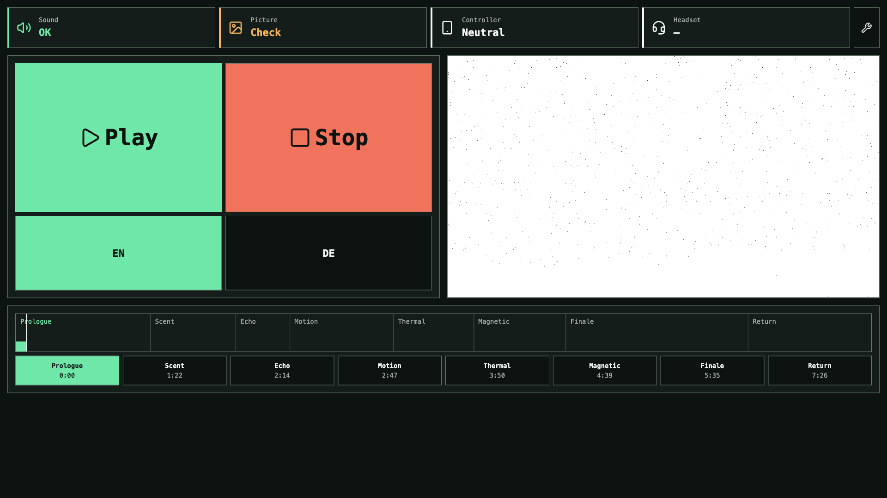

Conductor after the completed course and **Begin experience**, then paused for
capture. Main chapters are available again. This image records the review
candidate at 1920 × 1080; the embedded rendering canvas is 934 × 525.

The same Run after **Stop**: training is back at right, 1/4; Play is available
and main chapters are disabled. The cloudy arrival presentation is expected
before formation begins. No page reload or replacement renderer occurs.

## Independent performance review

A separate read-only reviewer examined `1818a88`, its frame/resource ownership
and the recorded measurements. It confirmed fixed particle buffers, bounded
grain/source settings, no per-frame particle/wake allocations, and source/context
cleanup. It found:

- **P2, corrected:** post-handoff reset recreated GPU resources without preparing
  them. World now shares only in-flight preparation, holds visible frames while
  sampling its existing timer, warms new resources offscreen, and restores XR,
  target and visibility. Run's readiness gate also waits when audio is absent.
  Deferred preparation, failure/retry and cancellation have focused tests. The
  independent reviewer re-read the correction and found no remaining defect in
  these paths.
- **P2, evidence extended:** the quick replay measured only goal 0 in its flying
  phase. Its numbers are animation timestamp intervals with VSync disabled,
  not isolated CPU or GPU durations. The new full-course diagnostic includes
  passages, dissolution, subsequent goals, handoff and recreated training.
- **P3, claim narrowed:** zero sparkle/glow values do not remove their shader
  calculations. The comparison establishes equal resources, not zero marginal
  GPU cost. No extra shader variant was introduced for this claim.
- **Preparation risk addressed:** main narration used to be created only at
  handoff. Its existing owner now preloads it during training and releases only
  tutorial-exclusive clips on handoff. This preserves one bounded media owner. As before, media preload is started
  early; readiness of every HTML media element is not awaited.

## Acceptance and limits

#109's fixed cloud and drift implementation is closed. #110/#113 spatial passage,
formation, dissolution and wake are implemented and locally exercised. #111/#112
have bounded spatial-audio and narration integration, but production content and
listening acceptance remain open. #50 therefore remains open.

The five German recordings were found in the
[predecessor's pinned audio directory](https://github.com/E-Mus/becoming-many-tutorial/tree/52fdfdb69a80b63988b71e035614db8abad4bac1/public/audio).
No English recordings or effect samples were found there. The user subsequently
supplied eleven instrumental sources; the current recipe enables a bounded
granular mix from three short derivatives. DE-use and EN narration decisions
remain pending. Signal probes establish routing, distance response and cleanup;
they are not production listening evidence.

Automated desktop pointer lock still fails under #83; simulated M5 success does
not resolve it. Fallow retains its recorded complexity/style findings without
suppressions. No new full 521-second observation, human tutorial-comprehension test or Windows-PCVR
USB-C 90 Hz/transport/headset acceptance is claimed. These limits prevent calling
the required production tutorial fully accepted.

## Object-bound granular atmosphere — #112

The ordinary sample bed is replaced by three granular layers bound to the visible
ring sides and arrow body, plus the current-goal voice. The eleven original MP3s
remain preserved; the literal recipe loads only three twelve-second mono
excerpts with recorded source ranges, fades and headroom. One shared eight-second
hall, HRTF direct placement, distance-dependent filtering and inverse-distance
room sends provide near/far behavior. Audio receives Start's borrowed world
anchors and Show's actual speech state. Hidden presentation, formation zero,
pause and lifecycle end stop the appropriate sources; pause mutes hall tails.

The independent read-only review found an upper clamp in the hall attenuation
that would leave distant missed goals equally loud beyond 128 m. It was removed,
with a regression at 96/192 m. No further ownership/scheduling defect was found.
Four sources, three buffers and one hall remain fixed; configured scheduling is
12.375 grains/s, with a validated maximum of 40. At 48 kHz the excerpts use
6.59 MiB decoded, plus the shared impulse. No new runtime or listener is introduced.

The combined focused suite passes 56 tests (Start, graphics, audio, Run restart,
Show clock/state), and the production build and mandatory lint (333 files) pass. The actual instrumental
signal probe confirms nonzero direct/hall output, decreasing near/far levels,
speech ducking and zero output after pause/unload. A separate worst-case
40-grains/s probe retained at most 20 scheduled/active native sources across its
two observations; scheduling stops on pause/unload. One shared Tone context
source remains until context close; context replacement/close and late decode
cancellation pass. These native-source counters include lookahead/stop tails,
not just the nominal four voices.

The full 1920×1080 production root course and operator handoff pass without
browser errors. Compared with the earlier silent training candidate, CPU p95
increases from 0.4 to 2.4 ms; GPU p95 is 0.249 versus 0.355 ms. Normal desktop
frame cadence remains around 60 Hz. This is added audio cost, not a performance
improvement or proof of Windows-PCVR 90 Hz. See the exact conditions and identities
in [Performance](../../performance.md#object-bound-granular-audio).

Listening/timbral selection, substantial-hall localization, speech intelligibility,
first-visitor comprehension and actual Windows-PCVR acceptance remain open.

The corrected final build also passes two complete Conductor courses/handoffs,
two held Stop/restarts with newly prepared sample/room resources, and the
standalone Start browser interaction. No errors or warnings were observed.
Source identities and compact signal evidence are in [summary.json](summary.json).

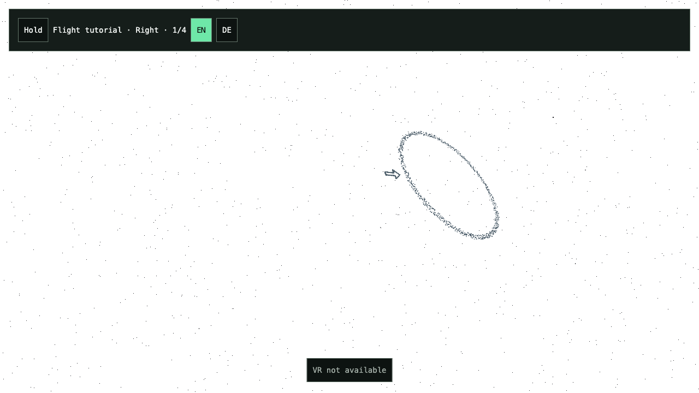

Standalone Start after formation, 1280×720. Both particle systems remain in world
space; the ring sides and arrow supply the spatial sound anchors.

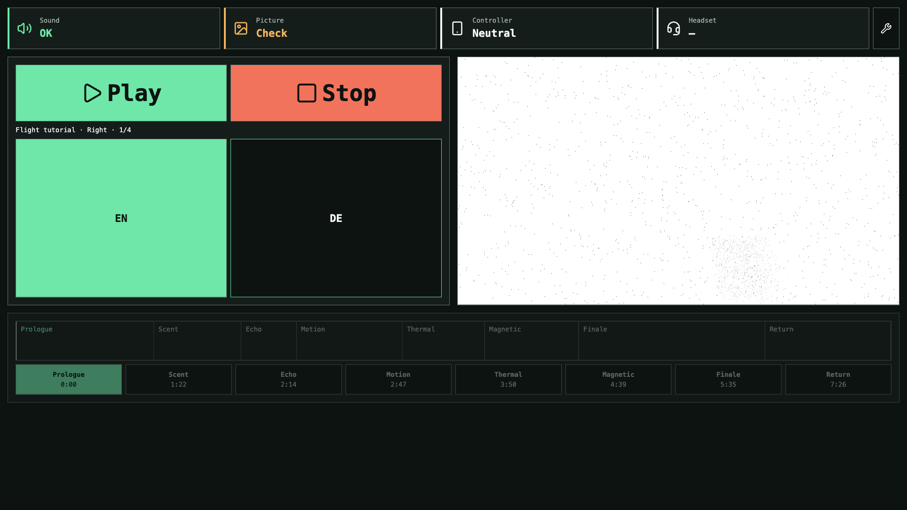

Conductor after the second operator handoff and Stop. Play is available only
after training graphics, excerpts and room have been prepared again. The static
image records readiness and scene state; it does not establish audible quality.

## Audio automation cost correction

A follow-up profile identified growing live AudioParam histories as avoidable
CPU cost. Source/listener positions and tutorial gain/filter targets now retire
past automation while holding their rendered value; existing smoothing and
spatial ownership remain unchanged. A 3600-frame regression bounds the retained
events during continued flight. The independent reviewer confirmed the cause
and the public-API approach, restricted to exclusive live parameters.

The comparable full production course reduces CPU p95 from 2.4 to 0.5 ms with
all four sources and the shared hall active. Build, four focused audio tests and
mandatory lint pass. The full course/handoff remains error-free. See
[the measured comparison](../../performance.md#bounded-live-audioparam-histories).
This supersedes the earlier elevated CPU result as the current candidate;
physical acceptance and approved narration remain open.

Actual instrumental HRTF, distance, ducking and silence assertions still pass.
The connected native gain/filter probe verifies progression and convergence
within measured time plus render-quantum uncertainty; context close/replacement
also passes. The report preserves the earlier unconnected-node and untimed-bound
diagnostic failures and their explanations. Perceptual clicklessness and headset
listening remain physical checks; no sample-identical output is claimed.

## Procedural course correction

The placement review replaces authored ring coordinates with bounded procedural
rules in the same literal Start recipe. Each goal is generated once; reset
samples a fresh course. The approved right/left/up/down sequence, world anchoring,
shared locomotion and geometry-owned sound attachments remain intact. Only
placement consumes randomness, with no new frame job, resource pool or runtime.
Show exposes the generated passage target through its existing observation;
Rehearsal and Conductor offer the same Show console access for inspection.

Ten Start logic tests include range extremes, all four passages, pause/miss
stability and fresh reset sampling. The combined focused set has 27 passing
tests across Start, particles, Run and audio; build and mandatory lint pass.
One stale audio-lifetime fixture lacked the existing AudioParam cancellation
methods and was corrected. The first Conductor probe exposed its missing Show
console observation; after aligning that entry access, two full courses,
operator handoffs and held Stop/restarts pass without errors or warnings.
Full-root flight also passes; its measured cost is recorded in
[Performance](../../performance.md#procedural-tutorial-placement).
Conductor restart probe served-assets SHA-256:
`bb46985637ea156ef8e7a79ba65055176ffbab159fe2118bd087573c365e49ca`.

Approved narration/EN behavior, spatial listening, visitor comprehension and
actual Windows-PCVR 90 Hz acceptance remain open.

Screenshot review caught a partially clipped first ring at the initial 30–34 m
range. The final first-distance range is 44–48 m. Standalone Start passes both
initial formation and reload with a pixel assertion that the blue target is
visible and does not touch the viewport edge; normal input interaction still
passes. The same pixel inspector correctly rejects the earlier clipped screenshot
and accepts the corrected image. Later goal spacing remains 58–62 m. These are bounded generation rules,
not fixed world positions.

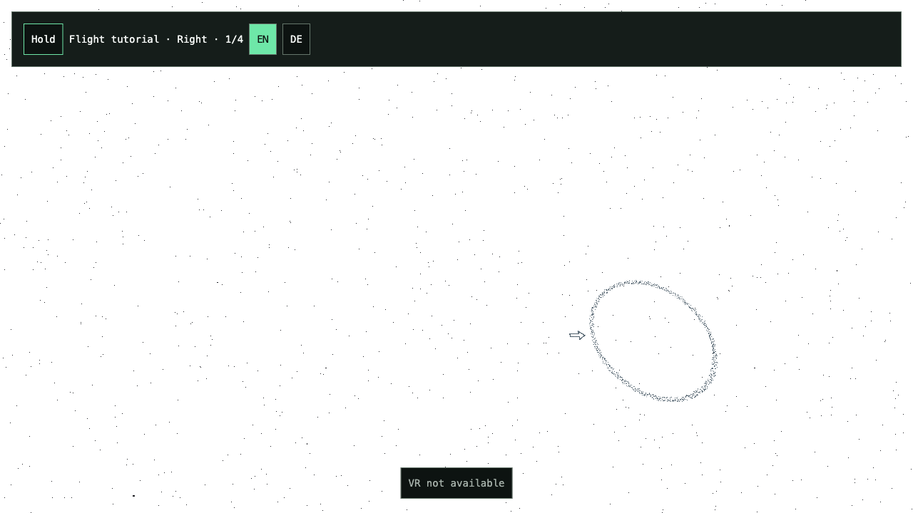
