# Required flight tutorial — 2026-09-08

The spatial tutorial replaces the held-gesture Start MVP on its existing routes
and opens the full experience. The approved sequence is right → left → up → down.
Actual ring passages advance learning; missed sections recycle ahead. The latest
integrated policy is 60 seconds of practice, a full closing voice on success and
an available direct UI transition, as recorded below. Show owns this policy; Run
retires training and releases the prepared main experience. World, M5 and
locomotion retain their ownership. No second renderer, loop or clock was added.
Older dated sections retain the evidence and decisions valid at their revision.

## Gaze-coupled instruction and slower flight — 2026-09-09

The latest feedback is implemented rather than merely restating the earlier
world-fixed correction: each new section now captures the current eye position,
look direction, up vector and conservative view cone at the spoken instruction.
The arrow is centered ahead; the current ring bends toward the requested direction.
Three bounded preview rings describe the approach, with their radii constrained by
the available view. All anchors stay fixed after placement, including under head
movement. The existing chunk-based surrounding particles are retained.

Show releases formation at authored DE clip positions 19.16/0.9/1/0.65 seconds,
independently from post-crossing instruction completion. Retries repeat the spoken
instruction portion, including the right cue, without replaying the whole opening.
The original audio bytes remain unchanged. At the flight ceiling, an upward view
may have no reachable visible target; Start waits in arrival for a feasible view
instead of lowering a newly visible ring outside the frame. The shared ceiling
is preserved. This does not move already placed particles with the viewer.

Run supplies 2 m/s tutorial translation through the existing M5/desktop controls;
steering and vertical M5 sensitivity stay unchanged. Main control defaults return
when training retires, and restart restores the tutorial setting. World publishes
orientation/projection facts once in its existing frame, including view assist
and head pose. No new clock, renderer, input path, shader pipeline or audio owner
is introduced. The preplanned course array/rig reference is removed. Rendering
and spatial audio share the independent arrow pose. A screenshot exposed a tilted
right arrow when orientation was derived from the normal alone; capturing eye-up
fixes that ambiguity, including head roll.

The 51 focused cases across Start geometry, particle ownership, ViewerRig, flight,
Show/audio and Run pass across the combined and targeted correction checks. The
Show probe additionally checks in-clip formation onset, language repetition and
retrying the instruction without replaying the introduction. Lint and production
build/typecheck pass. A focused read-only review identified the ceiling/view
intersection; the wait-for-feasible-view correction has a regression test.
Three 0.185.1 behavior was checked through Context7 and the installed source:
[Camera direction](https://threejs.org/docs/#Camera.getWorldDirection),
[PerspectiveCamera projection](https://threejs.org/docs/#PerspectiveCamera),
[XR camera update](https://github.com/mrdoob/three.js/blob/r185/src/renderers/webxr/WebXRManager.js).
XR retains the existing previous-render-pose publication boundary; physical
headset acceptance is not inferred from the desktop checks.

The final standalone `/start?language=de` browser check observes the actual
shader model-view/projection and object matrices. Before the instruction the
section is hidden. At its first visible frame the original native recording is
at 19.060 s (within the existing 0.25 s narration synchronization tolerance),
the arrow center projects to effectively (0, 0), its left/right axis is horizontal,
and all 16 sampled outer-ring points lie inside the viewport. Actual M5 yaw
before appearance changes the placement; yaw/flight afterwards leaves both
world matrices unchanged. A missed section repeats the right instruction near
19.632 s and creates a new world anchor. These are real rendered/audio-state
observations, not injected learning progress or a physical listening claim.

The initial standalone probe incorrectly assumed that route exposed `window.show`
and that PointsMaterial uploaded `viewMatrix`. The corrected observer uses native
voice time and the actual program's `modelViewMatrix`; no production workaround
or suppressed error was introduced for those fixture failures. Raw media range
`ERR_ABORTED` findings remain in the final report; functional assertions pass.

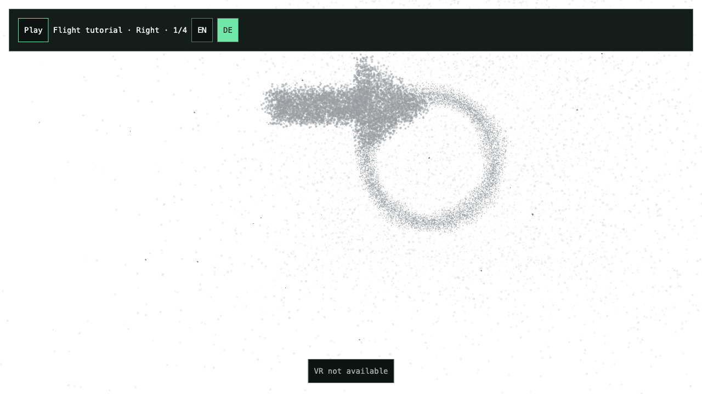
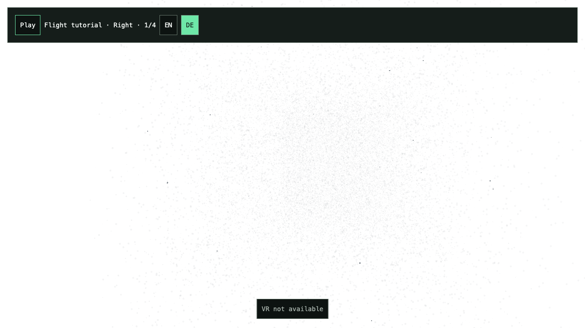

The integrated final browser course passes all four goals around 51.4 s and
retains the full closing before automatic handoff around 65.3 s. Its CPU/GPU p95
is 0.4/0.2961 ms; the measurement identity and changed-workload limits are in
Performance.

The nearer arrow/ring are substantially clearer than the preceding distant
presentation. Fine points and soft edges remain; the maximum sprite size is
bounded to 6 pixels to control near-field overdraw without lowering particle
capacity. The [performance record](../../performance.md#gaze-coupled-tutorial--2026-09-09)
separates the initial cost increase from the optimized measurements. Physical
PCVR comfort/listening and EN voice policy remain open.

## Timed tutorial and visit timeline — 2026-09-09

The latest user instruction supersedes the older unlimited/operator-only behavior
in the dated evidence below. Integrated practice has 60 playing seconds, displayed
as a Tutorial chapter before the main experience. Four actual passages before the
cutoff keep the complete successful closing recording; the user explicitly approved
up to about 74 seconds for that path. Otherwise the cutoff starts the experience
directly. Begin experience is available throughout prepared integrated practice.
Skip/timeout never increment a passage count or play the successful closing speech.

The five installed original WAVs were rechecked against their provenance hashes
and measured with ffprobe: 20.725729/2.735417/4.334896/2.552583/13.861479 s,
44.210104 s total. An existing local ASR transcript identifies right/left/up/down;
the opening right instruction arrives around 19.16 s. The closing recording
explicitly approves successful movement, then introduces the narrator. That content
supports keeping it for success and omitting it for skip/timeout. The transcript
contains ASR errors and is not a new approved script or physical listening test.
No audio bytes or script sources changed.

Show retains the sole clock. Pause/audio suspension consumes no practice budget;
practice language changes repeat the instruction without resetting that budget.
The fourth passage starts the closing immediately, even if the final directional
cue is unfinished. The successful closing voice retains its offset across a language change. The
public sample reports total visit time plus `mainStartSeconds`; internal main
narration, senses, organ and passages still use the original relative score.
The UI projects that observation onto existing chapter templates. It updates
geometry when the tutorial span changes without rebuilding nodes/listeners.
Seeking into retired practice clamps to the main start; Run reset reconstructs
only the already-owned exclusive training content and restores a held minute.
Standalone Start stays independently exercisable without a prepared main handoff.

Only authored tutorial pacing changes: the first target remains 60–64 m ahead
for formation readability; subsequent spacing is 30–34 m, horizontal displacement
7–9 m and vertical displacement 7–10 m. Arrival between goals is 0.5 s, formation
2 s and dissolution 1.5 s. Shared locomotion, 38,000-point capacity and audio
resources remain unchanged. The first 34–38 m pacing candidate reached only three
goals before timeout in the actual M5 fixture. The shorter final spacing and
retirement correct that concrete failure; it is not accepted as a successful run.

The final root browser run reaches all four goals at about 55.14 seconds and
hands off after the complete 13.861479-second closing, around 69 seconds total.
A separate real UI run verifies held time, desktop/narrow layout, direct skip
while held, shifted chapter jumps and a fresh 60-second timeout with actual
misses. Neither skip nor timeout starts the closing recording. The existing
browser fixtures now exercise automatic success and timeout instead of clicking
through the obsolete operator-only gate. A fixture initially sampled completion
before Show's next frame published the closing span; it now waits for that public
observation before checking the full remaining recording duration.

43 focused Start, Show/audio, Run restart, timeline and scrubbing tests pass
(1,278 assertions); mandatory lint and production build/typecheck pass. Vite
retains its existing large-chunk warning. The Show tests include success at
59.9 seconds, a full closing recording, paused wall time, repeated language
selection, early/idempotent skip, main cue offsets and standalone isolation.
A focused independent diff review found no blocking owner/lifetime/cost issue;
its note about the final directional cue interruption is reflected above.

Root functional assertions pass; strict raw browser reports still exit nonzero
for `net::ERR_ABORTED` on introduction/closing media requests. Successful playback
requests have readyState 4, all five expected voice selections occur, and no
functional failure or other console error is recorded. These reports are not
claimed as clean all-error browser passes or physical audibility evidence.
[Performance](../../performance.md#timed-tutorial-and-timeline--2026-09-09)
records the measured candidate identity and cost.

The Conductor production run also completes the spoken success path and passes
transport, keyboard seeking, scrubbing and desktop/narrow layouts. Its later
technician fixture still expected absolute zero after main-only Reset show;
that obsolete assertion now expects the retained main-start prefix. A focused
rerun passes the entire technician helper. A second fixture clicked Play during
asynchronous Stop preparation; it now waits for the public arrival observation.
The focused Stop/restart/Play/direct-skip scenario then passes. These concrete
failed results are retained, without relaxing the expected behavior.

Final Conductor UI verification uses `ffc495b` plus the fixture corrections,
Chromium 151 and served-assets digest
`7ca0a47e25c6c9544272f197175518774c1ca6cf7019a7432986ea89ba324b17`.
This includes the separately committed headset-icon update `0044943`; the root
performance measurement keeps its original asset identity. Lint and typecheck
also pass after the fixture corrections. Strict reports retain the same two
media-request aborts. Startup-failure and UI-mount-failure Conductor scenarios
pass; no physical device claim follows from those simulated checks.

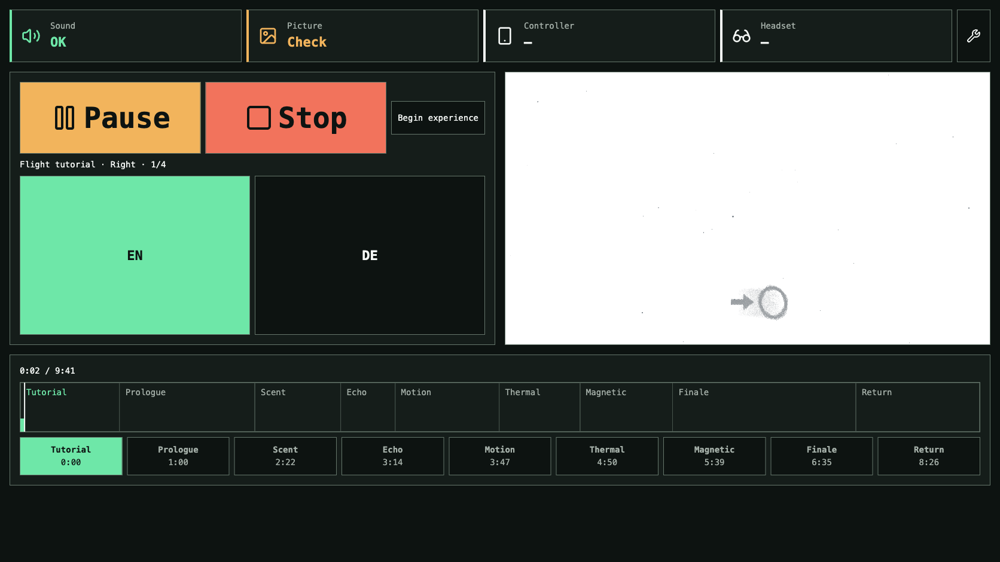

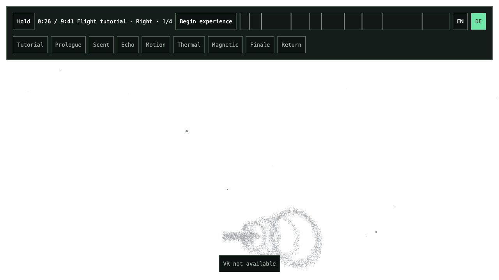
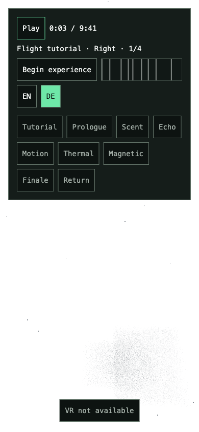

The actual view retains white space, fine point volume, spatial rings and an
arrow. It remains more restrained and less photographically cloud-like than the
inspirations; this timeline revision changes pacing, not the accepted renderer or
particle capacity. Visitor readability, final visual strength, spatial listening,
EN voice policy and physical Windows-PCVR acceptance remain open.

## Forward recycling and original voice — 2026-09-09

The user approved higher particle density and requested continuously renewed
courses ahead of flight, explicit passage feedback and the original voice.
A missed plane (outside the aperture), overtaken formation or distant receding
target now retires its entire section over three seconds. The existing fixed
slots then generate ahead of the current rig heading, repeating the same direction.
No time limit or miss-based success is introduced. Four actual passages still
precede the operator handoff; preview rings never count. Targets use the existing
flight ceiling without changing locomotion. Pause holds both retirement and flight.

Success retains its local silver expansion/wake and raises the existing spatial
goal voice; misses fade without that success accent and lower the same voice.
The shared operator readout distinguishes Passed/Missed. No extra audio node,
particle buffer, renderer, loop or clock is created during recycling.

All five original German WAVs are installed unchanged with source revision,
SHA-256 and measured duration in `public/audio/tutorial/provenance.json`.
`/start?language=de` now honors the same language query as the full show.
The first counted goal forms ahead after the 20.726 s introduction; later short
instruction clips repeat on a retry without interrupting an active clip. Original
opening narration is not repeated after every first-goal miss. The first real
spoken completion run exposed an old Show bug: selection alternated between Down
and Complete while the final clip was playing, preventing handoff. The completion
cue now remains selected across intervening frames; its full duration still gates
handoff. A regression test covers the intermediate frames that the former test
skipped. German voice works through the existing narration player; EN policy is
still pending. Main narration and language behavior are unchanged.

Served-assets digest for the forward-recycling verification:
`c8c4a8609d7912aeffc24b616154078516a6eef8caac582668993e0389f52e15`.
[Performance](../../performance.md#forward-recycling-and-spoken-tutorial--2026-09-09)
records the comparable desktop measurements and their limits.

Validation: 45 focused logic, geometry, audio, Show, Run and UI tests pass;
build/typecheck and mandatory lint pass. This includes 100 repeated misses with
identical preview slots, paused retirement, overtaken formation, ceiling bounds,
actual passage-only success, distinct audio feedback and the final spoken cue latch.

Headed Chromium 151 / Apple M2 Max checks exercise real shared M5 input:

- Root: one intentional miss, a fresh forward section, four passages, all five
  audible-enabled media clips and operator handoff to the German main prologue.
- Conductor: the same complete flow twice, with Stop/recreation and held Ready
  after each handoff, using the final build. No console/HTTP/shader failures or
  warnings. Media `playing` events confirm all five unmuted volume-1 clips and
  main prologue in each course.
- Standalone `/start?language=de`: query selects DE; the intro plays, Pause holds
  its settled media position, language switching repeats the instruction, and
  real formation/input/turn/climb/reload/image-boundary checks pass. A first
  diagnostic sampled the pause before the next owner frame and failed; the
  corrected check waits for the media's actual paused state before measuring.

The strict diagnostic reports retain Chromium `net::ERR_ABORTED` media-range
requests, including startup preloads. They therefore have nonzero raw request-error
counts; no global error filter or repository assertion was weakened. All five
clips emit `playing` and advance close to their authored duration; the logs do
not prove native `ended` for every clip. Completion can start at readyState 3 and
subsequently reach 4. For example, one intro stops at 20.667 s of 20.726 s and
completion at 13.807 s of 13.861 s as the Show-selected interval ends. This proves
playback, not exact native-end delivery or physical audibility. Cancellations
persist before and after the Hold correction below; their precise cause is
unresolved and cannot be attributed to repeated seeks or source retirement. Local reports:
`benchmark-results/issue-50/recycling-final-conductor/probe.json` and
`recycling-final-standalone-settled/result.json`. The earlier failed completion
run is retained locally as `recycling-voice-de/probe.json`.

The generated bodies retain fine points, soft dense edges and a white composition;
the reference images remain inspiration, not a photographic rendering target.
Human speech intelligibility, localization, first-visitor comprehension and
Windows-PCVR USB-C 90 Hz remain physical acceptance.

## Final independent review and narration Hold correction — 2026-09-09

A separate read-only review of `4480d55` checked ownership, particle/audio pools,
frame work and the raw performance evidence. It confirmed the fixed capacities and
found no additional particle or granular-audio resource defect. It identified the
existing #93 narration bug as a direct tutorial dependency: every unchanged Hold
frame wrote native time and rate, and rejected play requests could repeat every
frame. The review also corrected the overly strong media-duration and cancellation
claims above. A focused second review of the final correction found no further
regression.

The existing narration player now applies changed native rate/held-seek intent
only and retains at most one pending/rejected play attempt per clip. Pause, cue
replacement and unload invalidate that attempt; Pause → Play retries a rejected
start. This is native operation state, not another playback clock. The sole-use
matching interface and forwarding/seek/drift helpers are removed. Show still owns
all transport and cue decisions. Native metadata gates seeking; a held target is
recorded only after it can actually be applied, preserving precise scrub values
when native getters round. There is no new listener, timer or input owner.

The matched 10 s Hold comparison records 600 → 0 unchanged time writes and
600 → 0 unchanged rate writes, both before first playback and after Pause.
Summed callback CPU p95 remains 0.5 ms initially and 0.4 ms after Pause; this is
an operation-count improvement, not an FPS claim. See the
[measurement and source identities](../../performance.md#narration-hold-and-independent-review--2026-09-09).
An explicitly injected first `NotAllowedError` produces one attempted play over
two seconds, followed by successful native playback after actual Pause/Play
controls. An earlier attempt to force browser autoplay policy instead allowed
playback; that diagnostic could not establish the blocked case. The final check
therefore identifies its injected failure rather than claiming a real policy block.

The final Station-served root course (`e4d58d70…`) completes one deliberate
miss, four passages, all five tutorial play requests and operator handoff.
Subsequent public Show controls seek a held German prologue to exactly
3.1234567890000005 s (native getter 3.123456 s), resume at rate 0.75, change to
Scent, switch to English while held, apply 2.234567889999994 s and resume there.
The requested values equal Show time minus the selected cue start; getter
rounding does not cause repeated writes. There are no functional assertion,
console, HTTP or shader failures and no warnings. The strict probe exits nonzero
because it retains three media `ERR_ABORTED` requests; it is not an all-green
request-error run. Local report:
`benchmark-results/issue-50/narration-final-integration/probe.json`.

Eleven focused narration/training-audio/organ tests, build/typecheck, mandatory
lint (336 files) and `git diff --check` pass.
These include delayed metadata, rounded native getters, exact stopped targets,
rejected/pending play, stale cancellation, cue replacement and unload. Existing
visual/course evidence above applies to unchanged geometry and flow. Physical
listening and Windows-PCVR USB-C 90 Hz, full decoder/driver memory plateau, and
the English tutorial voice decision remain open.

## Repeated forward recycling — memory observation, 2026-09-09

A further headed production-browser check closes the missing longer recycling
observation. On `295604f` the real M5 adapter receives a neutral forward flight
fixture: twelve missed sections retire and regenerate ahead, with zero awarded
passages. The last target is beyond world Z −1,132 m. The same point/material
resources remain allocated throughout the 232-second observation. After warmup,
retained JavaScript heap is 17.463/17.449/17.369 MiB at misses 6/9/12; backing
storage stays within 227 bytes of 74.357 MiB. The brief sample series shows no
continuing JS growth after warmup, not an installation-duration leak guarantee.

Ten seconds after Pause, observed AudioBufferSource/Gain counts return to their
initial values. These CDP counters include prepared main and offline-context
nodes; they are not the number of audible voices. Main assets remain prepared.
The [measurement details](../../performance.md#repeated-forward-recycling-memory--2026-09-09)
separate JS/backing storage from unmeasured decoder/driver memory and distinguish
forced-GC diagnostics from ordinary frame timing. The run has no functional,
console, HTTP or shader failure; its strict report retains two media preload
`ERR_ABORTED` requests. No production source or numerical reference changed.

## Cloud revision — 2026-09-09

The latest visual handoff is implemented as independent procedural geometry,
not copied image geometry or backgrounds. All six selected references and the
four newer cloud studies were inspected. The rejected reduced studies are not
the design target. Thick torus volumes, a filled 7.2 m arrow, a dense core, soft
haze minority and visible fine grains replace the flat outlines. Three quieter
intermediate rings explain a smooth curve; only the four actual goal disks
advance the tutorial. Sections remain in place until their destination is passed.

These are actual final-build screenshots at 1280×720 from `/start`, using the
existing M5 adapter with simulated firmware. The white composition, volumetric
particle bodies, softer edges and layered depth translate the references'
qualities. The result deliberately remains a visible particle material: it does
not reproduce photographic cloud lighting, depth of field, a cloud landscape or
image silhouettes. Fine-grain readability, softness and the quieter preview/active
hierarchy still need the user's visual acceptance, particularly in the headset.
The first target is 60–64 m away to accommodate the thicker body during formation
without changing flight, head-pitch assistance or renderer ownership.

The last image records the crossing interval, but **does not show the silver
reaction itself**: the just-passed ring is behind the front-facing view. GPU
observations show its finite 0.9 s pulse and 6.5% expansion, followed by the 2.4 s
local trajectory wake. A side/head-turn view is still needed to judge their
strength and comfort. The next guide rings remain visible and do not react or
count as additional goals. No full-screen flash was added to hide this limitation.

Final served-assets digest:
`fca5507de4268d2d5853b297dc02347fbe04c3b1be9b586d93ba6e5a39278277`.
[Performance](../../performance.md#cloud-tutorial-revision--2026-09-09) records
CPU/GPU comparisons, point counts, buffer bytes, uploads and the user-accepted local
GPU-cost increase (2026-09-09). The final material was selected after 24k/32k and near-field
range comparisons; the result is not a performance improvement claim.

Validation: 41 focused Start/Air/chunk/audio/Run tests pass, including stationary
world poses, curve-preview non-completion and retention, finite wake, fixed arrays,
partial startup, pause and complete disposal. Build/typecheck and mandatory Biome
lint pass. Standalone Start passes real formation/input/turn/climb/reload and
image-boundary checks. Root completes all four targets and operator handoff. Conductor completes two
full courses, both handoffs and held Stop/recreations without errors or warnings.
The grayscale density inspector replaces the obsolete blue-color assumption;
it still checks actual visible bodies and image boundaries. Existing automated desktop
pointer-lock issue #83 is not resolved by M5 simulation.

The separate final coverage run observes **38,000 points in two desktop draws**.
Start's seven immutable buffers each upload once; all seven and both compiled
Start program variants are released at handoff. Projected point-square area /
viewport area is 0.110 at formation, 0.414 near the ring, 0.120 during crossing
and 0.143 during dissolution. This includes overlapping squares and clipping,
not measured fragment executions, alpha-weighted visibility or an exhaustive
worst-case bound. The largest point is capped at 16 px (Air 12 px), below the
observed hardware limit of 511 px. Stereo work and installation overdraw remain
unmeasured. Raw diagnostic evidence is local under
`benchmark-results/issue-50/cloud-final-coverage/`; it is separate from frame timing.
A first diagnostic attempt started its flight estimate after six seconds of
actual travel and failed; the corrected probe starts estimation with flight.
That failure was in the test setup, not treated as a passing course.

The two requested research subtasks started with Context7 and checked installed
Three.js **0.185.1 / r185** against official sources:

- [Buffer attributes and update ranges](https://threejs.org/docs/pages/BufferAttribute.html),
  [r185 point example](https://github.com/mrdoob/three.js/blob/r185/examples/webgl_buffergeometry_points.html)
  and [r185 attribute uploads](https://github.com/mrdoob/three.js/blob/r185/src/renderers/webgl/WebGLAttributes.js)
  support fixed buffers, GPU animation and partial recycled Air ranges.
- [Point material limits](https://threejs.org/docs/pages/PointsMaterial.html),
  [r185 point shader](https://github.com/mrdoob/three.js/blob/r185/src/renderers/shaders/ShaderLib/points.glsl.js)
  and [WebXR cameras](https://threejs.org/docs/pages/WebXRManager.html) support
  the existing perspective/per-eye path, soft point profiles and explicit caps.
- [Material depth/transparency](https://threejs.org/docs/pages/Material.html) and
  [resource cleanup](https://github.com/mrdoob/three.js/blob/r185/manual/en/cleanup.html)
  inform normal blending with depth test, no depth writes, conservative bounds
  and owner disposal. The renderer has no MSAA; alpha-to-coverage, WebGPU soft
  particles, bloom and global fog were not introduced.

#109/#110/#113 software presentation and passage behavior are extended; #111/#112
spatial audio ownership and existing granular content are preserved. #50 remains
open for visual/first-visitor/headset review,
narration use/EN policy, actual spatial listening and Windows-PCVR USB-C 90 Hz.
No issue is closed by these desktop results.

## Earlier implementation evidence

The screenshots and measurements below describe previous revisions, not the
current cloud material.

Implementation checkpoint: `1818a88155e6d0b82e2168171e8e67e4d2b765e6`.
The subsequent review correction prepares recreated GPU resources before reset
becomes ready, and retains preloaded main narration across the tutorial handoff.
[Performance](../../performance.md#flight-tutorial--2026-09-08) owns measurements
and their limits; [current status](../../current-status.md) owns current readiness.

## World-space correction

The user subsequently clarified that all particles must stay anchored in the
world rather than follow the player. The original near-field guide shown below
is superseded: all training particles now share the ring's world pose, and the
arrow forms beside that ring. Player translation or rotation cannot move either
particle cloud. Time-driven drift, formation and the local crossing wake remain.
Background Air already uses stable world-space chunk positions. The correction
passes 24 focused tests, build/lint, actual WebGL pose observations during flight
and turning, and a full four-goal browser course with handoff. Its measurements
are recorded in [Performance](../../performance.md#world-anchored-tutorial-particles).

## Browser evidence

Standalone Start, 1280 × 720, headed Chromium on Apple M2 Max. The final 80-degree
desktop projection keeps the first ring visible below the existing assisted head
pitch. Capture from the implementation checkpoint before the preparation-only
review correction. The ring and arrow use the same fixed particle allocation.
This is a desktop view, not a headset readability or comfort assessment.

The retained functional suite passes seven combined scenarios (Root, Conductor,
Start, startup failures and UI-mount failures), plus four shared-UI scenarios
(Echo and Flash including their failure paths). Root and Conductor traverse all
four spatial goals through the actual M5 polling, validation and smoothing path
using simulated firmware responses. Existing main-show language, playback,
seeking, scrubbing, responsive layout and cleanup assertions remain enabled.
Exact source digests and scratch report paths are retained in current status.
After the review correction, a fresh root smoke passes 3/3 scenarios, including
all course passages, handoff, main-language/transport interaction and declared
startup/mount failures. Ten focused regression tests, build and mandatory lint
pass. Fallow 3.23 remains fail with ten introduced complexity and four CSS
findings; dead-code, import-boundary and cycle counts remain zero.

The additional review comparison exercises two complete courses, handoffs and
Conductor Stop resets per build. It uses the actual controls and the existing
course fixture, without editing scene/camera/progress state. GPU/RAF diagnostics
are separated from the earlier functional smoke; screenshot intervals are
excluded from the timing groups. Essential results and raw-report hashes are in
[the measurement summary](summary.json).

Conductor after the completed course and **Begin experience**, then paused for
capture. Main chapters are available again. This image records the review
candidate at 1920 × 1080; the embedded rendering canvas is 934 × 525.

The same Run after **Stop**: training is back at right, 1/4; Play is available
and main chapters are disabled. The cloudy arrival presentation is expected
before formation begins. No page reload or replacement renderer occurs.

## Independent performance review

A separate read-only reviewer examined `1818a88`, its frame/resource ownership
and the recorded measurements. It confirmed fixed particle buffers, bounded
grain/source settings, no per-frame particle/wake allocations, and source/context
cleanup. It found:

- **P2, corrected:** post-handoff reset recreated GPU resources without preparing
  them. World now shares only in-flight preparation, holds visible frames while
  sampling its existing timer, warms new resources offscreen, and restores XR,
  target and visibility. Run's readiness gate also waits when audio is absent.
  Deferred preparation, failure/retry and cancellation have focused tests. The
  independent reviewer re-read the correction and found no remaining defect in
  these paths.
- **P2, evidence extended:** the quick replay measured only goal 0 in its flying
  phase. Its numbers are animation timestamp intervals with VSync disabled,
  not isolated CPU or GPU durations. The new full-course diagnostic includes
  passages, dissolution, subsequent goals, handoff and recreated training.
- **P3, claim narrowed:** zero sparkle/glow values do not remove their shader
  calculations. The comparison establishes equal resources, not zero marginal
  GPU cost. No extra shader variant was introduced for this claim.
- **Preparation risk addressed:** main narration used to be created only at
  handoff. Its existing owner now preloads it during training and releases only
  tutorial-exclusive clips on handoff. This preserves one bounded media owner. As before, media preload is started
  early; readiness of every HTML media element is not awaited.

## Acceptance and limits

#109's fixed cloud and drift implementation is closed. #110/#113 spatial passage,
formation, dissolution and wake are implemented and locally exercised. #111/#112
have bounded spatial-audio and narration integration, but production content and
listening acceptance remain open. #50 therefore remains open.

The five German recordings were found in the
[predecessor's pinned audio directory](https://github.com/E-Mus/becoming-many-tutorial/tree/52fdfdb69a80b63988b71e035614db8abad4bac1/public/audio).
No English recordings or effect samples were found there. The user subsequently
supplied eleven instrumental sources; the current recipe enables a bounded
granular mix from three short derivatives. DE-use and EN narration decisions
remain pending. Signal probes establish routing, distance response and cleanup;
they are not production listening evidence.

Automated desktop pointer lock still fails under #83; simulated M5 success does
not resolve it. Fallow retains its recorded complexity/style findings without
suppressions. No new full 521-second observation, human tutorial-comprehension test or Windows-PCVR
USB-C 90 Hz/transport/headset acceptance is claimed. These limits prevent calling
the required production tutorial fully accepted.

## Object-bound granular atmosphere — #112

The ordinary sample bed is replaced by three granular layers bound to the visible
ring sides and arrow body, plus the current-goal voice. The eleven original MP3s
remain preserved; the literal recipe loads only three twelve-second mono
excerpts with recorded source ranges, fades and headroom. One shared eight-second
hall, HRTF direct placement, distance-dependent filtering and inverse-distance
room sends provide near/far behavior. Audio receives Start's borrowed world
anchors and Show's actual speech state. Hidden presentation, formation zero,
pause and lifecycle end stop the appropriate sources; pause mutes hall tails.

The independent read-only review found an upper clamp in the hall attenuation
that would leave distant missed goals equally loud beyond 128 m. It was removed,
with a regression at 96/192 m. No further ownership/scheduling defect was found.
Four sources, three buffers and one hall remain fixed; configured scheduling is
12.375 grains/s, with a validated maximum of 40. At 48 kHz the excerpts use
6.59 MiB decoded, plus the shared impulse. No new runtime or listener is introduced.

The combined focused suite passes 56 tests (Start, graphics, audio, Run restart,
Show clock/state), and the production build and mandatory lint (333 files) pass. The actual instrumental
signal probe confirms nonzero direct/hall output, decreasing near/far levels,
speech ducking and zero output after pause/unload. A separate worst-case
40-grains/s probe retained at most 20 scheduled/active native sources across its
two observations; scheduling stops on pause/unload. One shared Tone context
source remains until context close; context replacement/close and late decode
cancellation pass. These native-source counters include lookahead/stop tails,
not just the nominal four voices.

The full 1920×1080 production root course and operator handoff pass without
browser errors. Compared with the earlier silent training candidate, CPU p95
increases from 0.4 to 2.4 ms; GPU p95 is 0.249 versus 0.355 ms. Normal desktop
frame cadence remains around 60 Hz. This is added audio cost, not a performance
improvement or proof of Windows-PCVR 90 Hz. See the exact conditions and identities
in [Performance](../../performance.md#object-bound-granular-audio).

Listening/timbral selection, substantial-hall localization, speech intelligibility,
first-visitor comprehension and actual Windows-PCVR acceptance remain open.

The corrected final build also passes two complete Conductor courses/handoffs,
two held Stop/restarts with newly prepared sample/room resources, and the
standalone Start browser interaction. No errors or warnings were observed.
Source identities and compact signal evidence are in [summary.json](summary.json).

Standalone Start after formation, 1280×720. Both particle systems remain in world
space; the ring sides and arrow supply the spatial sound anchors.

Conductor after the second operator handoff and Stop. Play is available only
after training graphics, excerpts and room have been prepared again. The static
image records readiness and scene state; it does not establish audible quality.

## Audio automation cost correction

A follow-up profile identified growing live AudioParam histories as avoidable
CPU cost. Source/listener positions and tutorial gain/filter targets now retire
past automation while holding their rendered value; existing smoothing and
spatial ownership remain unchanged. A 3600-frame regression bounds the retained
events during continued flight. The independent reviewer confirmed the cause
and the public-API approach, restricted to exclusive live parameters.

The comparable full production course reduces CPU p95 from 2.4 to 0.5 ms with
all four sources and the shared hall active. Build, four focused audio tests and
mandatory lint pass. The full course/handoff remains error-free. See
[the measured comparison](../../performance.md#bounded-live-audioparam-histories).
This supersedes the earlier elevated CPU result as the current candidate;
physical acceptance and approved narration remain open.

Actual instrumental HRTF, distance, ducking and silence assertions still pass.
The connected native gain/filter probe verifies progression and convergence
within measured time plus render-quantum uncertainty; context close/replacement
also passes. The report preserves the earlier unconnected-node and untimed-bound
diagnostic failures and their explanations. Perceptual clicklessness and headset
listening remain physical checks; no sample-identical output is claimed.

## Procedural course correction

The placement review replaces authored ring coordinates with bounded procedural
rules in the same literal Start recipe. Each goal is generated once; reset
samples a fresh course. The approved right/left/up/down sequence, world anchoring,
shared locomotion and geometry-owned sound attachments remain intact. Only
placement consumes randomness, with no new frame job, resource pool or runtime.
Show exposes the generated passage target through its existing observation;
Rehearsal and Conductor offer the same Show console access for inspection.

Ten Start logic tests include range extremes, all four passages, pause/miss
stability and fresh reset sampling. The combined focused set has 27 passing
tests across Start, particles, Run and audio; build and mandatory lint pass.
One stale audio-lifetime fixture lacked the existing AudioParam cancellation
methods and was corrected. The first Conductor probe exposed its missing Show
console observation; after aligning that entry access, two full courses,
operator handoffs and held Stop/restarts pass without errors or warnings.
Full-root flight also passes; its measured cost is recorded in
[Performance](../../performance.md#procedural-tutorial-placement).
Conductor restart probe served-assets SHA-256:
`bb46985637ea156ef8e7a79ba65055176ffbab159fe2118bd087573c365e49ca`.

Approved narration/EN behavior, spatial listening, visitor comprehension and
actual Windows-PCVR 90 Hz acceptance remain open.

Screenshot review caught a partially clipped first ring at the initial 30–34 m
range. The final first-distance range is 44–48 m. Standalone Start passes both
initial formation and reload with a pixel assertion that the blue target is
visible and does not touch the viewport edge; normal input interaction still
passes. The same pixel inspector correctly rejects the earlier clipped screenshot
and accepts the corrected image. Later goal spacing remains 58–62 m. These are bounded generation rules,
not fixed world positions.

## Arrow-first turn-triggered tunnel — 2026-09-09

The next user review replaces simultaneous arrow/ring formation. A six-metre
particle arrow captures the current eye ray at the spoken cue, with at least
12 m lead distance. Its world pose stays fixed. Start compares actual travel
against the captured approach: a signed directional change of 0.12 sustained
for 0.2 s opens the tunnel; rotating the head alone cannot do so. Current travel
predicts the curve inside the visible corridor. Arrow-only misses dissolve after
leaving view for 0.8 s (or passing its plane), then repeat the instruction portion
at a fresh anchor. The arrow dissolves as the tunnel forms, avoiding the former
overlapping symbols. Preview passages trigger individual immediate silver/6.5%
expansion and drag-damped dispersal, fading within 1.4 s; only the final ring
counts toward right/left/up/down. Existing 60 s/full-closing/UI-skip policy remains.

The effect solves a critically damped mass-spring response analytically in the
existing vertex shader; crossing impulses decay under linear drag. This is a
reduced physical particle model, not a general collision/fluid engine. Reversing
an unfinished formation retains the achieved displacement, avoiding a visible
jump. One Points draw and immutable particle attributes remain. Official Three
r185 guidance was checked through Context7 and the official
[Material](https://threejs.org/docs/pages/Material.html),
[BufferGeometry](https://threejs.org/docs/pages/BufferGeometry.html) and
[GPUComputationRenderer](https://threejs.org/docs/pages/GPUComputationRenderer.html)
documentation. Ping-pong computation textures were unnecessary for these
analytically solvable forces. No dependency, renderer or time owner was added.

Verification: 17 Start, 11 particle-effect, 5 training-audio and 5 composed
Show/audio tests passed; production build/typecheck and repository lint passed.
Tests cover real directional travel, head-only rejection, fixed anchors, all four
passages, preview feedback without progress, pause, ceiling feasibility, 100
recycles and complete cleanup. The combined check caught an arrow-miss phantom
ring; fixing presence ownership removed it. Audio follows the independently
visible arrow before ring sources begin.

Actual headed Chromium production runs used the existing M5 response fixture.
All four goals completed with zero misses, followed by the complete German closing
and automatic handoff at about 65.3 s. Separate standalone captures verify no
rings at arrow onset, world-fixed arrow pose after turning, delayed tunnel
formation, paused animation and fresh spoken retry. The dense arrow is readable
alone; the tunnel has volumetric grain bodies and dispersed surrounding particles
instead of the old small overlapping symbols. White composition and fine gray
points retain the inspiration's restraint; photographic lighting/fluid fidelity
is not claimed. Physical comfort, visual approval and spatial speech listening
on Windows-PCVR remain open, as does EN content policy.

Comparable 1920×1080 DPR1 headed Chromium measurement (no screenshots during the
measured course): 3,955 frames, CPU median/p95/p99 0.3/0.4/0.5 ms; GPU
0.103375/0.307708/0.36975 ms; RAF 16.7/18.1/18.6 ms. Previous gaze-coupled GPU
median/p95 was 0.104333/0.296125 ms; the first candidate was 0.10054/0.29412 ms.
These nearby desktop results do not establish a performance improvement or a
90 Hz installation result. No buffer/program/texture creation occurred during
the course; upload p99 was zero and maximum 34,560 bytes from existing Air
streaming. Capacity remains 32,000 training + 6,000 Air points. Training attribute
storage remains 1,408,000 bytes; physical release origins add two fixed vec2
uniforms (16 bytes), preview ages one fixed three-float uniform (12 bytes).
The six-pixel cap bounds training sprite-square coverage to 1,152,000 pixels
before clipping/alpha rejection; this is a conservative overdraw proxy, not
measured fragment invocations. No new long-duration heap-plateau claim is made.

Raw local comparison: `benchmark-results/issue-50/turn-triggered-release/probe.json`,
served asset digest `6128816d3fd19a9d6c615ba1851fcc76f0aa6ec6744f528e00a097e068fbcf0b`.
The final dead-configuration cleanup removes unused former wake knobs/uniforms;
it does not change the measured rendered motion. Procedural routes vary across
runs; these are comparable experience measurements, not isolated shader timings. Native audio request cancellation logged
`ERR_ABORTED` on introduction replacement and completed closing disposal; no
functional, shader or console warning occurred. The harness reports those raw
cancellations as nonzero exit despite all interaction assertions passing.

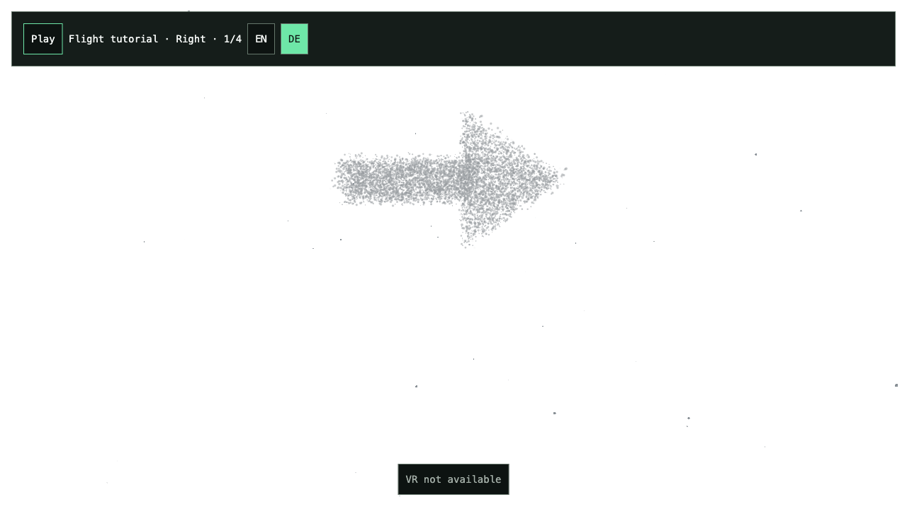
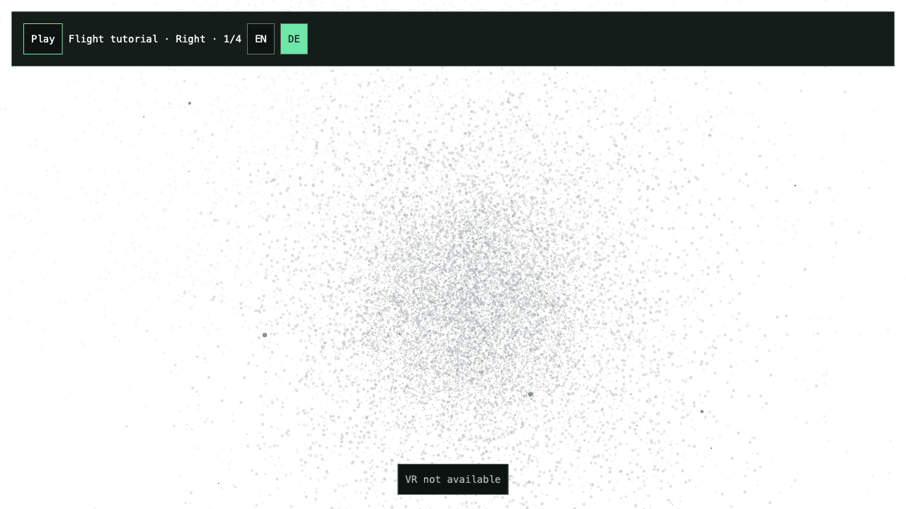
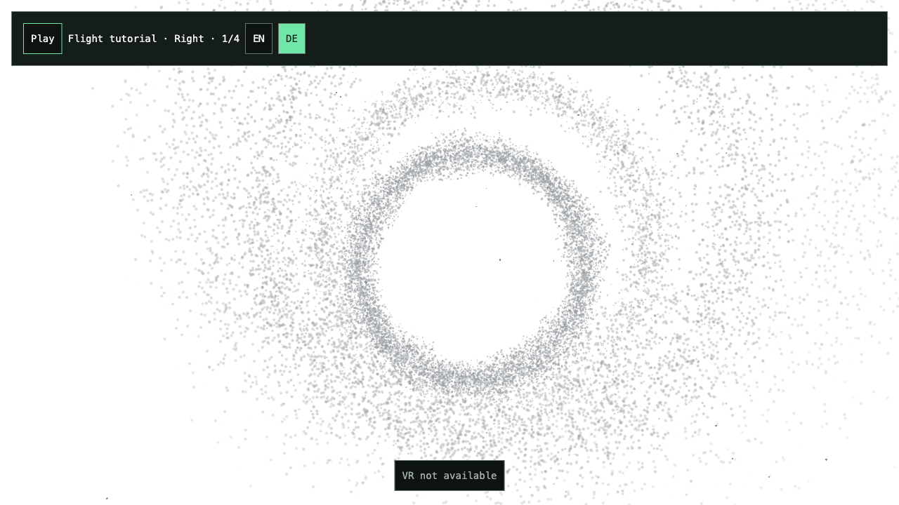

This is feature growth, not a code-reduction claim: production +259 lines,
tests −28 lines, with documentation/evidence updated separately. The simultaneous
formation path was replaced rather than retained as a second mode.

## Spoken-line staging — 2026-09-09

The next user review requires the room to appear only when it is mentioned,
and makes arrows primary with rings as subsequent assistance. All five shipped
German clips were aligned locally word by word with the already available
faster-whisper-small model, without upload or changing recording bytes.
`script/de.md` and `script/en.md` contain the main piece, not these tutorial lines;
they remain unchanged. The table gives English glosses of the complete tutorial
recordings, not replacement narration. ASR word boundaries are estimates, not
sample-accurate human listening approval.

| Clip | Local seconds | Spoken line (gloss) | Presentation |
| --- | --- | --- | --- |
| right | 0.00–3.86 | Hello; before starting, check everything is here | Empty white space |
| right | 4.48–5.32 | What do we need? | Remain empty |
| right | 5.80–7.50 | We already have a beginning | No new objects |
| right | 8.02–9.20 | We have you too | No new objects |
| right | 9.70–11.98 | We need a narrator | No invented narrator figure |
| right | 12.32–15.44 | And of course a room where everything can happen | At 13.12, “a room” begins the two-second particle-space reveal |
| right | 16.30–18.46 | Let us see whether it works | Space present; no arrow/rings |
| right | 19.30–20.10 | Lean to the right | Right arrow begins at 19.30 |
| left | 0.00–0.52 | Yes, exactly | No new arrow during praise |
| left | 1.14–2.18 | Now the other side | Left arrow begins at 1.14 |
| up | 0.00–0.44 | Very good | No new arrow during praise |
| up | 0.92–2.06 | What about up above? | Preparatory question; space remains |
| up | 2.66–3.94 | Lean back a little | Up arrow begins at the explicit call, 2.66 |
| down | 0.00–0.78 | Perfect | No new arrow during praise |
| down | 1.04–1.82 | And now forward | Down arrow begins at 1.04 |
| complete | 0.00–0.84 | Wonderful | Completion feedback; no new course |
| complete | 1.32–3.24 | Left, right, up, down | Retrospective list; no direction triggers |
| complete | 3.78–4.92 | The room works | Calm particle space remains |
| complete | 5.48–6.96 | We can begin | Do not interrupt the recording |
| complete | 8.14–10.08 | Wait, something is missing | Continue closing voice |
| complete | 10.68–11.94 | The narrator! | No new character/content |
| complete | 12.36–13.74 | Wait, I will fetch him | Existing handoff after clip end at 13.861479 |

The old 19.16/0.9/1/0.65 arrow markers are replaced by
19.30/1.14/2.66/1.04. Show follows narration first and gates visuals against the
lesser of requested cue offset and observed native media offset, so tolerable
native audio lag cannot make geometry anticipate the word. This observation
never changes Show time, the practice budget or locomotion. Revealed room
presence is retained across later cues/retries/language changes; reset hides it.

Start now requires the arrow to complete its formation before actual directional
travel may reveal the helping rings. The same original four final passages still
count; preview rings never do. Composition gives standalone training the same
owned Air module as integrated training, removing its former always-visible
separate background path. Show supplies presence; Air owns its existing material
opacity and visibility. Ordinary levels retain their default presence and no
shader, particle budget, render loop or runtime owner was added. Benchmarks without
narration explicitly retain the visible room.

Standalone production browser: room opacity zero at native 10.018 s, first
positive opacity at 13.125 s, first arrow at 19.312 s with rings still hidden.
The arrow remains world-fixed and fully forms before a turn reveals the tunnel;
Pause freezes presentation. The initial room screenshot is genuinely empty.
Native cancellation on clip disposal is retained in raw reports as ERR_ABORTED;
no interaction assertion failed. Local raw evidence:
`benchmark-results/issue-50/spoken-staging-visual/probe.json`.

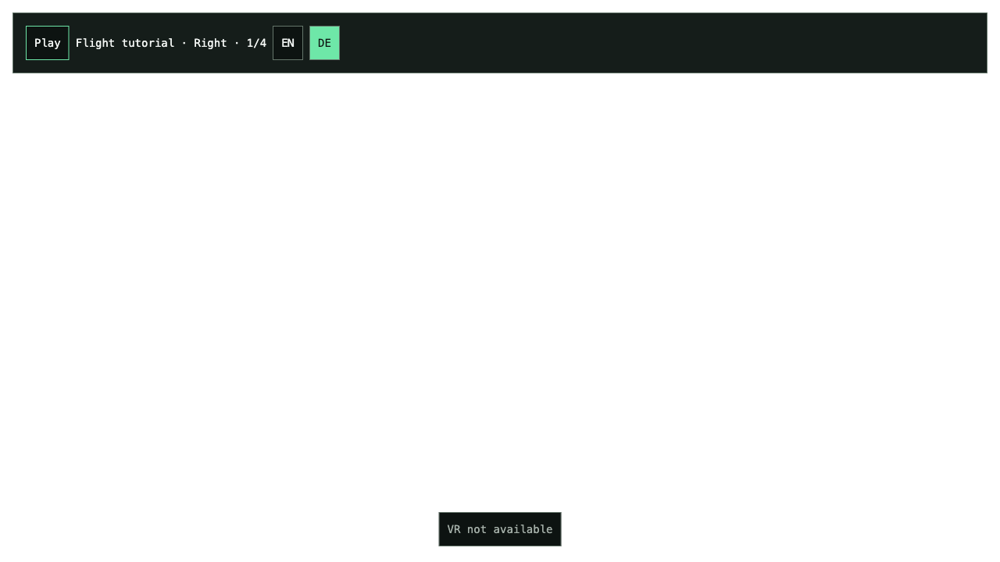

Final combined verification at `4bb726a`: 37 focused Start/Air/Show/audio/restart
tests, repository lint and production build/typecheck passed. The first course
with longer arrow readability exceeded the minute; the preserved timeout worked,
but successful practice was too long. Authored ring lead ranges were shortened
to 10–11 m initially and 9–10 m subsequently, still expanded for narrow views.
Preview rings begin farther along the short curve, after their formation time.
The corrected course finished four real passages with zero misses and retained
the complete closing, handing off at about 69.6 s. Native arrow onsets were
19.314/1.150/2.661/1.054 s; every ring reveal followed its arrow by about 2.2 s.
No closing-list mention generated another direction cue.

Shorter nearby rings initially increased GPU median/p95 to 0.160750/0.321250 ms.
The final four-pixel point-size cap preserves all 32k training/6k Air particles
while reducing the conservative training sprite-square coverage bound from
1,152,000 to 512,000 pixels. At 1920×1080 DPR1, the final 3,953 measured draw frames
had CPU median/p95/p99 0.3/0.4/0.5 ms and GPU 0.099500/0.286291/0.379749 ms.
The preceding arrow-first baseline was 0.103375/0.307708 ms GPU median/p95.
For the common 20–55 s practice window, GPU median/p95 changed from
0.127749/0.319458 to 0.112374/0.299625 ms. No course-time buffer/program/texture
creation; upload p99 zero, bounded Air face-update peak 49,920 bytes. RAF median/
p95/p99 was 16.7/18.1/18.5 ms. The 4.317 s gap between recorded draws is the
intentionally empty opening: this probe records draw frames only, and recorded
no corresponding course long task. It is not a multi-second render-loop stall.
No Windows-PCVR acceptance or statistically isolated speedup is inferred.

Raw final evidence: `benchmark-results/issue-50/spoken-staging-bounded/probe.json`,
served asset digest `dfaa349afded276d6b4d6520d75c366558eddf792d8f8aa254d149d368153603`.
The browser assertions passed; raw native media cancellations at replacement/
disposal remain reported as ERR_ABORTED by the harness. The source change is a
scoped staging feature, not a code-reduction claim. EN voice policy and physical
listening/comprehension/90 Hz acceptance remain open.

## Tutorial wind and ring variation — 2026-09-09

Tutorial playback now borrows the existing organ wind at strength 0.22, scaled
by the spoken room reveal and halved during narration. Show retains transport
and organ ownership; integrated playback reuses the prepared organ, while
standalone practice creates only its wind layer. Pause silences its input.
Ring voices switch among the same three decoded samples and choose bounded
new offsets on each goal/attempt, avoiding immediate sample repetition. Pause
retains the selection; the arrow remains authored. No additional sample fetches,
players, reverb instances or per-frame randomization are introduced.

Repository lint, production build/typecheck and 11 targeted sound/restart tests
passed. Tests exercise 100 course changes and 3,600 unchanged frames with three
decodes, four granular voices and one granular reverb, plus wind-only disposal.
The headed production-browser course completed all four goals and the main
handoff. Its audio diagnostic observed silence before room formation (RMS
1.54e-10 at 5 s), then wind output (4.66e-5 at 16 s, 1.15e-4 at 18 s), and three
reused native grain buffers across the course. Standalone `/start?language=de`
produced wind RMS 9.23e-5 at 16.01 s before any grain starts; Pause and navigation
completed without page errors. These are signal checks, not listening approval.

Raw integrated evidence: `benchmark-results/issue-50/tutorial-wind-variety/probe.json`.
Served asset digest: `5e436ac878abc09f5400cb128a7cae23b982f0b3c81130894c69c50da858ea2c`.
Course assertions passed. The generic harness still exits nonzero for two
reported native narration ERR_ABORTED cancellations at replacement/disposal;
there was no course assertion failure. This audio diagnostic inserts an analyser
at the native destination and is not an isolated rendering-performance comparison.
Windows-PCVR and physical sound balance/listening acceptance remain open.

Tone 14.8.49's existing
[ToneAudioBuffer.set](https://github.com/Tonejs/Tone.js/blob/14.8.49/Tone/core/context/ToneAudioBuffer.ts)
retains the native buffer reference; the existing
[GrainPlayer](https://github.com/Tonejs/Tone.js/blob/14.8.49/Tone/source/buffer/GrainPlayer.ts)
accepts the chosen start offset. No dependency or alternate audio runtime was added.

## Motion-history course prediction — 2026-09-09

Start now estimates curvature from successive world-space movement segments,
smoothed over 0.25 s, capped at 0.12/m and decaying over four metres. Arrows use
that forecast near the captured viewing ray; counted and preview rings share
predicted centers and tangent normals. A one-time linear corridor correction
preserves discoverability under the existing view assistance, followed by the
flight ceiling. No generated anchor follows later movement. Pause, reset,
activation, long frame gaps and implausible displacement discard old curvature.
The existing World loop owns updates; flight, narration, rendering and audio
ownership are unchanged. This replaces the one-frame direction/random lateral
placement and independent Hermite preview shape. Both lateral offset settings
and the old matrix/quaternion construction are removed. Fixed three-preview
and 32k/6k particle capacities remain unchanged; no new dependency or frame job.

Repository lint, build/typecheck and 31 focused Start/particle/restart tests pass.
Regression coverage includes changing travel versus changing head yaw, tangent
normals, world-fixed anchors and reset. The first targeted run caught a ceiling
case: view correction must use the uncut forecast before ceiling clipping. The
production fix preserves the original reachability assertion. Headed Chromium
at 1920x1080 DPR1 completed all four actual M5-driven passages with no misses,
then played the full closing and automatically entered main playback at about
69.3 s (before: 70.0 s). This is a software exercise, not human comfort acceptance.

In the common 20–55 s window, before CPU median/p95 was 0.3/0.4 ms and GPU
0.111333/0.313625 ms. The first candidate run measured CPU 0.3/0.4 ms and GPU
0.255541/0.319749 ms. Because that median shift was unexplained, the unchanged
candidate was exercised again: CPU 0.3/0.5 ms, GPU 0.113875/0.309583 ms. The large
GPU median shift did not reproduce; no speedup is claimed. RAF median/p95 was
16.7/18.1 ms before and 16.7/18.2 ms in the confirmation. Course-time GPU resource
creation remained zero; buffer upload p99 zero and maximum 19,200 bytes in the
before/first-after window. No shader, particle count or draw topology changed.

Raw probes: `benchmark-results/issue-50/motion-before/probe.json`,
`motion-after/probe.json` and `motion-confirm/probe.json` under the same parent.
Before served asset digest: `5e436ac878abc09f5400cb128a7cae23b982f0b3c81130894c69c50da858ea2c`;
after: `82ea22ba187d8464abc066ff2f5146ca33f29b92015bbba9dfd06099393711ca`.
All course assertions passed. The generic harness reports native narration
ERR_ABORTED cancellations during replacement/disposal and consequently exits
nonzero; these remain visible in the raw evidence. There were no course assertion
failures. Physical headset prediction/comfort and Windows-PCVR acceptance remain
open. The change adds bounded prediction logic, not a code-reduction claim.

## Reachable guidance and independent particle lifetimes — 2026-09-09

The user's schematics are conceptual references, not runtime screenshots or
geometry/count requirements. The Scent shaders/palette informed calmer wind and
restrained feedback; no sibling module import or new physics pipeline was added.

| Requested principle | Current implementation |
| --- | --- |
| Separate view, forecast and guidance | World publishes eye and rig facts; rig movement supplies smoothed speed/curvature, while eye segments retain swept passage semantics. A gentle lesson bias and visibility correction form guidance without writing controls. |
| Short forecast, uncertainty versus reachability | A speed-dependent horizon and heuristic spread describe uncertain continuation; a separate fixed 33-sample table checks existing yaw/climb limits. Visibility may require longer lead than the preferred six-second forecast; this is guidance, not a claim of precise long-range prediction. |
| Rings along the curve | Cumulative sampled arc length selects three equally spaced previews before the counted goal; transported up vectors keep orientations continuous. |
| Plan only future sections | Visible sections retain their anchors. New unshown sections use current motion; misses fade/recycle instead of forcing an unreachable connection. No automatic steering or per-frame movement of targets. |
| Bounded ownership | One form-particle draw, three preview slots, two arrow slots and 125 existing world-anchored Air chunks. No new renderer, loop or time owner. |
| Reliable passage and feedback | Existing swept crossings, once-only goals and per-preview pulses remain. Misses award nothing; sound keeps the existing fixed object bindings and cleanup. |
| Calm independent arrows | Arrow/ring samples were already separate. Removed the one-second arrow release tied to tunnel birth. Arrows now wait two playing seconds entirely outside view, then release for three seconds; an old cue uses the second fixed slot without blocking speech or progress. |

The shader retains exact critically damped gathering and linear-drag impulses.
Slow world-correlated breeze plus small seeded eddies replace the more restless
local movement; formed bodies drift less than loose particles. The neutral/silver
base carries only slight orange arrow and turquoise hit accents from authored
Scent palette literals. An initial 18k ambient trial still looked sparse in the
actual screenshots, so the final recipe uses 48k ambient particles (384/cell),
up from 6k. The form pool is 40k rather than 32k to retain existing per-body density
while allowing an old arrow to coexist. Two arrow roles use identical immutable
samples so retirement does not morph one cloud into another.

Repository lint, production build/typecheck and 49 focused tests passed; the
small subsequent whole-arrow visibility/paused-release refinement passed all
21 Start tests again. Coverage includes head translation versus rig movement,
arc spacing, transported orientation, fixed anchors, 100 miss/retry cycles,
50 retiring-arrow cycles/1,500 updates without particle attribute uploads,
spatial audio and restart cleanup. Two old miss fixtures assumed a world-aligned
ring plane; they now actually fly outside the tilted plane while preserving
zero-award/recycling assertions. Floating-point orientation uses a tight distance
tolerance rather than exact binary equality.

Headed production-browser success runs completed right/left/up/down without
misses and retained the full closing (handoff around 70.7 s). A separate real
forward-flight run missed/recycled twice with zero goals, then exercised Begin
experience successfully. The attempted head-only pointer-lock run timed out;
Chromium did not grant lock. This remains explicit in `guidance-look/probe.json`;
`guidance-deviation/probe.json` records the available interaction instead. The
head-only invariants pass isolated tests, not physical/XR/browser-pointer proof.
All paths are under `benchmark-results/issue-50/`.

Actual final browser screenshots, not renders from the inspiration images:

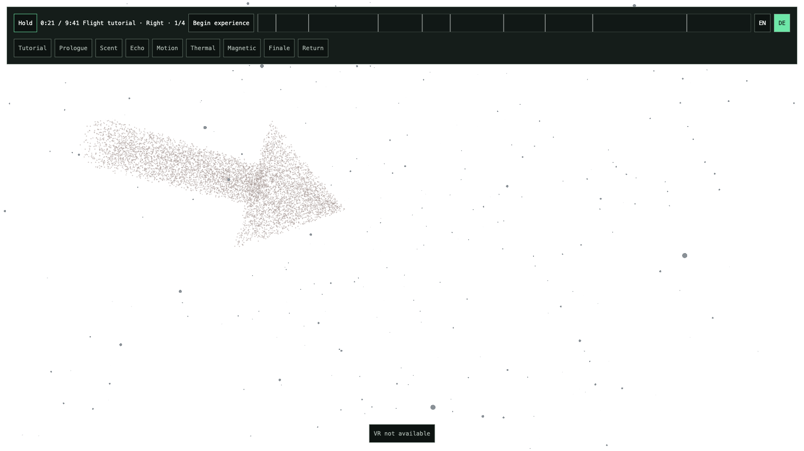
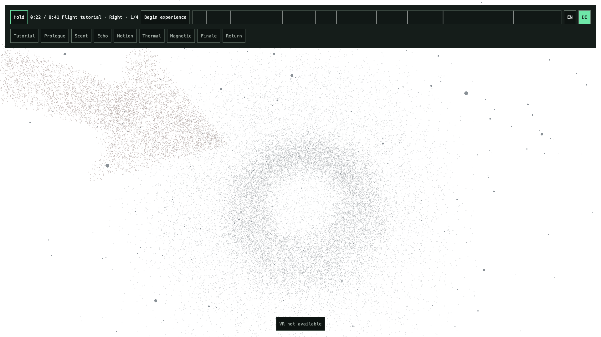

The screen sequence shows distinct bodies, fine grains and a restrained warm
arrow; the arrow leaves the image as the pilot turns while the tunnel forms.
Photographic clouds are not claimed. Animation comfort, full headset field of
view, spatial listening, EN policy and Windows-PCVR USB-C 90 Hz remain open.

Comparable final measurement uses the same probe as the preceding motion revision,
without the extra screenshot/uniform inspection. In the 20–55 s window, prior
CPU median/p95/p99 was 0.3/0.5/0.6 ms and GPU 0.113875/0.309583/0.373291 ms;
final CPU was 0.3/0.5/0.6 ms and GPU 0.120583/0.306875/0.369583 ms. RAF
median/p95/p99 was 16.7/18.2/18.5 ms. The screenshot run had an elevated GPU
median (0.265749 ms, p95 0.333125); it is retained rather than used as the
comparable timing claim. No speedup or Windows performance certification follows.
Course-time buffer/program/texture creation remains zero, upload p99 zero;
peak Air face uploads rise from 19,200 to 153,600 bytes with eightfold density.
Form attributes use 1,760,000 bytes and Air attributes 768,000 bytes per CPU/GPU
copy, versus 1,504,000 combined before. These are attribute budgets, not total
application memory. The 40k form-point four-pixel cap bounds sprite-square
coverage at 640,000 pixels per eye before culling; Air retains its existing
point path. No additional draw or per-particle CPU update was introduced.

Raw final sources: `guidance-final/probe.json` (screenshots) and
`guidance-measured/probe.json` (comparable timing), under the evidence parent above.
Served asset digest: `7e5c7d8f9ffa9c7e10ba92fcd06f8d1b85fb645ebac5b5ce9c26487f400c9d23`.
Course assertions passed; the generic probe exits nonzero for reported native
narration ERR_ABORTED cancellations during replacement/disposal. Those reports
are preserved, not suppressed. This is requested feature growth, not a
code-reduction claim.

## Spatial scene composition and sampled effects — 2026-09-09

The [seven-scene script](../../direction/tutorial-scene-script.md) pairs seven
independent concept images with existing German clip-local markers and participant
behavior. These images are aspirational compositions, not screenshots or budgets.
The implementation preserves spoken gates, 60 seconds plus the full earned closing,
manual handoff, separate arrow/ring lifetimes and existing motion ownership.
Arrows capture a forward/lesson axis once at birth. A first browser candidate
incorrectly used the head-projected arrow tip as the steering hint and missed Down;
restoring the motion-relative hint fixed it without changing the test or locomotion.
A regression checks that upward gaze cannot reverse the downward lesson.

Actual production captures:

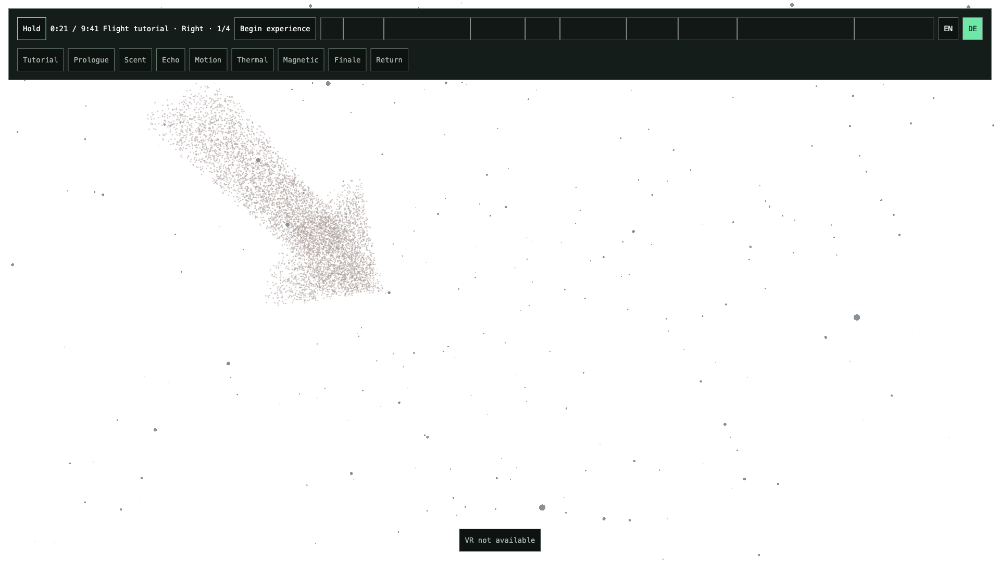
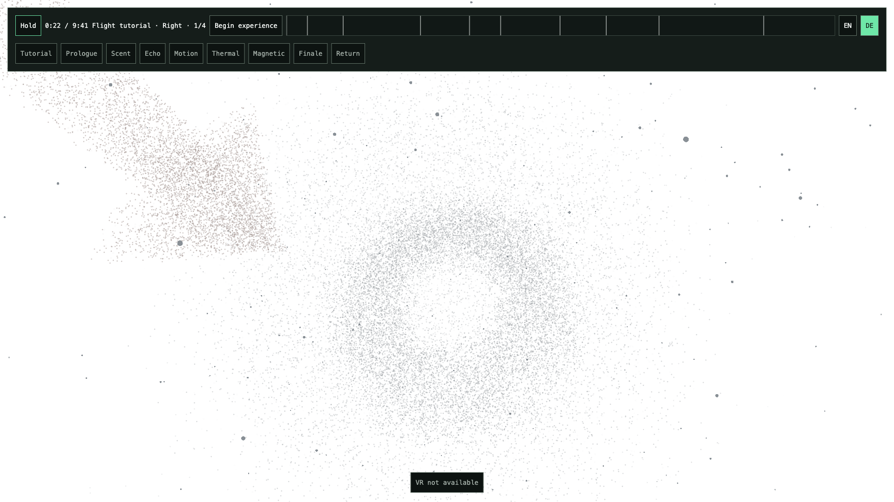
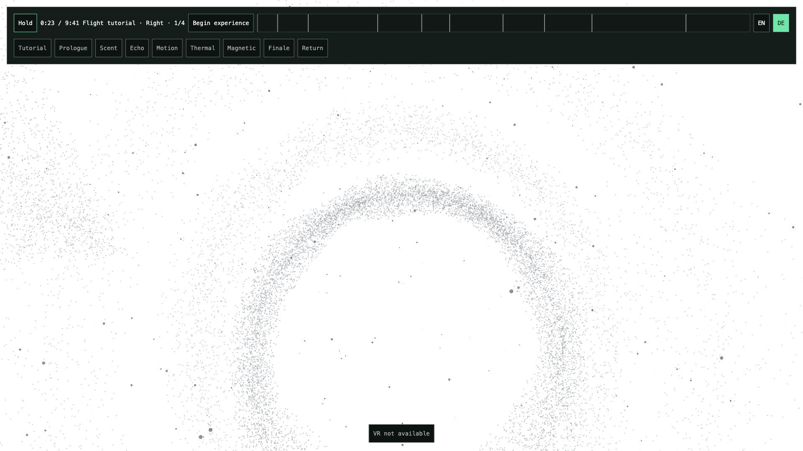

The captures show volumetric grains, separate birth regions and open apertures.
They remain more point-like and less cloudy than the concept images; photographic
cloud banks and cinematic light scattering are not claimed as implemented. Human
visual/comprehension approval remains open. Orange/turquoise accents stay restrained.

### Implementation and verification

- Existing 40k form/48k Air capacities and two draws remain. The 4,865 haze points
  may reach 8 pixels while 35,135 fine form points remain capped at 4. The maximum
  form sprite-square proxy rises from 640,000 to 873,520 samples per eye/draw
  (+36.49%); this deliberately conservative bound includes inactive slots and is
  not a measured fragment count. Actual size attenuation and visibility reduce it.
- Fixed attributes remain 2,528,000 bytes per CPU/GPU copy. No new render target,
  instancing system, light, postprocess or frame-time attribute rewrite was added.
- Two CC0 mono samples add 2,352,400 decoded float32 bytes at 48 kHz, two pooled
  Tone players and one spatial source (five total). Asset preparation, source
  links and licenses are in the [effects README](../../../public/audio/tutorial/effects/README.md).
  Crossing events borrow the latest ring center; sound copies it only on passage.
- Combined focused run: 52 tests passed. After the browser-discovered correction,
  all 23 Start tests passed, including the added gaze regression. Final lint,
  TypeScript/Vite production build and diff checks pass. Build retains the existing
  large-chunk advisory. Audio tests exercise 200 events, pause, ducking and cleanup.
- Corrected screenshot, measurement and native-audio browser runs all completed
  four actual M5-controlled goals before timeout and retained the earned closing
  before automatic main handoff. No runtime exception or shader error occurred.
  Native-media cancellation requests on cue replacement/teardown remain recorded
  as `ERR_ABORTED`; these make the diagnostic wrapper exit 1 despite passing
  interaction assertions and are not silently removed from evidence.
- Native-audio observation recorded 15 whoosh starts sharing one decoded buffer
  across preview and counted crossings. The complete route need not hit every
  preview. The quiet opening/room RMS observations and bounded sample decode counts
  are preserved; listening quality and headset localization are not established.

### Comparable local measurement

Headed Chromium, 1920×1080, DPR 1, Apple M2 Max/ANGLE Metal, shared M5 course,
show seconds 20–55. The previous commit was rebuilt read-only in `/tmp`; its
asset digest exactly matches the earlier reference. No repository branch changed.
[Compact measurements](scene-flow-measurements.json) retain candidate failure,
source digests, cancellations and every comparison below.

| Run | CPU median / p95 ms | GPU median / p95 ms | RAF p95 ms |
| --- | --- | --- | --- |
| Earlier `315d89e` measurement | 0.3 / 0.5 | 0.120583 / 0.306875 | 18.2 |
| Current-condition `315d89e` control | 0.3 / 0.5 | 0.237750 / 0.340791 | 18.1 |
| New composition/effects | 0.3 / 0.5 | 0.151791 / 0.345625 | 18.1 |
| Separate new screenshot run | 0.3 / 0.5 | 0.132124 / 0.320124 | 18.1 |

The contemporary control shows substantial median variability; these measurements
support neither a GPU speedup nor a material frame-time regression. Current GPU
p95 differs by 0.004834 ms from that control. Upload maximum remains 153,600 bytes
for Air recycling; current upload p99 is 6,144 bytes versus zero in control because
streaming crossings differ. No course-time buffer/texture/program creation or
buffer allocation occurred. Physical Windows-PCVR USB-C 90 Hz, spatial listening
and first-visitor comfort remain unverified; standalone PICO is a separate project.

### Version-specific implementation research

Context7 and installed Three.js 0.185.1/r185 sources informed the decision to keep
one Points draw. [PointsMaterial](https://threejs.org/docs/pages/PointsMaterial.html)
and [r185 point shaders](https://github.com/mrdoob/three.js/blob/r185/src/renderers/shaders/ShaderLib/points.glsl.js)
retain hardware-dependent point-size limits; the separate haze cap changes no
attribute layout. [InstancedMesh](https://threejs.org/docs/pages/InstancedMesh.html)
would not reduce the existing single draw and would add quad vertices without
removing transparent overdraw. [WebXRManager](https://threejs.org/docs/pages/WebXRManager.html)
still owns per-eye rendering. Existing bounds and explicit resource disposal stay
with the current effect owner; no renderer migration or standalone path was added.

## Shared overlay without a standalone UI mode — 2026-09-09

The tutorial already used the root experience's declared rehearsal controls;
there was no custom element or separate tutorial document. Removed the remaining
`standalone` presentation flag and the standalone entry's unused full-piece
schedule dependency. One transport now consumes an optional real schedule and
Show's existing handoff availability. Standalone practice displays elapsed time;
only a prepared show supplies chapters/total time and the handoff command.
No duplicate markup, CSS, controller, runtime or transport owner was introduced.

Lint, TypeScript/Vite build and diff checks pass. A production-browser check
exercised `/start?language=de`, `/?language=de` and `/white-world`; Play/Hold,
frozen readout, EN/DE state, integrated direct handoff, one shared bar and the
absence of a fabricated standalone timeline pass. At 1440 and 390 pixels the
controls stay within the viewport. No page errors occurred. The initial probe
needed to await the normal frame-delivered language observation before asserting;
no production behavior was changed for that probe timing.

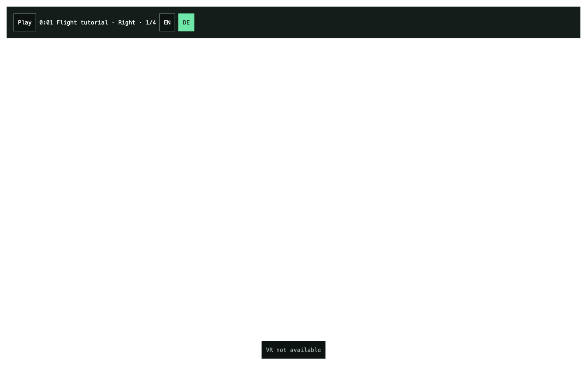

## Aligned approach and gentle audio release — 2026-09-09

The arrow reserves its first ring opening when it appears. Its tip points into
that opening; a bounded shared placement correction preserves both positions
relative to each other. The ring section becomes visible only after actual
turning, following the existing spoken cue. Two reused cubic curves replace the
independent ring planner: the approach requires steering, then three preview
rings and the counted goal follow the short continuation. The existing 33-point
table checks reachability. Appeared objects remain fixed in world space.

Real M5-driven browser iterations exposed and repaired three problems: requiring
the whole ring inside the head view blocked the pitch-assisted approach; a
10–11 m arrow lead left too little of the approved minute for the fourth task;
moving only the arrow toward gaze made its direction misleading. The final
candidate checks the opening center, uses an 8–9 m lead at the unchanged 2 m/s
tutorial speed, and translates the arrow and reserved entry together by at most
half the minimum ring radius. Earlier failed candidates remain identified in
[the measurements](aligned-release-measurements.json).

Wind is reduced by 8 dB, passage effects by 10 dB and grain layers by 12 dB;
dry/send levels also decrease. Retiring object sources keep their fixed position
and reach zero over 1.2 s before stopping. Pause uses an 80 ms release. The
existing hall drains over four seconds across the main-piece handoff, with quiet
wind feeding it through earned closing narration. Run retains one retiring owner;
restart waits for its release instead of allocating another spatial voice pool.
Rapid pause/resume preserves the wind loop. Closely spaced passage samples
coalesce rather than relocating an audible previous sample.

The focused Start, particle, audio and Run checks pass (46 tests across affected
runs), as do TypeScript/Vite build and lint. The headed Chromium production
course completes four tasks without misses, plays the full closing and enters
the main piece at about 72 s. Native source scheduling confirms delayed stopping;
owner-release and restart tests verify disposal. A native convolver disconnect
alone is not an owner-disposal signal: standardized-audio-context can passivate
silent native connections before wrapper disposal. Expected media-request
cancellations at cue replacement/teardown are recorded separately from failures.

Comparable 1920×1080, DPR 1 Mac browser samples over show seconds 20–55 have
CPU p95 0.5/0.4 ms and GPU p95 0.320124/0.314874 ms (previous/current).
No course-time GPU resource creations occurred; median/p95 attribute uploads
remain zero, maximum 153,600 bytes at recycling. This is no material regression
in the local workload, not evidence of a speedup or physical 90 Hz acceptance.
The unchanged capacities are 40k form and 48k Air points, with 2,528,000 bytes
of particle attributes per CPU/GPU copy. The four-second audio drain adds no
second tutorial pool.

These are actual implementation screenshots, not concept art. Visual review,
spatial loudness/click listening and Windows-PCVR USB-C acceptance remain open.

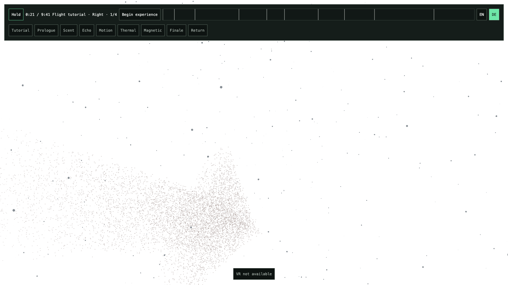
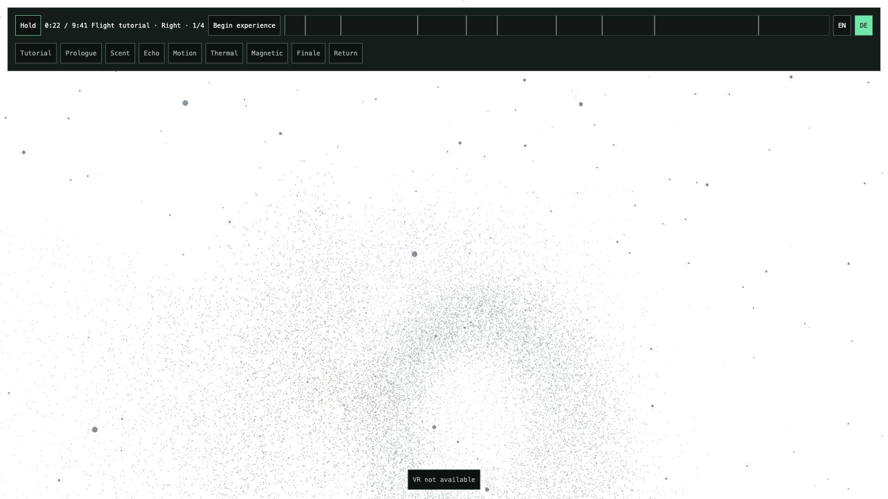
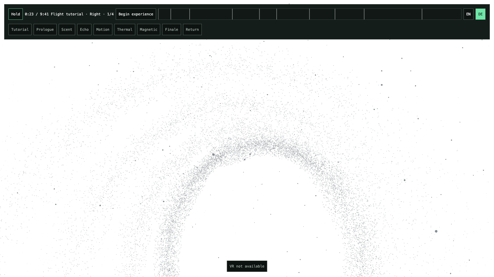

## Readable cue faces and temporary EN voice — 2026-09-09

World-up orientation made vertical arrows edge-on. Start now projects the captured
eye-to-arrow vector onto the plane perpendicular to the promised entry axis,
then derives its orthogonal broad-face basis. This maximizes the visible face
without changing the tip direction, course or world anchor. It uses the installed
Three.js r185 Vector3 operations, checked through Context7 and local source. No
new resources, attributes, per-frame work or camera-following transforms are added.
The fixed anchor can still leave the frame as the visitor flies past it.

EN previously selected no recordings. The user approved temporary reuse of the
five DE clips and their phrase markers; replacement English recordings remain
pending. German playback and the narration runtime remain unchanged.

25 Start tests including broad-face/axis/fixed-pose assertions and five existing
audio-composition tests pass. Build and lint pass. A real M5-driven production
browser course captures all four arrows and passes four goals/full closing/handoff.
Build digest: `6674806ff640b4c1b4b25e5e095be1615b42ea28315cdbaaa6d80f43bf65db74`.
Native DE and EN playback starts at offset zero, resolves successfully and advances
unmuted at volume one. Expected canceled media requests at clip replacement are
not playback failures. Headset readability and spatial listening remain physical
acceptance; temporary DE speech on the EN selection is not an English translation.

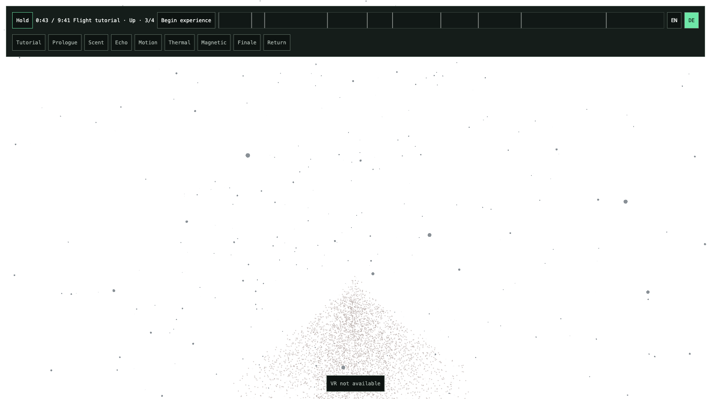
