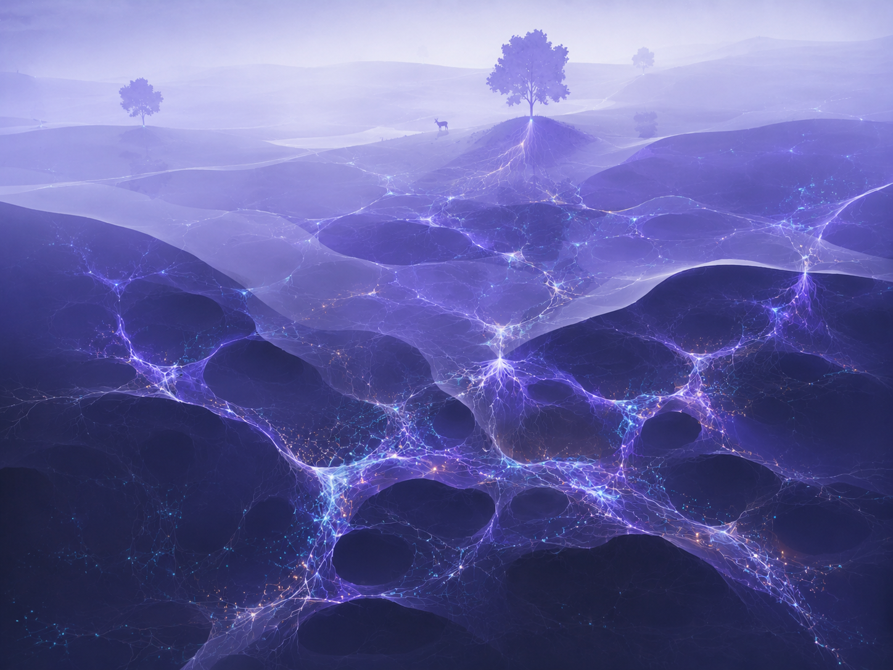
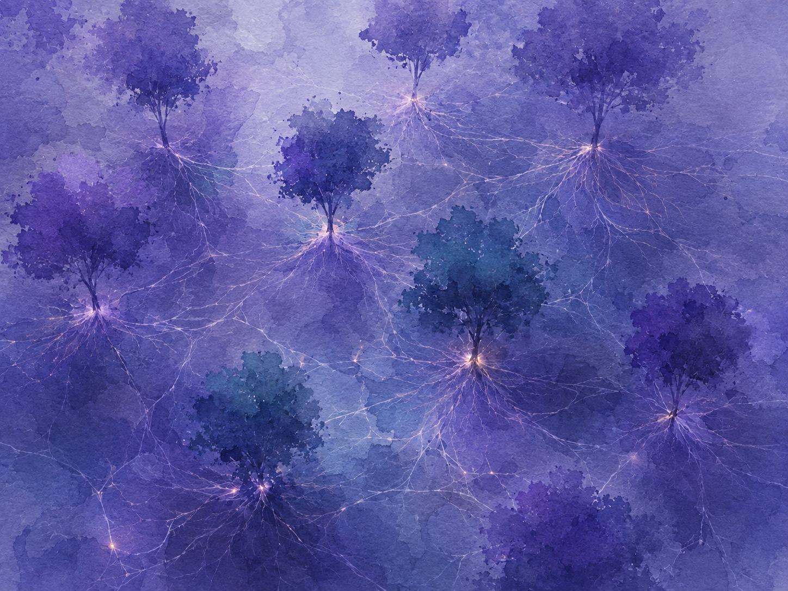
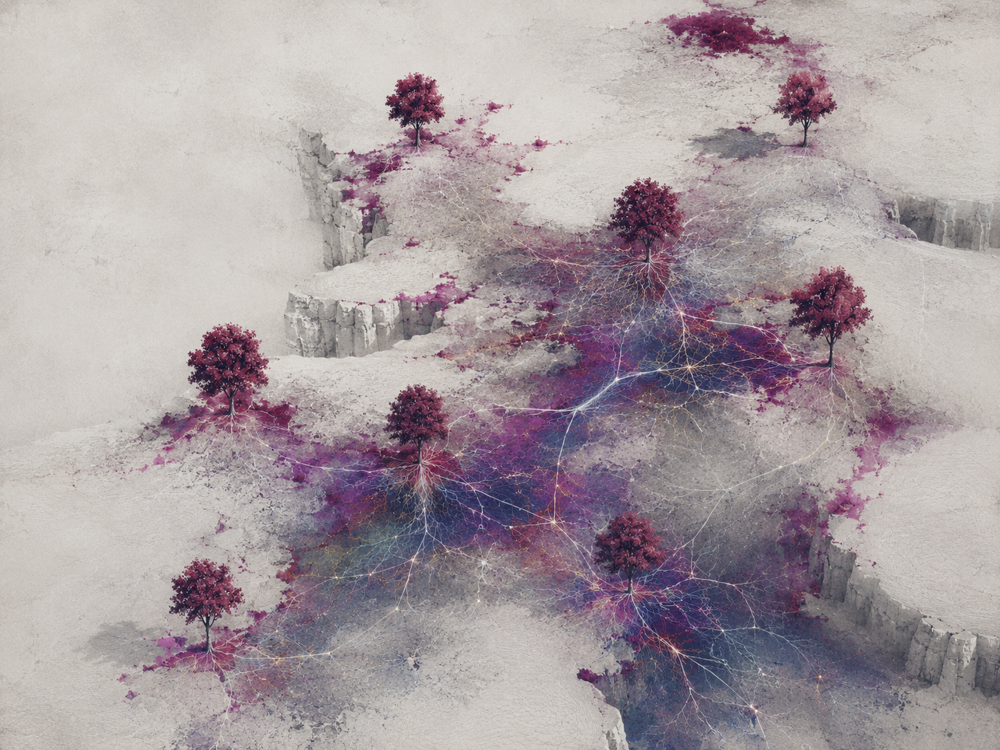

# Connections Atmosphere References

Status: requested visual direction, not implemented by this documentation change.
The project owner supplied these three images on 2026-09-08; the original PNGs
are preserved without modification. Their original creator/source is unspecified.

[Issue #114](https://github.com/Strehk/becoming-many/issues/114) owns scope and
acceptance for a stronger final Connections reveal: luminous mycelium, visibly
transparent ground and a more pronounced change in the world's atmosphere.

## Luminous Underground

Use the layered ground transparency, depth and strong violet/cyan filaments with
warm junctions as guidance for the reveal. The soft atmosphere above contrasts
with the brighter network below.

## Luminous Tree Network

Use the readable relationships between trees, branching light roots and brighter
junctions. A coherent blue-violet atmosphere makes the network feel part of the
whole world.

## Pale Ground Reveal

Use the contrast between a restrained surface, plum/blue revealed areas and fine
light roots. This offers an alternative contrast reference; it does not require
new plateau geometry or replacement trees.

These are mood and visibility references, not exact camera, geometry or rendering
specifications. Exact palette, transparency, glow technique and transition curve
remain implementation choices evaluated in the issue. The existing world and
its final layered composition remain the context.
