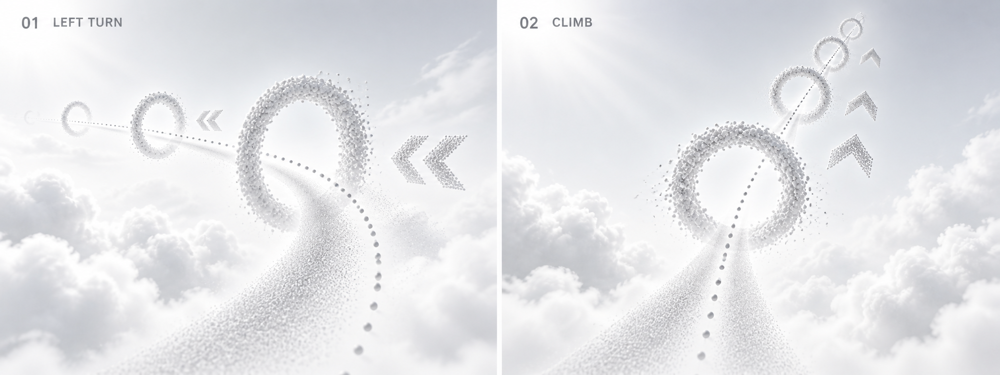
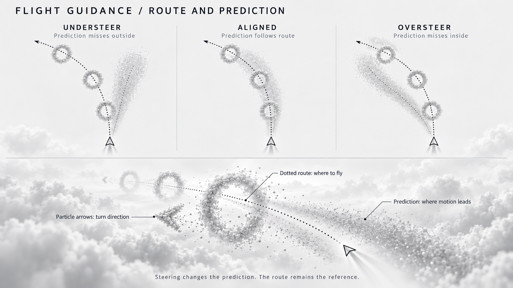

# Start flight guidance concepts

Target-state discussion material, 2026-09-10. These images are proposals, not
runtime screenshots, an implementation specification or evidence of VR performance.
No application code was changed for this concept study.

## User direction

Begin in complete white, then gradually reveal a neutral grayscale sky, clouds
and soft directional light. A small point cloud indicates a curved route through
ring openings. Particle arrows indicate the way. The predicted flight route
changes as the flyer moves and remains a curve. Colors in the supplied sketches
only distinguish elements; they are not the desired palette.

## Working interpretation

The illustrations distinguish the intended route from the predicted trajectory:

- The narrow dotted route passes through ring centers and provides a reference.
- A short, translucent particle corridor describes where current flight motion
  leads. Steering changes its curvature; it can diverge from the intended route.
- Airy particle rings mark passages. Particle arrows indicate upcoming turns.
- Sparse clouds provide depth and motion reference. Consistent directional light
  and a soft horizon establish spatial orientation without color.

The corridor's widening, exact density and appearance are visualization proposals,
not an approved probabilistic model. Its shape responds to flight motion rather
than head gaze alone. The diagrams compare steering responses from the same pose;
they do not prescribe flight equations or automatic steering. Distances, ring
counts, contrast and climb angles are illustrative, not authored level values.

## New views

The left view explores approaching a curved course; the right explores a climb.
Dots, rings and chevrons share a restrained particulate language. The diffuse
prediction remains distinguishable from the narrow route. Static images suggest
material and composition; they do not demonstrate animation or stereo readability.

The comparison explains insufficient, matching and excessive turn input. The
intended route stays fixed while the prediction changes. Geometry is schematic.

## Preserved user references

Original PNG files copied unchanged:

1. [Flight guidance principle](references/01-flight-guidance-principle.png)
2. [Left curve](references/02-left-curve.png)
3. [Climbing curve](references/03-climbing-curve.png)
4. [Directional arrows](references/04-directional-arrows.png)

## Project and technical references

Existing project concept images supplied to image generation:

- [Scene 03](../../direction/tutorial-storyboard/scene-03.png): particle material,
  curved ring sequence and spatial arrows.
- [Scene 04](../../direction/tutorial-storyboard/scene-04.png): rising ring sequence.

Their colored accents and dense cloud composition are not adopted. Existing code
was inspected only by a read-only exploration subagent; its implementation was
not used as the target design. The only retained interaction context is that body
input drives flight independently of head gaze.

User-selected Three.js references:

- [Sky](https://threejs.org/examples/#webgl_shaders_sky)
- [Instanced billboards](https://threejs.org/examples/#webgl_buffergeometry_instancing_billboards)
- [Volume cloud](https://threejs.org/examples/#webgl_volume_cloud)

Created with the built-in image generation tool. The complete
[prompt set](prompts.md) records the intended semantics and image-reference roles.
Cloud traversal, final prediction appearance, animation timing and VR performance
remain to be discussed or tested during a later implementation step.
