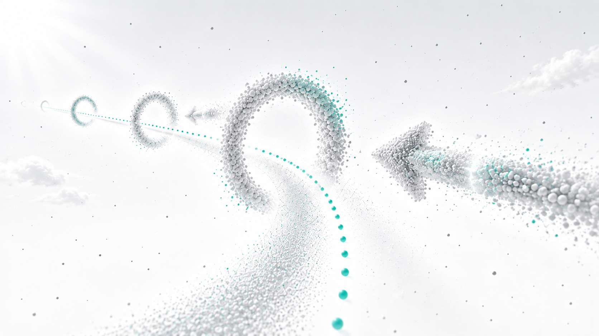
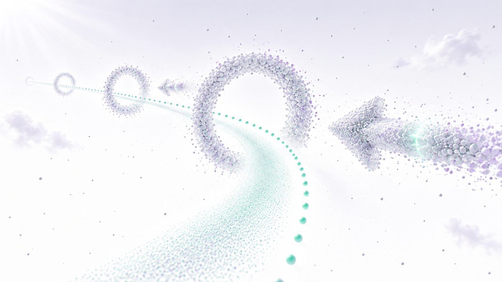
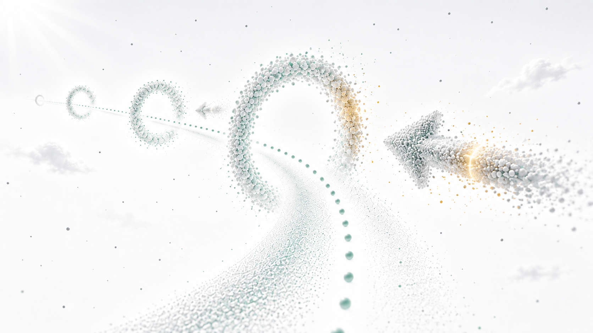

# Start flight guidance concepts

Target-state discussion material, 2026-09-10. These images are proposals, not
runtime screenshots, an implementation specification or evidence of VR performance.
No application code was changed for this concept study.

## User direction

Begin in complete white, then gradually reveal a neutral grayscale sky, clouds
and soft directional light. A small point cloud indicates a curved route through
ring openings. Particle arrows indicate the way. The predicted flight route
changes as the flyer moves and remains a curve. Colors in the supplied sketches
only distinguish elements; they are not the desired palette.

## Working interpretation

The illustrations distinguish the intended route from the predicted trajectory:

- The narrow dotted route passes through ring centers and provides a reference.
- A short, translucent particle corridor describes where current flight motion
  leads. Steering changes its curvature; it can diverge from the intended route.
- Airy particle rings mark passages. Particle arrows indicate upcoming turns.
- Sparse clouds provide depth and motion reference. Consistent directional light
  and a soft horizon establish spatial orientation without color.

The corridor's widening, exact density and appearance are visualization proposals,
not an approved probabilistic model. Its shape responds to flight motion rather
than head gaze alone. The diagrams compare steering responses from the same pose;
they do not prescribe flight equations or automatic steering. Distances, ring
counts, contrast and climb angles are illustrative, not authored level values.

## Revised views

The user corrected the first concepts: use large single full arrows with a shaft
and one head, sculpted from cloudlike particles, and a subtle traveling light
pulse. Keep the overhead steering explanation separate from immersive views.
The overhead diagram follows the original left-lean / neutral / right-lean sketch;
the previous understeer / aligned / oversteer comparison was rejected.

The left view explores approaching a curved course; the right explores a climb.
Dots, rings and full cloudlike arrows share a particulate language. The diffuse
prediction remains distinguishable from the narrow route. Static images suggest
material and composition; they do not demonstrate animation or stereo readability.

Three separate overhead diagrams show a left-curving, straight and right-curving
prediction corridor, respectively. Small hollow circles are diagram sampling
markers, not physical ring gates. These panels explain steering response only;
they do not compare missed targets or impose a shared left-turn course.

Three moments show a soft brightness pulse at the tail, shaft and tip of the same
arrow. The arrow stays visible. This is an animation storyboard, not a playable
animation or a final decision about pulse speed and intensity.

The [first flight views](01-flight-views.png) and
[rejected mixed system board](02-route-and-prediction.png) remain archived for
comparison only; they are superseded by these revisions. In particular, their
chevrons and understeer/oversteer diagrams are not the desired design.

## Color exploration

The user subsequently requested restrained color studies using the game's clean
landscape images as aesthetic references only. Start contains no landscape.
These options explore color without replacing the initial white opening or
establishing an approved palette. The later white-space and particle-ring images
refine the sparse atmosphere and dissolving particulate forms.

White and neutral gray dominate; turquoise marks the route and selected particles.
This is the most restrained color option.

Pale lavender shadows and particle accents connect to the game palette, with mint
along the route and prediction. This option introduces a broader atmospheric tint.

Muted mint accompanies sparse gold on the nearest ring and the arrow light pulse.
Gold is a proposed attention accent, not an approved success or target signal.

All three remain open sky with sparse clouds and ambient gray points, without
terrain, vegetation or a cloud floor. Their similar framing supports comparison,
but generated geometry is not identical. Pulse brightness and particle sizes are
illustrative; static images do not establish animation or VR readability.
The [color prompts](color-prompts.md) preserve the full generation instructions.

## Preserved user references

Original PNG files copied unchanged:

1. [Flight guidance principle](references/01-flight-guidance-principle.png)
2. [Left curve](references/02-left-curve.png)
3. [Climbing curve](references/03-climbing-curve.png)
4. [Directional arrows](references/04-directional-arrows.png)
5. [Game color atmosphere](references/05-game-color-atmosphere.png)
6. [Game palette reference](references/06-game-palette-reference.png)
7. [Game white atmosphere](references/07-game-white-atmosphere.png)
8. [White particle space](references/08-white-particle-space.png)
9. [Particle ring course](references/09-particle-ring-course.png)
10. [Particle arrow and ring](references/10-particle-arrow-ring.png)

The landscape references inform color and visual restraint only. Their objects
and embedded technical specifications are not instructions for Start.

## Project and technical references

Existing project concept images supplied to image generation:

- [Scene 03](../../direction/tutorial-storyboard/scene-03.png): particle material,
  curved ring sequence and spatial arrows.
- [Scene 04](../../direction/tutorial-storyboard/scene-04.png): rising ring sequence.

Their colored accents and dense cloud composition are not adopted. Existing code
was inspected only by a read-only exploration subagent; its implementation was
not used as the target design. The only retained interaction context is that body
input drives flight independently of head gaze.

User-selected Three.js references:

- [Sky](https://threejs.org/examples/#webgl_shaders_sky)
- [Instanced billboards](https://threejs.org/examples/#webgl_buffergeometry_instancing_billboards)
- [Volume cloud](https://threejs.org/examples/#webgl_volume_cloud)

Created with the built-in image generation tool. The complete
[original prompt set](prompts.md) and [revision prompts](revision-prompts.md)
record the intended semantics and image-reference roles.
Cloud traversal, final prediction appearance, animation timing and VR performance
remain to be discussed or tested during a later implementation step.
