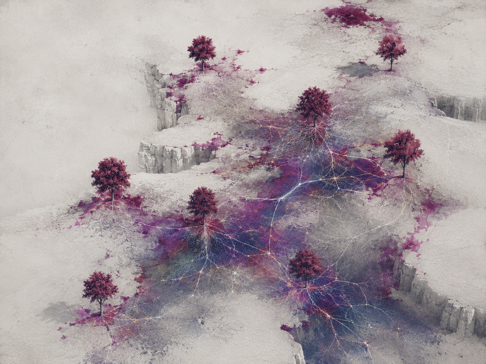
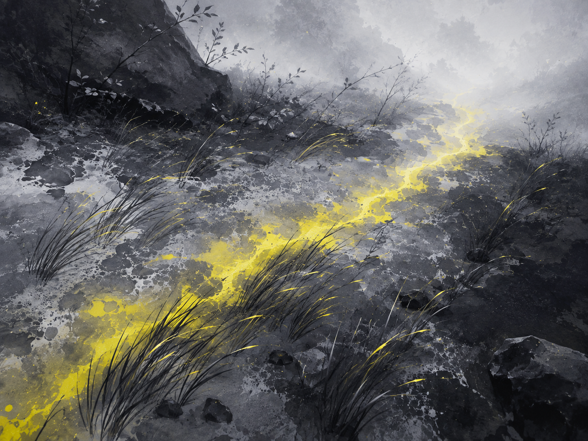
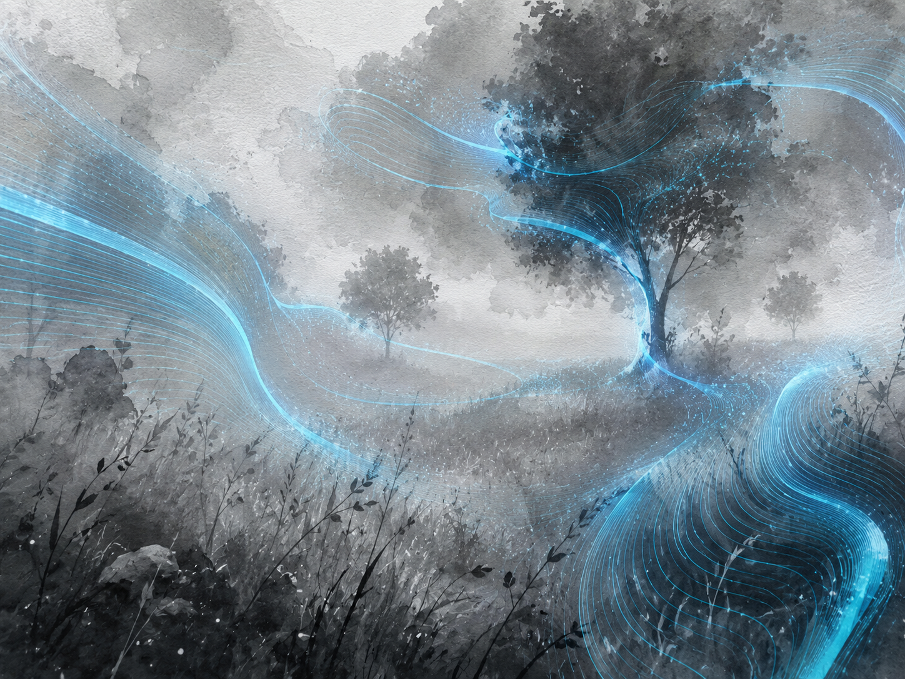
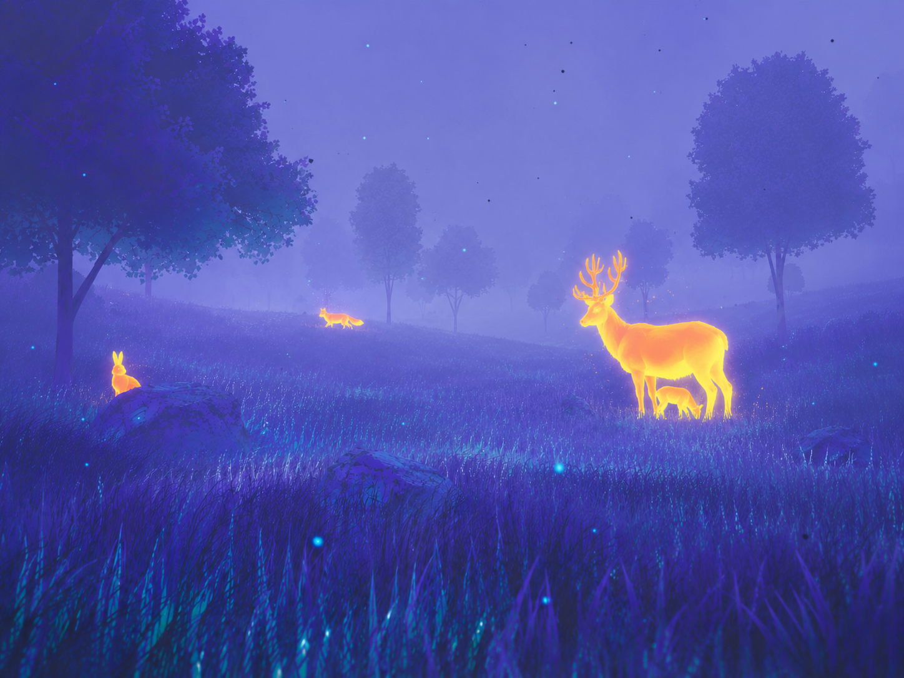

# Stylized World Mood References

These references explore a more abstract visual direction for Becoming Many. They are useful for perception states, transitions, and the final relationship layer, not as a replacement for the core world look.

All images in this collection were supplied by the project owner.

## Network Landscape

Sparse trees sit on pale plateaus while root-like energy networks connect the terrain. This is a strong reference for the mycelium and relationship state.

## Contrast Landscape

A nearly monochrome terrain uses a single warm signal to guide attention. This can inform heat, scent, or operator-guided focus cues.

## Flow Landscape

Blue procedural streams wrap around trees and terrain. The image is a reference for motion fields, depth cues, and non-verbal world signals.

## Fauna Landscape

Warm animal silhouettes emerge from a deep blue-violet field. This reinforces the existing luminous-fauna language while allowing a more graphic, stylized presentation.
