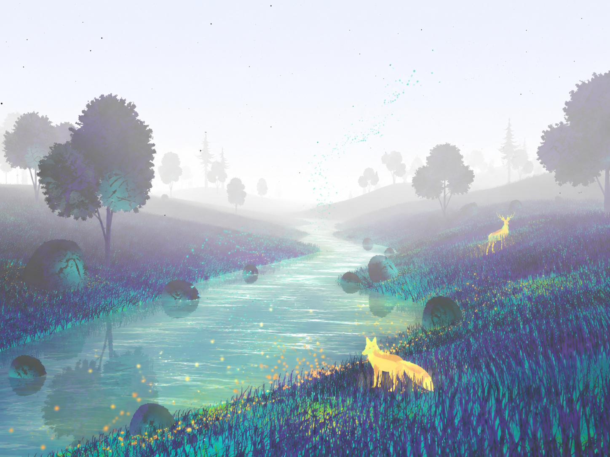
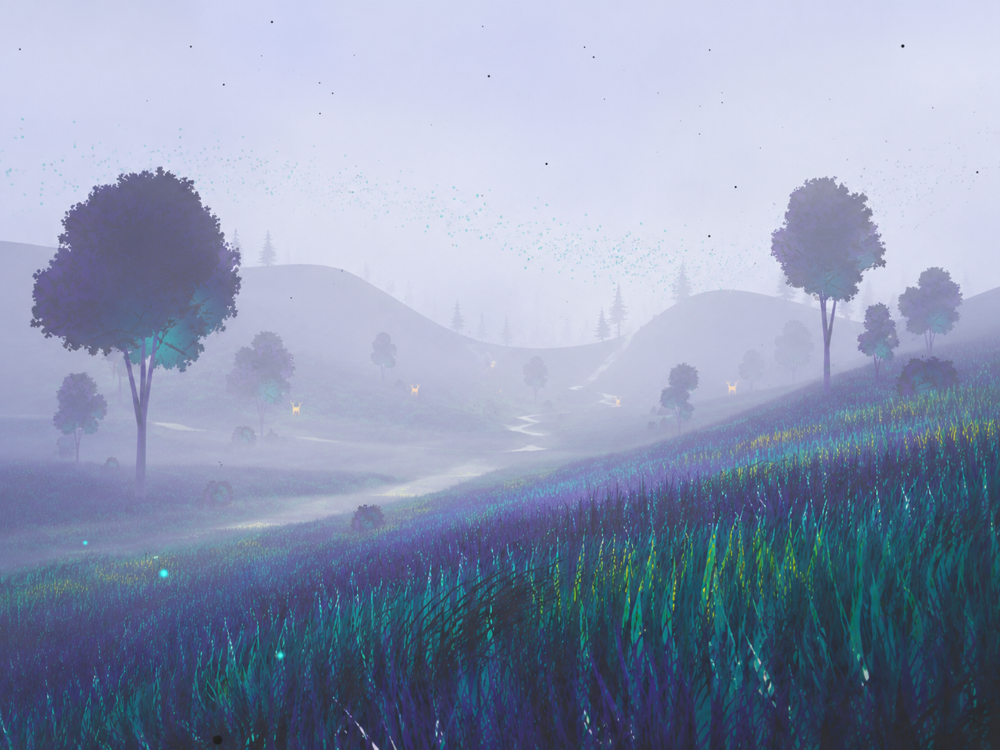
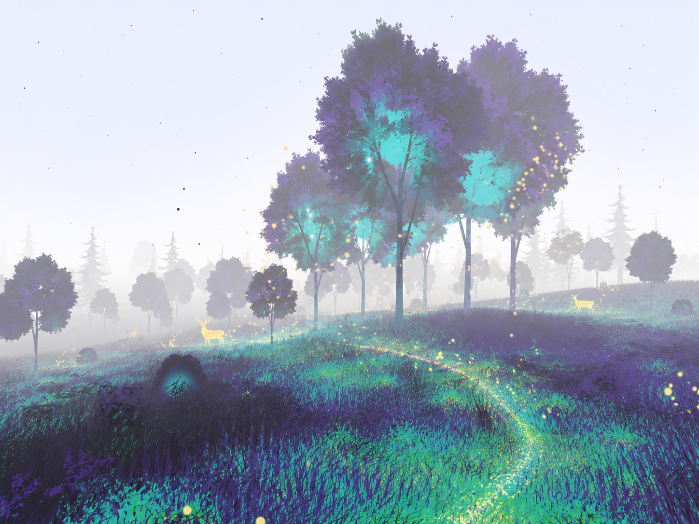
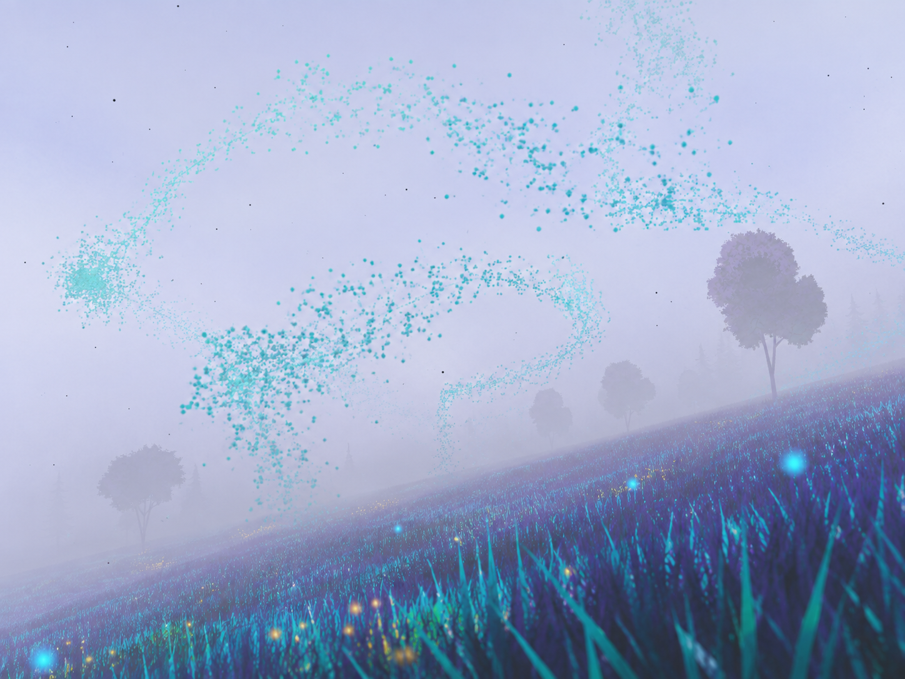
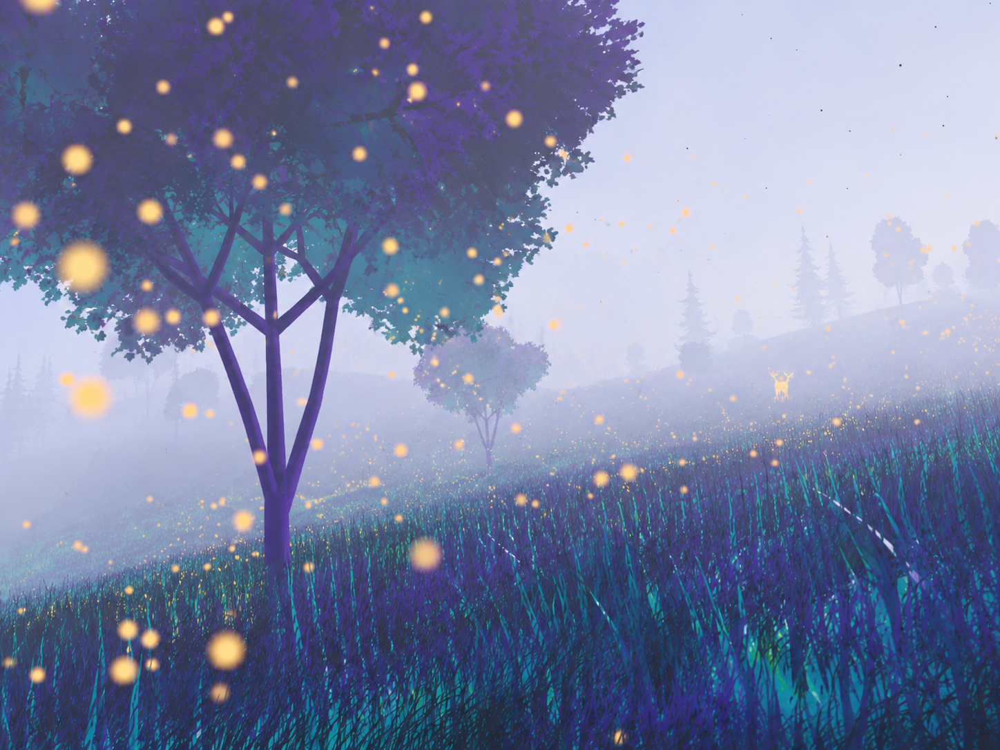
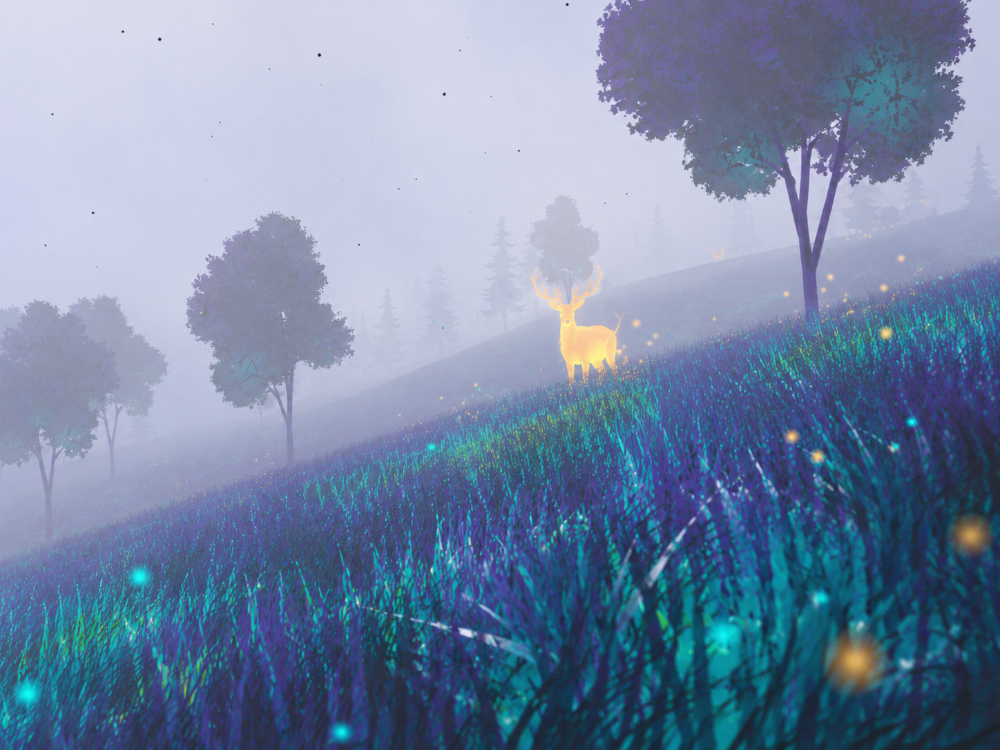
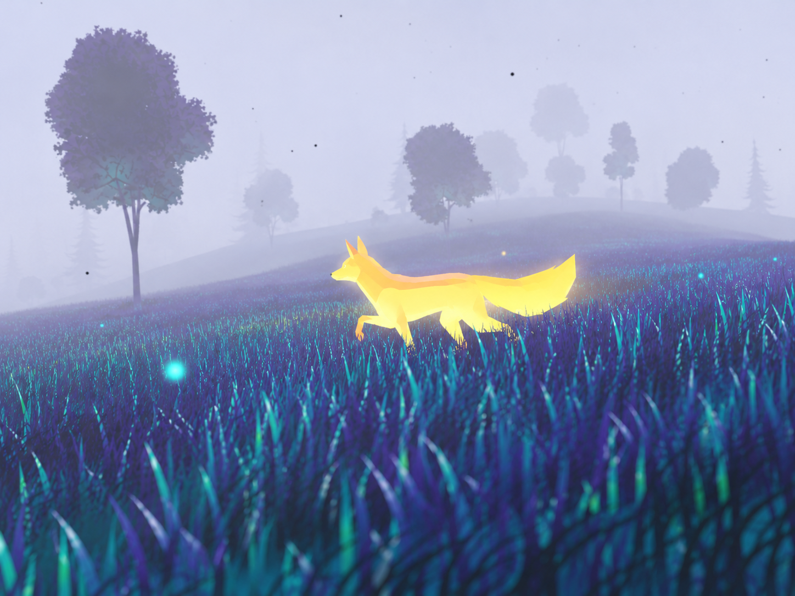
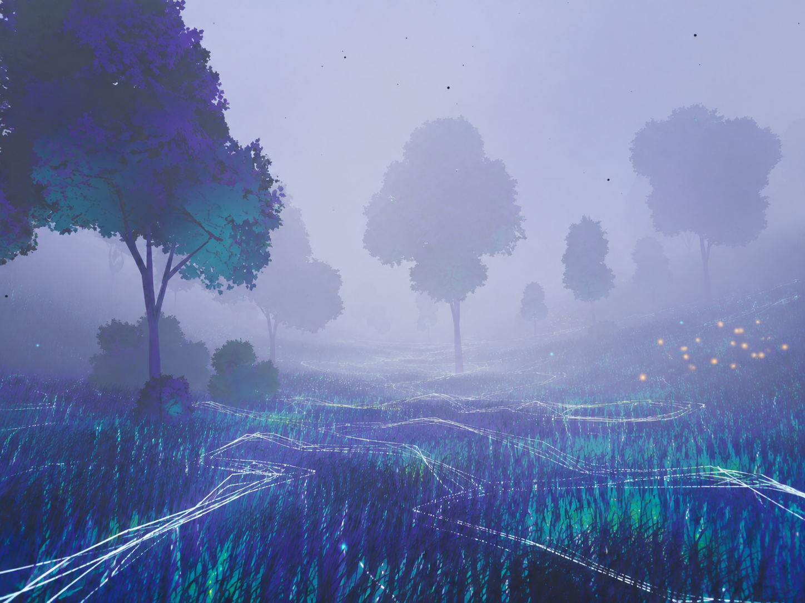
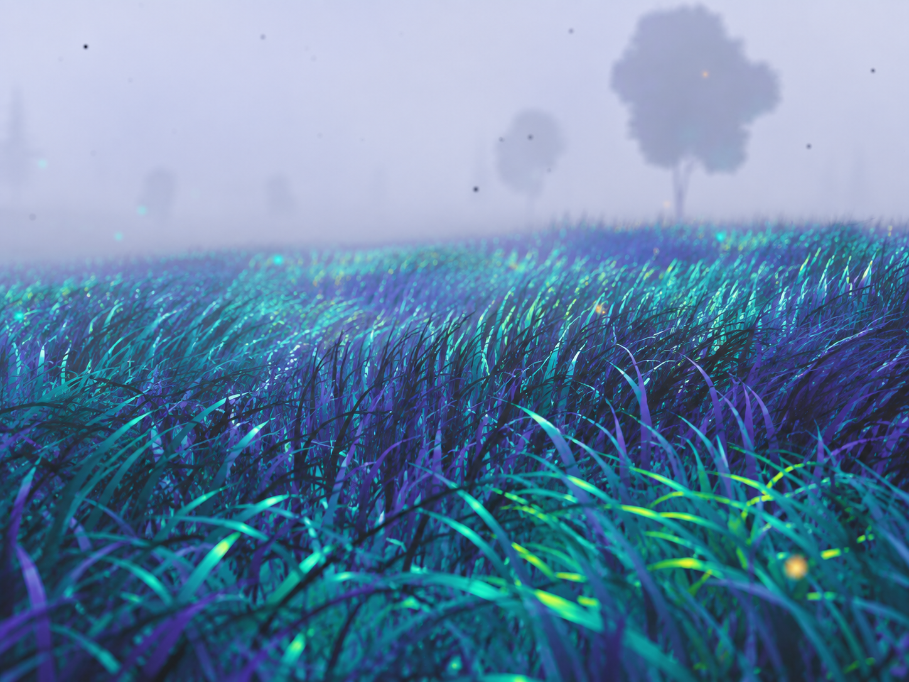
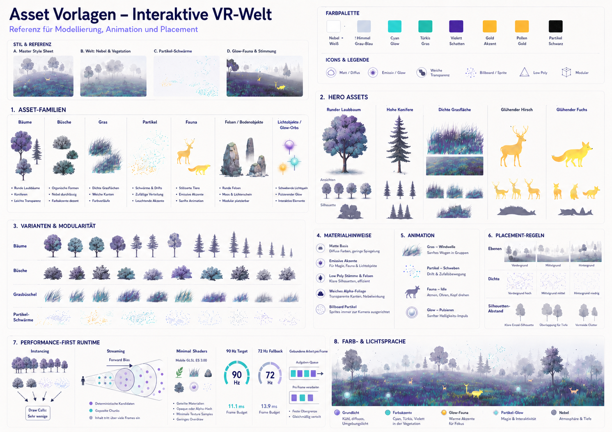

# World Look and Moodboard References

These images define the visual language of the continuous Becoming Many world. They are reference material for atmosphere, palette, silhouettes, particles, vegetation, and perception layers.

All images in this collection were supplied by the project owner.

## World Atmosphere

Soft white atmosphere, rolling terrain, luminous grass, a winding water path, and warm animal silhouettes.

Long sightlines, layered hills, sparse silhouettes, and a pale horizon for the open flight experience.

Denser tree clusters, cyan inner light, golden accents, and a stronger sense of a living world.

## Perception and Motion Cues

Large cyan particle flows act as spatial and perceptual signals rather than physical objects.

Warm floating particles create focus, life, and transitions within the cool landscape palette.

The stag is a high-contrast warm silhouette for animal presence and thermal perception.

The fox uses the same luminous animal language at a lower, closer scale.

Fine white connections reveal relationships between existing world elements for the final network state.

Close-range grass establishes the cyan, violet, and green surface palette while keeping the background quiet.

## Runtime Reference

The runtime reference sheet defines the performance-first rules: instancing, procedural streaming, minimal shaders, and the 90 Hz target with a 72 Hz fallback.
