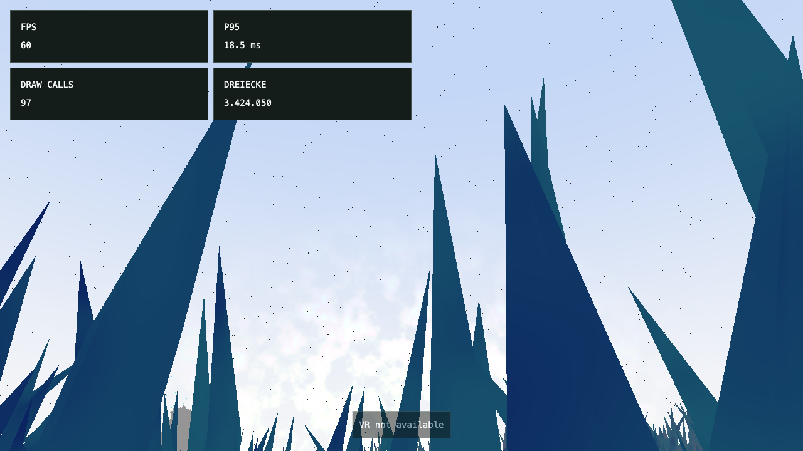

# Browser performance audit — 2026-09-08

## Outcome

The ordinary desktop show and stationary cue crossings passed, but that is not
proof that every execution path fits the 90 Hz installation budget. This audit
found redundant native audio work, inconsistent preparation and overload rules,
expensive streaming steps, and work that bypasses the shared queue budget.
The strongest profiled recurring cost is the Hi-Hat audio trigger and its downstream graph traversal. The appropriate response is to remove work at the existing owners. The code
does not need another loading manager, scheduler, renderer, or runtime.

The report separates measured behavior, source-established mechanisms, and
hypotheses requiring a controlled follow-up. No application fix or benchmark
reference update was made by this audit. At the user’s request, the findings are now recorded in GitHub performance issues.
Those issues own implementation acceptance; product and physical decisions remain open.

## Scope, source identity, and conditions

The initial checkout was `6b84b9a4ac8bf8878596968def596ad55a44dc45` on
`david_refactor`, with existing Conductor/CSS/browser-smoke changes. The initial
browser observer recorded runtime source digest
`74c3dd7663fe4656793b7ac196b9c1aaa3bf818cc34d0b83d4b52b5b71d5f674`.
Concurrent work subsequently committed UI changes as `145918b` and changed
level names, entries, composition, and Conductor again. Those edits were preserved.

A copy of the production build was frozen under
`/tmp/becoming-many-performance-build-20260908` and served at
`http://127.0.0.1:4194`. The initial English transitions used the same initial
build on port 4193, before freezing. Later runs used the frozen build.
The runtime modules/world/audio are unchanged between `6b84b9a` and `145918b`;
a read-only `git archive 145918b` supplied the matching historical harness and
readable source for attribution. It created no branch or Git worktree.
The archive's complete source digest differs from the initial dirty build's
source digest; they must not be presented as byte-identical UI snapshots.

The served build's per-file hashes and aggregate hash are retained with the
measurement summary. Some original harness reports record the live checkout's
identity when invoked: that identity describes the harness working directory,
not the frozen assets served over HTTP. Use the explicit served-build identity
for these measurements. Source references below identify the audited version;
later refactors must be checked before implementing a package.

| Condition | Observation |
| --- | --- |
| Host | Apple M2 Max, macOS / Darwin 25.6.0, Bun 1.3.14 |
| Browser | Chromium 151.0.7922.34, headed |
| Actual WebGL renderer | ANGLE Metal Renderer: Apple M2 Max; software rendering false |
| Viewport | 1280 × 720 CSS pixels, device scale 1 |
| Display timing | Approximately 60 Hz desktop RAF cadence |
| Power | AC power; thermal/performance warning APIs returned unavailable |
| External load | Codex renderer was observed at 213% CPU, WindowServer at 38%; another task also performed UI work during part of the audit |
| Lock/focus | Native computer tooling later reported the Mac locked. Pointer-lock reproduction failed despite `document.hasFocus() === true` and `document.hidden === false` |
| Installation | No Windows-PCVR headset/compositor/USB transport available in this run |

Consequently, these are development observations under a recorded, imperfectly
controlled desktop environment. They establish actual code/API activity and
useful local bottleneck evidence. They do not establish a regression relative
to a controlled reference, a physical smoothness guarantee, or target-device
90 Hz acceptance. A finite test also cannot identify every possible future spike.

### Measurement layers

1. **Existing real-speed observer:** eight English cue crossings, first and
   repeated in fresh contexts, ten seconds each; one complete German show,
   522 seconds without intermediate seeks. Normal VSync, production clock and
   streaming; no trace, profiler, or GPU hooks in these observations.
2. **Existing full browser benchmark:** all ten audited level names, 240 warmup
   frames and 1,260 sampled frames per level. Browser VSync/frame limiting is
   disabled and streaming uses 64 virtual steps per frame. This isolates a
   repeatable rendering workload; it does not reproduce ordinary show audio,
   first startup, or real production queue timing.
3. **Production diagnostic injection:** temporary, bounded RAF/WebGL/media
   hooks, asynchronous GPU timer queries on the application's existing context,
   Chrome main-thread metrics, Long Task observations, and selected CPU profiles.
   No second canvas or renderer. These runs are diagnostic and have overhead.
4. **Movement:** the initial real desktop keyboard-flight attempt failed at
   pointer-lock. Independent movement tests reuse `prepareStartInput` from the
   existing browser suite, sending firmware-shaped responses through the actual
   M5 fetch, validation, and flight code. They do not claim physical M5 testing.
5. **Attribution:** a short readable-source development profile/trace is kept
   separately from production measurements. Its durations are not substituted
   for production results.

GPU timer values are elapsed GPU command time, not whole-device utilization or
headset presentation time. Queries are read only after availability; disjoint
results must be discarded. CPU callback values are elapsed main-thread callback
time, including native calls made synchronously from JavaScript, not CPU-cycle
counts. Chrome TaskDuration includes additional page work outside the World
callback. RAF is a scheduling interval, not either of those costs. See the
[Khronos timer-query specification](https://registry.khronos.org/webgl/extensions/EXT_disjoint_timer_query_webgl2/)
and [Chrome performance reference](https://developer.chrome.com/docs/devtools/performance/reference/).

## Browser results

### Ordinary playback

| Scenario | Samples | Median | p95 | p99 | Maximum | Result |
| --- | ---: | ---: | ---: | ---: | ---: | --- |
| Full German show, 522 s | 31,317 | 16.7 ms | 18.3 ms | 18.7 ms | 18.8 ms | PASS; clock reached 521 s, no browser errors |
| Eight English cues, first + repeated | 9,585 | 16.7 ms per window | 17.0–17.5 ms | 17.5–17.7 ms | 17.8 ms | All 16 windows PASS |

No interval above 25 ms occurred in these ordinary observations. That threshold
is an inventory convenience for an obvious gap on this desktop, not a new
acceptance tolerance. Every approximately 16.7 ms desktop interval exceeds
11.11 ms; counting them as missed headset frames would be incorrect.
Readiness was approximately 805–1,048 ms across the English fresh contexts and
1,041 ms for the full German show. This readiness means the UI can access Show,
not that every audio or worker preparation task has finished.

The historical #73 Motion clock-progress failure was not reproduced. Successful
runs do not explain or close its original cause. The full run is stationary
with respect to interactive flight, so it does not replace movement acceptance.
Lock-state uncertainty also prevents calling this a human-visible screen test.

### Deterministic full replay

| Level | Draws / submitted triangles (max) | p95 RAF | Maximum RAF | Queue peak |
| --- | ---: | ---: | ---: | ---: |
| start | 2 / 5 | 0.2 ms | 11.1 ms | 0 |
| white-world | 1 / 0 | 0.2 ms | 1.0 ms | 0 |
| scent | 14 / 1,536 | 2.4 ms | 848.3 ms | 61 |
| echo | 62 / 4,321,202 | 2.6 ms | 240.6 ms | 72 |
| motion | 65 / 4,321,202 | 2.5 ms | 224.6 ms | 72 |
| thermal | 104 / 4,333,049 | 3.0 ms | 66.6 ms | 72 |
| magnetic | 105 / 4,334,009 | 3.1 ms | 73.4 ms | 72 |
| connections | 107 / 4,487,609 | 2.9 ms | 69.4 ms | 79 |
| test | 105 / 4,431,664 | 2.9 ms | 123.6 ms | 131 |
| design-test | 104 / 4,430,704 | 2.9 ms | 124.8 ms | 131 |


The largest isolated intervals appeared once in each dense level. A separate
Scent reproduction recorded an approximately 835.8 ms gap. Around that gap,
the preceding World callback cost about 2.1 ms and the next one about 0.2 ms;
callback dispatch itself arrived approximately 835.6 ms after its supplied RAF
timestamp. This locates the long wait outside those JavaScript frame callbacks.
It does **not** identify the responsible native browser, compositor, GPU-driver,
or operating-system mechanism. Retain the failure; do not invent a garbage
collection or shader-compilation explanation from a long RAF interval alone.

The benchmark queue remained nonempty at the route endpoint for most dense
levels, with peaks below its 256 capacity in this run. “Never drained” here
means it was still busy at the end of a moving replay; it is not evidence of a
queue that can never finish at rest. The stored exact reference was not changed
or accepted. Existing #78 differences remain a separate reference decision.

### Production CPU/GPU and movement diagnostics

**All ten standalone levels, simulated M5, 22-second valid-neutral window:**

| Level | CPU p95 / max | GPU p95 / max | Main-thread task share |
| --- | ---: | ---: | ---: |
| white-world | 0.1 / 0.5 ms | 0.37 / 1.05 ms | 1.65% |
| start | 0.2 / 0.7 ms | 0.36 / 1.09 ms | 1.77% |
| scent | 0.2 / 0.9 ms | 0.46 / 2.11 ms | 1.95% |
| echo | 1.8 / 2.4 ms | 1.60 / 2.08 ms | 3.58% |
| motion | 2.0 / 2.7 ms | 1.71 / 2.17 ms | 4.86% |
| thermal | 2.4 / 3.3 ms | 1.93 / 3.61 ms | 7.36% |
| magnetic | 2.9 / 5.6 ms | 1.92 / 3.38 ms | 9.08% |
| connections | 3.0 / 5.1 ms | 2.03 / 2.63 ms | 9.44% |
| test | 2.9 / 5.4 ms | 1.63 / 2.31 ms | 6.92% |
| design-test | 2.9 / 5.2 ms | 1.52 / 2.03 ms | 6.95% |

All ten runs had no recorded browser errors, no disjoint GPU results, and no
skipped queries. None of the listed valid-neutral windows exceeded 11.11 ms
in the recorded World callback or GPU command duration. Main-thread task share
is the CDP TaskDuration delta divided by wall time; it excludes worker/audio/GPU
threads and is not whole-system CPU utilization.

The existing M5 contract continues neutral glide even with rejected/zero-quality
input while configured. Therefore the raw probe's `stationary` and `flight-settle`
phase labels are misleading: they are invalid-neutral glide before and after
the valid-neutral window, **not stationary controls**. All movement conclusions
here use that corrected interpretation. Continuous authored glide is 5 m/s;
22 s corresponds to approximately 110 m by the flight model, not an independently
tracked position measurement. Cold settle, invalid-neutral, valid-neutral and
final invalid-neutral phases total about 39 s per level. This is a straight
streaming flight, not exhaustive turns/teleports or a physical controller test.

Several standalone levels created new buffers/textures during movement, but
no new programs in the measured phases. Unlike Show/Start, these static routes
do not call the same renderer preparation path before their first frame.
Delayed resource creation on those paths therefore must not be described as a
regression of the Show's stationary first-cue preparation guarantee.

**Show diagnostic, separate from ordinary playback:**

| Phase | CPU p95 / max | GPU p95 / max | Largest RAF interval |
| --- | ---: | ---: | ---: |
| scent | 0.5 / 2.2 ms | 1.24 / 1.90 ms | 17.7 ms |
| echo | 0.9 / 133.3 ms | 2.19 / 2.60 ms | 133.4 ms |
| motion | 1.2 / 4.7 ms | 1.98 / 2.41 ms | 33.4 ms |
| thermal | 1.4 / 25.4 ms | 1.81 / 2.57 ms | 17.7 ms |
| magnetic | 1.5 / 3.1 ms | 2.11 / 2.85 ms | 17.8 ms |
| connections | 10.0 / 12.1 ms | 2.13 / 2.86 ms | 17.8 ms |
| return | 7.8 / 12.2 ms | 2.05 / 2.64 ms | 17.7 ms |

The instrumented first Echo frame at Show time 134.005 s took 133.3 ms on the
main thread but only 1.83 ms of GPU command time; it created no new GL program,
buffer or texture. First Thermal had a 25.4 ms callback. Their exact synchronous
cause was not isolated. They were absent in the uninstrumented first/repeated
crossings, so instrument/driver first-use overhead remains a live alternative.
Do not claim that ordinary Echo playback has a reproduced 133 ms stall.

Connections/Return had recurring callbacks around 10–12 ms with much lower GPU
cost, supporting the audio-path investigation in F1. Small RAF gaps at phase
boundaries can also include the test's seek/profiler start/stop operations;
those are not automatically production frame failures.

**Same stationary Connections page, resolution sweep:**

| Resolution | CPU p95 / max | GPU p95 / max | Largest RAF interval |
| --- | ---: | ---: | ---: |
| 1280x720 | 1.5 / 1.6 ms | 1.86 / 2.48 ms | 18.7 ms |
| 2560x1440 | 1.4 / 3.7 ms | 2.19 / 2.96 ms | 18.7 ms |
| 3840x2160 | 1.4 / 3.7 ms | 3.27 / 4.78 ms | 18.8 ms |

Each size had 3 s resize warmup and 8 s recording; 480 RAF observations each,
with the last 4K GPU query still pending at collection (479 GPU values).
No disjoint queries or browser errors occurred. 4K increased GPU work, but no
11.11 ms GPU command-time violation was measured in this view. It remains a
single-eye desktop scene, not equivalent to a stereo XR workload or compositor.

The M5 endpoint screenshot below documents the tested scene, not visual/physical
acceptance. Its original diagnostic HUD is part of the audited older standalone
entry; later diagnostic-entry simplification is outside these measurements.




The separate source profile identified the recursive audio connection detector
and Hi-Hat note starts (F1). It also sampled the expected height-field noise,
Three matrix/render work, and Motion integration. It did not establish that
full-pool compaction or worker publication was a dominant cost on this particular
straight flight. Those remain measured-stress candidates rather than invented
explanations for the observed audio spikes.

Cold Show CPU profiling sampled native AudioContext creation and program-log
access, while three startup Long Tasks measured 223, 337 and 199 ms. The last
began at approximately 810 ms, just after the 809 ms readiness observation.
This confirms that meaningful work can continue after that readiness marker;
not every millisecond was individually assigned to a module. Cold initial load
has a different budget from already-playing frames.


### Confirmed redundant media operations

The injected browser counters recorded **300 `currentTime` writes, 300
`playbackRate` writes, 300 `seeking` events and 299 `seeked` events in five
seconds of unchanged Hold at Show time 10 s**. A held Connections sample added
362 seeks in about six seconds. These are real browser media operations, not
only a fake-audio unit observation. The paused-prologue World callback stayed
small (p95 0.5 ms, max 0.8 ms) in this sample, so the event storm is proven while
a severe pause-time frame spike is not.

### Failures and limitations retained

- Real desktop flight failed with `WrongDocumentError: The root document of
  this element is not valid for pointer lock` and a Three.js PointerLockControls
  console error. The 30-second wait was allowed to fail; it was not weakened.
  Native tooling reported a locked Mac. This is not proof of defective flight
  math or proof that the lock screen is the sole cause of Chromium's error.
- A temporary `.ts` diagnostic copy under ignored `benchmark-results` was
  unexpectedly included by the repository's TypeScript glob and blocked another
  task's build. It was moved outside the repository immediately. This was audit
  tooling contamination, not an application performance defect.
- No failure was hidden by changing a benchmark baseline or suppressing browser
  errors. Simulated input, injected hooks, native lock state, and concurrent
  activity are explicitly separated from ordinary/physical acceptance.

### Reproduction and evidence navigation

The ordinary observations and deterministic replay use repository-owned tools:

```sh
bun run observe:show --mode transitions --language en --base-url http://127.0.0.1:4193 --out benchmark-results/performance-audit-2026-09-08/transitions-en
bun run observe:show --mode full --language de --base-url http://127.0.0.1:4194 --out benchmark-results/performance-audit-2026-09-08/full-de
bun /tmp/becoming-many-performance-source-20260908/tests/benchmark/run-benchmark.ts --profile full --headed --base-url http://127.0.0.1:4194 --out benchmark-results/performance-audit-2026-09-08/benchmark-full
```

Use new output directories for a later run; never overwrite the retained evidence.
These historical ports refer to the frozen build, not the evolving checkout.
The temporary production probe is `/tmp/becoming-many-performance-probe.ts`;
the dispatch-gap, readable-source and resolution probes have the corresponding
`becoming-many-benchmark-spike.ts`, `becoming-many-browser-profile.ts` and
`becoming-many-resolution-probe.ts` names. They are diagnostics, not new project
commands or a permanent test harness. The durable summary retains every
instrumented frame exceeding either 11.11 ms CPU/GPU or 25 ms RAF (35 events,
including startup/instrumentation effects), plus the separate Long Tasks and
benchmark maxima. That thresholded inventory is not a list of 35 proven defects.

## Root-cause analysis

### F1. Hi-Hat note starts traverse a complex audio graph repeatedly

**Observed source-attributed browser CPU hot path.**

The production diagnostic had periodic roughly 10–12 ms World callbacks in
Connections and Return, while the same frames used approximately 1.4–1.8 ms
of GPU command time. A separate readable-source profile followed this chain:

```text
World -> Run.updateFrame -> Show.followOrgan -> Organ.update
  -> lane.follow -> step sequencer -> Hi-Hat callback
  -> MetalSynth.triggerAttackRelease -> oscillator start/connect
  -> standardized-audio-context detectCycles
  -> recursive downstream graph traversal and temporary arrays
```

`hi-hat-voice.ts:65–94` schedules frequent metallic strikes. The installed
Tone `MetalSynth` starts its six internal oscillators at attack; their native
source lifecycle creates/connects nodes. In
`standardized-audio-context/src/factories/detect-cycles.ts:7–26`, every relevant
connect walks downstream output paths with fresh arrays, chain copies and
concatenation. The voice's own delay/Freeverb room and the layer/shared effect
paths make that traversal nontrivial. This is a graph-connect cost on the main
thread, distinct from steady audio DSP on the audio thread.

Of 21,558 profile samples, 914 included the Hi-Hat source frame and 885 sampled
the recursive detector itself. These are sampled stacks, not percentages of
CPU utilization. The profile returned 2,382 negative `timeDeltas`; weighted
profile milliseconds were therefore rejected instead of silently clamped.
The independent trace recorded World/UI animation callbacks up to 12.732 ms
and audio destination rendering up to 1.704 ms during this short diagnostic.
Trace overhead and development mode prevent treating those as a production
before/after benchmark. They do support the concrete call-path attribution.

**Smallest direction:** isolate this one voice and remove unnecessary downstream
routes/nodes before considering a synthesis change. Compare its actual room/send
requirements with the already-shared effects; keep the authored sound unless an
audio comparison explicitly accepts a change. If a cheaper existing Tone voice
or fixed source/envelope pattern is selected, remove the old MetalSynth-specific
path and settings in the same block. Do not fork the library's cycle detector,
introduce a global audio pool, or replace Tone wholesale. This package deserves
higher priority than unmeasured micro-optimizations in the queue or UI.

### F2. Preparation has one structural owner but several readiness meanings

**Established source mechanism; partially observed during startup profiling.**

`level.runtime.ts` loads borrowed source assets, constructs modules, activates
them, and awaits `World.prepareRenderer()` for Show and standalone Start.
`world-runtime.ts:251` waits for `compileAsync`, temporarily exposes resident
objects and renders into a disposable 1 × 1 target. This is valuable: the
stationary diagnostic cue crossings created no additional GL buffers, textures,
or programs. `compileAsync` only covers shader compilation; upload/preparation
is a separate concern in the [Three.js renderer documentation](https://threejs.org/docs/#WebGLRenderer).

However, `show.runtime.ts:150` starts audio **after** that graphics preparation:

| Component | What is awaited before Run returns | Remaining asynchronous work |
| --- | --- | --- |
| GLTF models / passage routes | Source download and parsing | Cancellation cannot promptly end all requests |
| World graphics | Compile + first resident offscreen render | Spatially new content and unselected variants |
| Narration | Audio elements created, `preload = auto` | Browser metadata/buffering/readiness |
| Organ | Dynamic import initiated | Module evaluation, graph creation, worklets, room setup |
| Organ reverb | Generation initiated | Offline impulse-response rendering; `ready` awaited only during unload |
| Connections | Initial worker requests posted | Topology construction and publication |

The first visible loop can therefore compete with late preparation, and an
initial seek may reach a resource before it is actually ready. The Show API is
async, but its initial audio constructors do not form an awaited readiness
contract. `drone-organ.ts:61`, `organ-engine.ts:48/78`, and
`narration-player.ts:157` show the local gaps. Tone already exposes the reverb
readiness promise; an additional application preparation framework is unnecessary.

**Smallest direction:** make the existing audio/Show startup finish its actual
needed preparation and let Run await it before publishing ready. Examine whether
that eliminates the current lazy “runtime may not exist yet” forwarding wrapper.
Keep World graphics preparation at World, worker resources at their module,
and one prepared world for the visit. Do not decode every recording into PCM
or keep every hidden simulation running merely to simplify readiness wording.

The two audio contexts are a confirmed compatibility decision. Combining them
would undo evidence-backed behavior, not remove an accidental second Show clock.

### F3. Paused narration rewrites native state every frame

**Browser-reproduced unnecessary work.**

`narration-player.ts:142–154` always writes playback rate and seeks whenever
`!isPlaying`, even if the target offset is unchanged. `seekTo` writes
`currentTime` whenever metadata is present. That causes the measured 60 seeks
per second. The intended capability is precise stopped scrubbing; repeatedly
seeking a stationary playhead adds no capability.

**Smallest direction:** write only a changed rate and a genuinely changed pause
position/cue. Reuse the existing matching/drift logic while preserving exact
scrub targets. Avoid a new media scheduler or parallel cached clock. Test
hold → scrub → resume and a blocked initial `play()` attempt: that path can
also retry `play().catch(...)` every frame while the media remains paused.

### F4. The queue's 0.5 ms budget does not bound a single step

**Measured on the actual CPU algorithm in Bun; browser attribution below.**

`StreamQueue.update()` checks its deadline between `runStep()` calls. It cannot
interrupt a long JavaScript step. Grass fills eight rows of 192 texels per step
(`grass-height-field.ts:108`), or 1,536 texels. A probe using the actual unchanged
function, two warmup refills and ten measured 64 m diagonal recenters found:
240 steps, median 1.320 ms, p95 1.597 ms, maximum 2.382 ms; all 240 exceeded
0.5 ms. These are Bun/host CPU values, not browser/XR timing guarantees.

The expense is explained by repeated surface evaluation. Each texel queries
height and then zone influences; zone conditions calculate the same height
again plus four neighboring heights for slope. That is six ground evaluations
per texel, each with four terrain-noise lookups: about 36,864 terrain-noise
lookups per step before additional river/zone work.

**Smallest direction:** reduce the existing step size and remove repeated
sampling. Measure complete refill latency as well as step duration: fewer rows
must still keep the moving height window valid. Do not introduce a new queue,
worker pool, or automatic quality controller.

### F5. Static populations can compact twice before one render

**Established source mechanism; timing priority informed by movement profiles.**

`static-population.ts:191–195` publishes completed models, updates the chunk
window, discards outgoing slots, and publishes again. A dirty pool invokes
`publishVariant` for every variant and copies all committed instances/parts
(`instanced-model-pool.ts:125,187–242`). It recomputes part matrices and marks
the entire active prefix for GPU upload. The actual GL transfer happens at
render time, but both CPU compactions can happen before the shared queue budget
is even consulted.

A completed job plus a boundary crossing can thus trigger two complete CPU
passes in the same module update. One changed chunk costs work proportional
to the whole resident population rather than just that chunk.

**Smallest direction:** discard and coalesce before a single publication using
the existing dirty flag. Preserve the rule that unsupported outgoing plants
are hidden before terrain recycles. Only pursue partial compaction if the
remaining measured cost warrants it; a new mesh per chunk can increase draws
and is not automatically a simplification.

### F6. Streaming overload has incompatible semantics

**Established source mechanism; overflow was not proven by ordinary replay.**

| Consumer | Rejected `enqueue()` behavior |
| --- | --- |
| Scent | Fixed slot retained for retry |
| Connections | Bounded admission retry per slot |
| Grass | Refill flag remains false; retries later |
| Terrain / StaticPopulation | Rejection ignored; work may be lost |
| Air particles | Synchronous fallback fills the slot immediately |

See `air-particles.ts:113–122`, `terrain.ts:118`,
`static-population.ts:200`, `scent-particles.ts:199`, and
`grass-clipmap.ts:141`. Under overload, Air does the very synchronous work the
queue is meant to defer, while other modules may leave missing replacement
content. The queue has 256 entries; Air alone can own 343 slots at 128 m view
range. That is a worst-case full reassignment calculation, not a claim that a
normal one-chunk movement always overflows.

**Smallest direction:** reuse a fixed slot's newest-needed work and the existing
admission retry pattern; remove synchronous bypasses and silently lost jobs.
Do not add an overflow manager. A mathematically justified capacity change is
an alternative only if it proves the actual combined workload and removes
obsolete fallback states instead of merely moving the limit.

### F7. Connections bounds meshes, but not queued worker requests

**Established source mechanism; backlog magnitude remains to be measured.**

`mycelium.ts:353–441` gathers a complete chunk in one queue step.
`postReadyBuilds` then sends every ready build slot in one pass. It copies its
own and eight halo chunks into fresh transfer arrays (`445–536`). The worker
computes every received request. Revision checks reject stale results only
when they return. Fixed render capacity does not bound the worker message FIFO.

There are 25 build and 49 gather slots. At the authored maximum, one request
contains up to 1,728 nodes / 29,376 payload bytes; a full set is about 734 KB
before object overhead. Repeated movement may enqueue more obsolete sets.
Publication executes directly in `worker.onmessage` through
`topology-messages.ts:68` → `publishTopologyResult` → edge-buffer writes,
outside `StreamQueue.update()`.

**Smallest direction:** retain only the latest unsent request per existing slot
and send when the single worker can accept useful work. Reuse `buildPending`
and revision ownership; remove obsolete copies/calculations before adding new
state. Measure gather, posting, worker computation, and publication separately.
Only budget the measured expensive publication step; do not automatically wrap
every callback in another scheduling abstraction.

### F8. Initial GPU preparation does not keep inactive spatial windows current

**Established source mechanism; movement activation requires dedicated coverage.**

All modules initially load around the starting position. `ModuleRuntime` updates
only active modules. A visitor who flies before Scent/Echo/Connections activation
can leave those inactive windows behind. On activation, several modules may
reassign and enqueue their entire windows together. GPU resources can be
preinitialized while their spatial content is stale.

Grass already differs: Composition keeps it ungated, so its height window and
wind/LOD update before visible Echo. That is not necessarily wrong; it means
“preloaded” must distinguish allocated resources from current spatial content.

**Smallest direction:** measure the actual first activation after a long early
flight and remove its dominant burst locally. Do not enable all hidden
simulations indefinitely or add a universal warming state based solely on this
static possibility. Preserve one Show clock and the same existing module owners.

### F9. Surface facts are recomputed across unnecessarily long data paths

**Established source mechanism; a direct target for measured CPU simplification.**

Terrain separately requests ground, zones, Thermal warmth and Grass cover per
vertex (`terrain-geometry.ts:276–321`). Its effect `.find()` lookups occur per
vertex. Thermal and cover paths can compute the same zone conditions again.
Vegetation asks complete zone conditions for a bank-clearance predicate that
only needs analytic river margin after placement already queried zones.

**Smallest direction:** resolve the actual effect sampler once at construction;
pass/reuse facts already computed for the same sample; use the existing Surface
owner's direct river fact for clearance. Delete redundant traversals and
parameter round trips. Keep one Surface authority; no global memoization cache,
SampleService, sibling-module import, or second zone classifier.

### F10. Invisible Scent capacity still executes vertex animation

**Established shader mechanism; GPU savings need an isolated comparison.**

Connections reserves 49 × 64 × 84 = 263,424 Scent points. A single uncullable
Points draw covers that capacity. `scent-particle-motion.vert.glsl:72–120`
calculates drift, multiple trigonometric functions and `pow` before its final
clip-position function discards invisible particles. Slot publication uploads
all reserved slot attributes, including unused capacity.

**Smallest direction:** discard known invisible/zero-size particles before drift.
Then consider smaller upload ranges only if that removes measured transfer work
while still clearing stale visibility. Do not arbitrarily reduce the capacity:
it follows the real maximum plant-placement contract. A different particle
engine would be disproportionate.

### F11. Grass retains inactive detail variants and pays for late shader culling

**Established source/configuration mechanism.**

`GRASS_CLIPMAP_SETTINGS.detail.byDistance` is false and the selected segment
index is always 1. Yet `grass-clipmap-field.ts:495–533` builds four geometry
rows and three material tiers, alongside distance thresholds/hysteresis and
selection logic. Density selection remains active and must be retained. The
unused distance-detail capability is a specific YAGNI deletion candidate.

Grass also allocates coarse 42.75 m chunks for the density needed near their
closest edge. Rank, cover, and shader-frustum rejection happen after vertex
invocations have started. Degenerate triangles counted by `renderer.info`
are not necessarily visible triangles, but they still represent submitted work.
The current one-ring layout was an explicit visual choice; do not silently
replace it or change density/segments during an ownership refactor.

**Smallest direction:** remove unused distance-detail rows, tiers, flags and
hysteresis while preserving the effective current material/geometry. For any
remaining GPU limit, compare existing density/segment/fade controls under the
same ground view. No new LOD framework. First-use tests must include density
selection during movement, not only stationary cue crossings.

### F12. GPU shading candidates: Thermal and an early Magnetic dome

**Established work in shaders, not proof of a GPU budget violation.**

Thermal computes four noise octaves and up to four body-heat contributions over
eligible fragments. Its existing range early-return and zero-heat-response
optimization are present and must not be reported as missing. Large close
surfaces can make this pixel workload significant.

Magnetic draws its opaque dome first with `depthWrite = false`
(`magnetic-sky.ts:80–109`). Its pole noise can shade pixels subsequently hidden
by terrain and objects. Existing cutoff/base-amount checks already reduce some
work. A later opaque order might let existing depth reject occluded fragments,
but that requires a visual comparison including transparent Connections content.

**Smallest direction:** first measure an isolated existing render-order or
shader-work reduction. Do not introduce postprocessing, a new culling system,
or visual tuning merely to reduce a counter. The measured GPU command times
in this audit describe this desktop viewport, not two headset eye targets.

### F13. Animals' selected count is not a hard visible/mixer count

**Established source mechanism; no missing-habitat stall reproduced.**

The ten-actor population selects at most four targets, but old selections fade
out for 0.8 s while new selections fade in. Every actor with nonzero appearance
continues animation/render work (`animal-actors.ts:194–226,644–688`). Thus more
than four bodies can be visible during changes. Thermal's four heat slots are
not automatically equivalent to a hard visible-body bound.

Habitat search also allocates, filters and sorts up to 289 candidate positions.
If no habitat exists, the failed search may run every frame. However, two
current-content spatial probes (289 positions to ±1,024 m and 1,089 to ±8,192 m)
found habitat everywhere tested. Do not elevate this hypothetical failure to a
proven current P1 issue.

**Smallest direction:** clarify the intended fade/render bound at Animals and
measure selection changes. Replace candidate sort with a direct minimum scan
only if relevant; avoid repeated identical failed searches. No VisibilityManager
or entity framework, and no silent removal of the authored fade.

### F14. Cancelled startup still pays for pending fetch/parse work

**Established cancellation latency; no retained source leak demonstrated.**

`gltf-assets.ts:32–44` checks abort before/after `Promise.allSettled`, but does
not pass the signal to the underlying Three loader operations. Passage routes
have a separate FileLoader path without that signal. Cancellation prevents
publication and releases successful/late resources, but waits for started work
to finish. A slow cancelled startup can continue downloading/parsing needlessly.

**Smallest direction:** use the loader's documented cancellation capability at
the existing source owner and thread the same lifetime into passage loading.
Verify real slow-request cancellation before claiming improvement. Do not add
a global asset cache, reference-count registry, or another cancellation owner.

### F15. Conductor repeats unchanged DOM work; diagnostics hide rare spikes

**Established audited-UI mechanism; concurrent UI edits require rechecking.**

`show-timeline.panel.ts:111–134` writes two playhead SVG attributes and eight
progress widths every UI RAF, even during Hold. That is approximately 600
identical writes per second at 60 Hz. Rehearsal already caches visible precision.

`FrameMetricsSampler` retains 120 frame samples and reports average FPS/p95.
That is appropriate lightweight status, but rare spikes quickly leave its
window and may never affect p95. The Conductor's below-85-FPS warning is not a
measurement of missed XR frames on a 60 Hz desktop. The benchmark's “frame
cost” wording likewise must not be mistaken for CPU/GPU duration.

**Smallest direction:** return from the existing timeline update when displayed
time is unchanged. Keep detailed profiling outside normal operation. Do not
build an always-on telemetry service to fix a diagnostic label.

### F16. Dependency cleanup is small; wholesale replacement is unjustified

Fallow 3.23.0 found no unused runtime package, cycle, or architecture-boundary
violation at the audited snapshot. The three API findings were unused exports
`BAT_PASSAGE`, `STEP_LOOKAHEAD_SECONDS`, and duplicate export name
`ReadSwarmCrossing`. Removing unused export capability is reasonable hygiene,
but no meaningful FPS improvement follows from those findings alone.

| Dependency | Current real consumer | Assessment |
| --- | --- | --- |
| Three.js | World rendering, geometry, materials, GLTF/FBX loading | Required; preserve one renderer |
| Tone | Organ voices, effects and scheduling | Required for current sound; lazy-loaded outside standalone benchmarks |
| esp-web-tools | Flash only | Correctly outside the Show path |
| lucide-static | Individual Conductor SVG imports | No runtime component/icon framework to remove |

The built shared engine chunk was about 673 KB, Three core 257 KB and lazy
organ 363 KB uncompressed. The `deployment-config` chunk name is an output
naming artifact, not 673 KB of configuration code. Flash's approximately
309 KB install dialog is not evidence of Show-path transfer. FBXLoader has a
real authored passage-route consumer; removing it requires a visually identical
asset conversion, not only deleting an import.

One very small definite audio removal is the always-created Gain/send wiring
for `insectWingBeat.roomSend = 0` (`organ-layer.ts:102–121`). Continuous noise,
oscillator and room graphs also deserve audio-thread attribution before any
claim of idle processing cost; muted output alone does not prove what the
browser prunes. Do not rewrite Tone in native Web Audio to remove one node.

Some small per-frame objects/closures remain despite the Show comment claiming
no allocations. They are real but not automatically the cause of a major GC
spike. Keep the report proportional to the profiles.

## Proposed work packages

These packages group the audit findings for implementation. The live GitHub
issues linked below own scope and acceptance; this report remains the dated
measurement record. Existing issue ownership is preserved. A refactor package should reduce
production code, states or work, and report the actual size delta. A scalar
budget correction may be code-neutral; do not present it as architectural
code reduction.

| Order | Package / current owner | Remove or simplify | Required focused acceptance |
| --- | --- | --- | --- |
| 1 | Native media matching — Narration | Unchanged pause seeks/rate writes; redundant play attempts | Real browser 10 s Hold with zero repeated seeks after initial positioning; precise scrub/resume and EN/DE change |
| 2 | Rhythmic graph work — Hi-Hat / existing Organ | Repeated source/connection setup and unnecessary effect routes | Isolated source-attributed browser profile; comparable Connections/Return callback spikes; audible/timing equivalence; no replacement framework |
| 3 | Honest preparation — Run / existing Show and Audio | Fire-and-forget readiness gap and obsolete lazy forwarding | Cold immediate Play/seek; graph/reverb/media readiness; one loop/context ownership; cancellation during preparation |
| 4 | Bounded procedural step — Grass / Surface | Oversized eight-row step and repeated same-point sampling | Browser step CPU distribution, complete refill latency and correct ground at maximum flight speed; existing #13/#71/#72 scope |
| 5 | One population publication — StaticPopulation / InstancedModelPool | Duplicate compaction in one frame | Completed jobs plus chunk boundary; identical visible populations; at most one actual publication before render; retain #41 ownership |
| 6 | One overload rule — existing StreamQueue consumers | Synchronous Air fallback and ignored rejected jobs | Deliberate combined reassignment/capacity stress; bounded retry; no stale/missing slot; preserve #26 behavior |
| 7 | Useful worker work only — Connections | Obsolete unsent requests and redundant halo copies | Bounded in-flight requests, stale-work ratio, result-publication cost and topology correctness in repeated turns; retain #82 lifetime checks |
| 8 | Current spatial content at first activation — existing modules / Show | Measured activation burst or obsolete warmup workaround | Long early flight into first Scent/Echo/Connections; first/repeated cue GPU+CPU; preserve one prepared world and #16 guarantees |
| 9 | Direct surface sampling — Surface / Terrain / placement consumers | Repeated conditions, per-vertex effect searches and long fact round trips | Same-point sample equivalence, bank clearance/ground/heat visuals, browser profile reduction; no sibling imports |
| 10 | Fixed effective Grass detail — Grass | Unused detail rows, tiers, thresholds, hysteresis and flags | Same effective geometry/shader/output and density behavior; cold/moving first-use checks; negative production-code/resource delta |
| 11 | Skip invisible GPU work — Scent, then measured shader owner | Invisible drift evaluation; proven overdraw only | Paired GPU timers under identical views; stale visibility cleared; no silent look change; #26/#32 acceptance remains |
| 12 | Stop unnecessary loading — existing asset and passage owners | Continued cancelled I/O and duplicate abort handling | Actual slow-network abort; no Run publication; late-success cleanup; no new registry; preserve #9 lifetime |
| 13 | Small local cleanup — Conductor / Animals / Audio APIs | Unchanged SVG writes, only measured actor-search waste, zero send, dead exports | Targeted behavior checks + lint; no blanket framework rewrite; recheck concurrent UI changes first |
| 14 | Installation and native-gap evidence — existing browser/XR tooling | Misleading measurement claims, not application features | Explain isolated benchmark dispatch gaps; actual Windows-PCVR 90 Hz CPU/GPU/compositor/encode/USB/decode and repeated visits; #42/#54/#73/#78 remain open |

Start with packages 1, 2, 4 and 5: they remove specifically identified repeated
work at existing owners. Package 3 closes the preparation contract; packages
6–9 address observed structure with a deliberately bounded stress scenario.
Prioritize any measured failure over this default order. Do not add a global
warming stage, universal event bus, quality governor or worker pool in advance.

### Intended common flow

```text
Entry resolves request and creates one cancellable Run
  Run loads source assets and constructs the selected composition once
  Existing owners finish their required graphics/audio/content preparation
  Run publishes readiness and starts World's single loop
    selected input -> one Show sample -> viewpoint -> active modules
    -> bounded useful streaming/publication -> one render
  Cue changes alter gates/uniforms within the same world
  End stops work, ends borrowers, then releases sources and World
```

Readiness is a shared promise about actual required preparation, not a new
shared manager. Scheduling remains World/StreamQueue; generated content and
worker work remain local to their modules. Visitor replacement, calibration,
tutorial and credits decisions stay in the target architecture.

## Live issue handoff

All findings are documented in the existing GitHub workflow under the
[performance label](https://github.com/Strehk/becoming-many/issues?q=is%3Aissue%20is%3Aopen%20label%3Aperformance).
Fourteen new focused issues were created; #16, #26 and #32 received dated scope
and acceptance additions. [#76](https://github.com/Strehk/becoming-many/issues/76)
contains the handoff and suggested starting order. Existing #73/#79/#83 uncertainty,
#78 reference review and #42/#54 physical commissioning received relevant evidence
without closure or duplicated implementation issues.

| Finding | Implementation / validation issue |
| --- | --- |
| F1 | [#94](https://github.com/Strehk/becoming-many/issues/94) |
| F2 | [#16](https://github.com/Strehk/becoming-many/issues/16) |
| F3 | [#93](https://github.com/Strehk/becoming-many/issues/93) |
| F4 | [#95](https://github.com/Strehk/becoming-many/issues/95) |
| F5 | [#96](https://github.com/Strehk/becoming-many/issues/96) |
| F6 | [#97](https://github.com/Strehk/becoming-many/issues/97) |
| F7 | [#98](https://github.com/Strehk/becoming-many/issues/98) |
| F8 | [#16](https://github.com/Strehk/becoming-many/issues/16) |
| F9 | [#99](https://github.com/Strehk/becoming-many/issues/99) |
| F10 | [#26](https://github.com/Strehk/becoming-many/issues/26) |
| F11 | [#100](https://github.com/Strehk/becoming-many/issues/100) |
| F12 | [#32](https://github.com/Strehk/becoming-many/issues/32), [#101](https://github.com/Strehk/becoming-many/issues/101) |
| F13 | [#102](https://github.com/Strehk/becoming-many/issues/102) |
| F14 | [#103](https://github.com/Strehk/becoming-many/issues/103) |
| F15 | [#104](https://github.com/Strehk/becoming-many/issues/104) |
| F16 | [#105](https://github.com/Strehk/becoming-many/issues/105) |
| Isolated native benchmark wait | [#106](https://github.com/Strehk/becoming-many/issues/106) |

## Inspection coverage and verification

Three focused read-only subagents inspected loading/lifetimes, rendering and
streaming, and dependencies/diagnostics. The primary investigation ran the
browser scenarios and correlated measured events with those findings.

| Area | Reviewed files / boundaries |
| --- | --- |
| Start/frame/end | Entry files, `level.runtime.ts`, `level-composition.ts`, `show.runtime.ts`, ModuleRuntime, World runtime, XR, flight controls |
| Time/audio | Show clock/schedule/states, narration catalog/player, native timebase, organ runtime/engine/layers/timeline/voice implementations |
| Spatial CPU | ChunkWindow, StreamQueue, Surface/height/zone functions, Terrain geometry and occluders, StaticPopulation, model pool, Vegetation/Rocks placement/providers |
| GPU/content | Grass layout/height/geometry/shaders, Scent fields/visibility/shaders, Thermal/Echo/Magnetic shaders, Motion flocks/swarms/trails, Animals/passages, Connections worker/messages/material/pools |
| Loading | GLTF source ownership, model derivatives, passage route parsing, shader/offscreen preparation, async audio and worker readiness/cancellation |
| UI/tooling | Conductor timeline/status/metrics, Rehearsal, diagnostic sampler, benchmark runner/settings/report/baseline, browser observers and M5 simulation |
| Dependencies/architecture | package manifest/lock, Vite output/import boundaries, Fallow configuration, target architecture, workflow, test plan, roadmap and performance documentation |

`bun run build` passed on the initial measured source. `bun run lint` passed
(318 files initially, 322 at final issue-handoff verification); direct Fallow analysis reported the three API findings and zero
unused packages/cycles/boundary violations. The Fallow wrapper's optional base
comparison failed while attempting a temporary worktree; no worktree was
created, and the supported direct read-only analysis supplied the findings.
No application unit-test suite was rerun for a report-only change. Browser
measurements above are the task's substantive verification, not HTTP checks.

A final source comparison at `dd84023` found no changes since `145918b` in
`src/world`, `src/modules`, `src/sound`, `src/diagnostics`, or `show.runtime.ts`.
The concurrent Test → Diagnostic/entry simplifications are not represented in
the measured route names; the report deliberately retains the audited `test`.
Conductor has changed, although its unchanged-time SVG writes remain present
in the inspected final diff. That is a source recheck, not a new UI timing claim.

The [retained measurement summary](evidence/performance-audit-2026-09-08/summary.json) includes source/build identity, scenario outcomes,
percentiles, important spikes, error facts and raw-artifact hashes. Raw frame
arrays, CPU profiles, traces and screenshots remain in ignored local scratch:
`benchmark-results/performance-audit-2026-09-08/`. Temporary scripts and the
frozen source/build live under `/tmp`; no diagnostic hooks ship in production.

Not established: exhaustive future spike freedom; a whole-system CPU/GPU
utilization ceiling; physical mouse operation while the Mac is locked;
audible quality; GPU-memory leak freedom across repeated real visitors;
long-duration arbitrary flight beyond these scenarios; target-device shader
first use; Windows-PCVR/USB-C/headset timing. Each stays attached to a concrete
remaining measurement instead of being covered by a passing desktop average.
