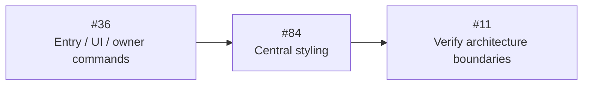
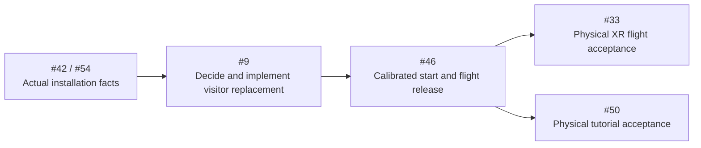

# Refactor Roadmap

This is the execution order and resume checkpoint. The [target architecture](target-architecture.md)
owns responsibilities and diagrams; the [Engineering Standards](engineering-standards.md)
own names, contracts and styling. The [workflow](refactor-workflow.md) and
[test plan](refactor-test-plan.md) own implementation and verification cadence.
Live issues own acceptance. Do not create a second implementation plan.

## Resume Checkpoint — 2026-09-09

| Field | Current state |
| --- | --- |
| Branch | `david_refactor` only. Commit/push completed, tested blocks to `origin/david_refactor` and verify success; no main, force-push or additional branches. |
| Current request | Documentation and handoff only. User reports installation running via front USB; do not use rear USB-C next to Ethernet. Tutorial remains physically unusable for following arrows; no new runtime changes in this closeout. |
| Source checkpoint | `226038d` is the latest implementation checkpoint. Read the [session handoff](evidence/2026-09-09-session-handoff.md) for grouped commits, corrected assumptions and verification limits; `1adc872` remains the historical pre-tutorial source. |
| Next implementation | First review the session changes at their existing owners (#76), then address [#117](https://github.com/Strehk/becoming-many/issues/117) under #50: reachable arrow lead, full silhouette and flight-direction perception. A curve indicator is a design candidate, not an approved overlay. Preserve spoken timing, fixed anchors, shared transport, 60-second learning budget and complete speech/tails. |
| Confirmed direction | Conductor is UI only; Entry connects UI to the existing browser Engine. Show owns transport/language, Run owns lifetime, World owns rendering, M5 owns validity. Backend remains Station delivery/config/health. Affected role filenames and `src/ui/app.css` are implemented. |
| Existing software | Direct startup, complete child/source cleanup, entry diagnostics, explicit literal levels, legacy Grass retirement, shared zone influences, approved bank clearance and shared Rocks/Vegetation lifecycle are implemented. Their distinct remaining issue acceptance is preserved. |
| Current visitor behavior | Initial Play; up to 60 seconds for four spatial goals. A transition request finishes the current native speech, then leaves 1.5 playing seconds before main playback; earned closing remains complete. The separate Begin experience button is removed; operators use the existing Play/Pause and Stop. Interim Stop resets rig/time and holds; after handoff it recreates only retired training content. Complete replacement and fresh calibration remain #9/#46 decisions. |
| Unresolved evidence | #73 Motion clock-progress failure, #78 exact reference approval and real Windows-PCVR USB-C 90 Hz/transport/headset/M5/venue acceptance remain open. CSS fixes do not resolve them. |

The previous detailed checkpoint, source identities and historical counts remain
in [the pre-plan roadmap](https://github.com/Strehk/becoming-many/blob/ee2692b9d7511b360b369c20e66bcda87c74e064/docs/roadmap.md).
Use [current status](current-status.md), live issue results and the
[evidence index](evidence/README.md) for current software and measurement facts.
The older checkpoint's issue order is superseded by the order below.

The kiosk correction adds Controller state inside the technician drawer and a
World-owned XR eye copy for the desktop preview. The subsequent user decision removes firmware, identity, calibration, sequence
and extreme-pose gates; the configured host supplies input directly. Local
compatibility and reconnect checks pass. The later user report confirms the
installation running, but separately measured M5 polarity, desktop XR mirror
behavior and both station assignments remain unrecorded. Windows deployment
changes are preserved.

## Windows startup follow-up

[#116](https://github.com/Strehk/becoming-many/issues/116) retains the EventLog
TCP 49667 collision, the separate `d135d32` startup-abort regression and its
`226038d` correction. The post-repair photo confirms new TCP ranges and no listener
on 49667; the user subsequently reports the installation running through front
USB. **Do not use rear USB-C next to Ethernet: connecting there reportedly powers
the PC off.** The canonical [cabling and recovery instructions](direction/deployment.md)
own this operational fact; the hardware cause remains unknown.

Next under #54/#116: label/inventory the ports and station/headset/M5 assignments,
record the actual running image and native OpenXR/PICO configuration, then verify
cold start, supervision and front-USB reconnect on both stations. Do not rerun
network repair on a working installation without the documented collision. No
browser shell bridge or automatic OS settings repair is planned.

## Immediate tutorial corrections after office review

[#117](https://github.com/Strehk/becoming-many/issues/117) captures the latest
physical feedback: arrows are too close to follow with a deliberate curve and
the white world gives insufficient perception of travel direction. This reinforces
the previous browser silhouette/clipping findings; #50 remains visually and
physically unaccepted. Review the captured-view/flight-prognosis/guide separation,
then tune actual lead time and angular readability with the existing flight model.
Evaluate a minimal motion or curve reference without assuming a HUD or auto-steering.

Resume in this order: inspect the [session handoff](evidence/2026-09-09-session-handoff.md)
and current owner boundaries; implement #117 as a coherent #50 correction; run
focused checks and real browser interactions/screenshots; obtain physical
comprehension, listening and PCVR performance evidence. Preserve already-corrected
language-after-handoff, retained wind reset and cold initial narration seek.
This ordering does not authorize unrelated #115 main-branch ports.

## Immediate UI and Engine Migration

The earlier #36/#84/#11 block is implemented and locally verified at its recorded
source identities. The 2026-09-08 consolidation is implemented: all browser HTML
and controllers live in `src/ui/`, startup in `src/entry/`, metrics in
`src/diagnostics/`, and platform-neutral contracts to `shared/`. Authored markup
and canvas placement are explicit; shared scrubbing replaces duplicate
gestures and Flash separates form binding from connection lifetime. Combined
checks and responsive browser interactions/screenshots pass in production and
development; [results and limits](evidence/ui-consolidation/README.md) are retained.

No new UI framework,
remote Show transport, command bus, global store or CoreEngine coordinator is needed.
A source move alone is not code reduction; remove the replaced implementation and
its exclusive paths in the same coherent block.

| Order | Existing issue | Scope and required removal | Dependency / completion boundary |
| --- | --- | --- | --- |
| 1 | [#36](https://github.com/Strehk/becoming-many/issues/36) | Separate Entry from Conductor UI; put transport/language in Show and existing reset operation in Run; delete `show-actions.ts`, duplicate pauses, stale-state decisions and unused scrub flag. Narrow M5/XR capabilities, move shared XR button to UI, migrate actual affected role filenames and all consumers. | Implemented and closed at `a213243`; local UI/lifetime checks pass. Complete visitor replacement remains #9; preserve and name the interim reset honestly. |
| 2 | [#84](https://github.com/Strehk/becoming-many/issues/84) | Central `src/ui/app.css`, shared visual rules and scoped layouts; remove four old stylesheets/imports and authored DOM inline styling. Fix known transport cascade and hidden M5 preview defects; preserve dynamic geometry and accessible interaction. | Implemented; three HTML pages plus the standalone-level layout, responsive gestures/focus and simulated M5 geometry pass. New visual/product redesign is outside this cleanup. |
| 3 | [#11](https://github.com/Strehk/becoming-many/issues/11) | Update existing Fallow zones/rules for Entry, UI, browser Engine, Station and migrated roles; verify real allowed/forbidden imports and narrow type capabilities. | Implemented after #36/#84: real graph clean, forbidden imports/types rejected; zero imports alone proves neither lifecycle nor 90 Hz. |

Each issue must name the current problem, target owner, replaced path, real
consumers, prerequisite and smallest useful acceptance check. Naming migration
includes imports, HTML/Vite entry references, tooling paths, tests and documents;
keep stable browser routes and remove old aliases. Role-bearing files outside the
affected owners migrate with their later coherent refactor, not a mass-rename task.

## Required Tutorial — #50

The current contract is documented in [Levels](../src/levels/README.md#required-flight-tutorial).
The literal Start recipe replaces the `a136bcc` held-gesture/opaque-arrow MVP
on its existing routes and also opens the full Show. The approved sequence is
right/left/up/down. The latest 2026-09-09 user revision adds 60 playing seconds of
integrated practice, automatic timeout without false success speech, a full earned
closing recording and a prepared transition through existing owner commands.
Current speech and a 1.5-second breathing interval may extend the earlier roughly
74-second estimate. The separate Begin experience button was subsequently removed;
keep the shared transport.
The timeline retains the actual tutorial span before the unchanged main score.
Earlier on 2026-09-09 the user replaced persistent
missed targets with forward recycling: retire the old section, then retry the
same direction ahead of the current flight pose. Only actual passages count.
Show owns explicit Play/Pause, instruction/language and transition policy,
using its existing clock before rebasing to the main schedule. Run retires
exclusive training resources/registrations and keeps the main world prepared.
World, locomotion and background particles retain their existing responsibilities.

#109/#110/#113 implement the fixed particle cloud, swept ring passage and bounded
wake/appearance. Sound and narration reuse existing owners for #111/#112. Five
DE recordings from the predecessor tutorial source are now installed following
the user request for the voice. The EN selection temporarily uses the same
German clips pending replacement English recordings. Eleven user-provided
generated instrumentals are now archived as granular material; the integration step below
owns their excerpt selection and sound implementation.
The production recipe enables granular atmosphere and all five German tutorial
recordings, using the existing narration player. Standalone Start uses the same Show timebase and Run-owned spatial audio. Configured instruction playback can finish
before the next goal is presented, and post-handoff reset remains held until its
graphics and optional sample are ready, with visible failure/retry. The combined
implementation passes its local tests, lint, build and browser checks; the
[review and screenshot packet](evidence/issue-50/README.md) records the subsequent
preparation correction and extended measurement. Fallow has no
dead-code/boundary violations but retains complexity/style findings. Local
rendering/audio comparisons are recorded in [Performance](performance.md#flight-tutorial--2026-09-08).
Visitor
comprehension, listening, XR comfort and real Windows-PCVR USB-C performance
remain physical acceptance. The approved software flow does not resolve #9/#46
visitor replacement or fresh calibration.

#20's completed shader-contract implementation is closed under the current
workflow; its old three-issue review gate no longer blocks source work. Other
issues with remaining physical, content, numerical-reference or unexplained
failure criteria remain open, even when their source refactor is implemented.

## Procedural Flight World — 2026-09-09

User direction: particles must continuously surround the flyer; reuse the main
experience's chunk logic. Large three-dimensional arrows lead into a curve and
a tunnel made of particles/rings. Formation, traversal and dissolution should
read as one flowing world. The existing manually controlled locomotion remains
binding; the world provides spatial guidance, not automatic steering.

The user's [flight-world sketch](direction/tutorial-flight-sketch.png), supplied
as inspiration on 2026-09-09, adds a clear spatial rhythm: open curved flight,
individual gates, large directional arrows, and a denser group of rings forming
a tunnel, followed by open flight again. Generate that alternation along one
continuous route instead of making every section a tunnel. Gate spacing and
orientation follow the local curve; nearby sections remain visible together.
The drawn layout is a reference for composition, not a fixed coordinate list.
The yellow dotted line is interpreted as a route annotation in the drawing;
a visible path line, automatic steering and an exact loop are not inferred.
The original PNG is archived unchanged from `Bildschirmfoto 2026-09-08 um 23.17.55.png`.

Current source uses the existing Air chunk window, a fixed 40,000-point training
pool, independently persistent arrows, rig-motion prediction, swept ring crossings
and future-only course recycling. The Start recipe authors 384 ambient particles
per chunk, a 6 m arrow, and 2 m/s tutorial translation; authored 8–9 m course values
are inputs, not a measurement of actual visible lead distance. #117 must assess
the complete placement calculation and real turning opportunity.

Earlier counts, distances and effects in the dated [tutorial evidence](evidence/issue-50/README.md)
record successive implementations, not extra requirements or current defaults.
The [scene script](direction/tutorial-scene-script.md) is a narration/composition
reference. Preserve the arrow-first, actual-turn-then-ring sequence; previews
help navigation and only the learning target awards progress. Start owns bounded
local presentation, Run retirement, World rendering and Show speech/time. Existing
sound voices borrow fixed object anchors and drain through the bounded handoff.

The white composition, cloud density, gentle motion and restrained accents are
approved direction, not accepted visitor usability. Replacement English
recordings, spatial listening, visual comfort and actual Windows-PCVR performance
remain open. Standalone PICO is a separate later project.

## Granular Atmosphere — #112

The user supplied eleven instrumentals and requested multiple granular layers,
spatial distribution, substantial reverb and a distant character. The originals
and technical catalog are in [Sound](../src/sound/README.md#granular-atmosphere-source-material).
This supersedes waiting for source samples; it does not approve narration
fallbacks or constitute listening acceptance. The software step is implemented at the existing
training sound owner; no second runtime or soundtrack was introduced:

- Three 12-second mono derivatives from sources 01, 03 and 08 have provenance,
  fades and headroom. Only these buffers load, shared by four GrainPlayers.
- Three layers bind to visible ring sides/arrow body, and one voice marks the
  current goal. Start supplies borrowed world anchors; hidden/ended objects stop
  their sources. Formation and wake use the graphics owner's transforms.
- One eight-second shared hall, HRTF direct sound, inverse-distance room sends,
  distance filtering and speech ducking implement the requested spatial mix.
  Pause mutes the room too; Run gates sample/room readiness and complete cleanup.
- The production recipe schedules about 12.4 grains/s; validation caps any recipe
  at 40. No complete original track is decoded or played.

Remaining #112 acceptance: audition the source selection and tune the mix with
actual headphones/headset. Test approach, retreat, passing beside each object,
head turns, distant missed targets, speech intelligibility, dissolution and
restart. Confirm that substantial hall preserves localization and clear near/far
perception. Initial gain/filter/room values are engineering choices, not measured
acoustic acceptance. Keep Windows-PCVR USB-C frame/audio acceptance explicit.
The [tutorial evidence](evidence/issue-50/README.md) records software checks and
measurement limits; German voice use is explicitly requested; replacement
English voice files remain pending.

## Independent Operating and Verification Work

- **#9:** awaited Run/child/source cleanup already exists. Preserve that evidence;
  decide the concrete replacement sequence and retained operator choices, then
  integrate it at existing owners. UI invokes the operation, never its sequence.
- **#42/#54:** collect the actual Windows/GPU/driver/browser/XR/USB/headset matrix
  early, including XR re-entry, audio wake, controller and station recovery.
  A page reload is a candidate requiring real operating evidence.
- **#46/#33:** fresh calibration, hold/play and flight release require the actual
  installation. Preserve local head pose and floor-relative height; no automatic
  immersive re-entry or unapproved start behavior is assumed.
- **#73:** startup/Composition flattening is implemented. Investigate the retained
  Motion failure separately: about 0.725 Show seconds advanced over ten seconds
  while 599 frames continued. Later passes have not explained it.
- **#78:** two current nine-level replays repeat exactly and the updated
  [proposal](evidence/issue-78/README.md) records current counts and limited endpoint
  views. Ground/sense workload review and explicit numerical approval remain;
  the real reference and its seven failing comparisons are unchanged.

These remaining gates do not invalidate the completed UI/Engine software boundary. They remain
required for actual visitor/installation acceptance and must not be reported as
complete after a UI, CSS or naming change.

## Browser Performance Follow-up — 2026-09-08

The [browser audit](performance-audit-2026-09-08.md) records the measured source,
results and limitations. Its findings are filed in the existing issue workflow
under the [performance label](https://github.com/Strehk/becoming-many/issues?q=is%3Aissue%20is%3Aopen%20label%3Aperformance),
with the handoff in [#76](https://github.com/Strehk/becoming-many/issues/76).
#93 is implemented and locally verified as a direct dependency of the spoken
#50 tutorial: zero repeated native Hold writes, bounded play attempts and exact
scrub/language/resume behavior. The [final tutorial review](evidence/issue-50/README.md#final-independent-review-and-narration-hold-correction--2026-09-09)
records its evidence and limits. Remaining work starts with #94 Hi-Hat graph work,
#95 Grass step cost and #96 duplicate population publication; #16 owns preparation
readiness.
Live issues own acceptance. Preserve KISS/YAGNI, existing owners and removal of
replaced paths; hypotheses require measurement before implementation. No new
reference, product or physical acceptance follows from the desktop results.

## Existing Work to Preserve

| Work | Current software facts and remaining scope |
| --- | --- |
| #73, #9, #16, #14/#35 | Startup forwarding, child/source cleanup, renderer preparation and entry-owned diagnostics have implementation evidence. Preserve the one loop and existing sampler timing; #73 clock, #9 visitor operation and issue-specific physical/performance gates remain. |
| #85, #25 | Explicit independent literal levels and active-state naming are implemented; #85/#25 are closed. Connections constructs the Show once; Show states control presentation. |
| #17/#18/#38 | Host lifetime and axis-boundary software is implemented; strict #18 eligibility was removed by the 2026-09-09 user decision; physical calibration/polarity acceptance remains. Do not change flight equations during interface narrowing. |
| #80 | Moving-animal Connections path is retired. Preserve vegetation including bushes, rocks, fixed forest-clearing anchors and soil; animal motion and Scent/Thermal body facts remain. Physical acceptance stays open. |
| #13/#72/#71 | Legacy Grass is retired; conservative Clipmap bounds and shared continuous World Surface influences are implemented. Integrated visual and Windows-PCVR acceptance remain separate. |
| #81/#41/#28 | Approved 1 m analytic-bank clearance, shared Rocks/Vegetation lifecycle and surviving wind checks are complete. Do not rebuild their removed alternatives. |
| #27/#26/#32 | Scent source typing and bounded queue path and Thermal corrections have evidence. Preserve remaining measured/physical acceptance and unexplained replay findings. |
| #50/#51 | Four-goal tutorial, timed automatic handoff and shared transport use the existing owners. Audio-content and physical acceptance remain; credits timing/movement is separate. No second timeline, tutorial runtime or credits renderer. |
| #29/#47–#49 | Reconcile current animal motion/passages against each real issue before changing timing, gaze or content. No parallel encounter implementation. |
| #79/#83 | Existing audio scheduling and automated pointer-lock findings retain their exact evidence and limits. UI migration does not resolve them. |

## Milestones

| Milestone | Remaining focus |
| --- | --- |
| M0 | Retain early boundary/tooling evidence; #78 exact reference and complete milestone acceptance remain open. |
| M1 | Preserve completed startup/content/material work and its outstanding acceptance; #73 uncertainty remains separate. |
| M2 | #36/#84/#11 architecture software implemented; retained #9/#16 software and complete visitor operation; early #42/#54 commissioning. |
| M3 | Physical input/calibration/flight: #18/#38, #9 → #46 → #33. |
| M4 | Remaining integrated rendering and performance acceptance: #13/#71/#72/#80, #26/#32. |
| M5 | Required #50/#51 and decision-bound encounter work. |
| M6 | Complete #42/#54, repeated visitors, both stations, recovery and exact integration handover. |

## Requested Connections Presentation — #114

[#114](https://github.com/Strehk/becoming-many/issues/114) records a requested
visual feature: strengthen the final Connections atmosphere with luminous
mycelium and visibly transparent ground. The
[three reference images](moodboards/connections-atmosphere-references.md) are
preserved as visual direction. Implementation and visual/performance acceptance
remain open; the issue owns their criteria. This does not reorder the current
implementation checkpoint.

## Remaining Decision Gates

| Decision | Required evidence / affected work |
| --- | --- |
| Visitor replacement mechanism | Compare the smallest complete sequence, including page reload if suitable, on actual Windows-PCVR: XR exit/re-entry, audio wake, retained settings and staff actions. #9/#46 own implementation after the decision. |
| Exact benchmark reference | Defined workload/pose/assets, repeatable counters and explained differences; #78 candidate remains unapproved. |
| Tutorial audio / credits | #50 replacement English recordings and #112 excerpt/mix acceptance (eleven instrumental sources supplied); #51 content/timing/rights and credits movement. The four-goal tutorial flow is approved. |
| Physical flow and encounters | Calibration, hold/play, flight, safety/see-through and existing motion/gaze/timing choices; their respective issues only. |

Windows-PCVR over USB-C is settled; standalone PICO is a later separate project.
No new engine owner, unexplained performance regression or unplanned product
change is approved by this documentation update. Relevant comparisons keep their
source/build identities and limitations. Never replace failed evidence with a
successful rerun without explaining the failure.

## Baseline Findings Without Dedicated Issues

Previously recorded Fallow findings include unused `BAT_PASSAGE`, unused
`STEP_LOOKAHEAD_SECONDS` and duplicate export name `ReadSwarmCrossing`. Reconfirm
them before implementation and associate an actual finding with a matching issue
or one focused new issue; do not fold unrelated work into the UI block.

## Integration Coordination

Open PRs previously listed in the checkpoint may target `main` from other
branches. Re-read their status and overlap before handover; they are not included
by this plan. Never check out, merge or modify main. All work stays on
`david_refactor`; no extra worktree/branch and no force-push. Tracker
[#76](https://github.com/Strehk/becoming-many/issues/76) mirrors this roadmap.
