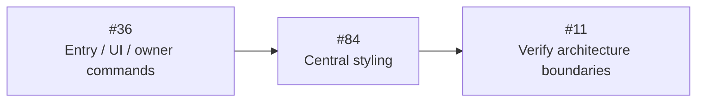
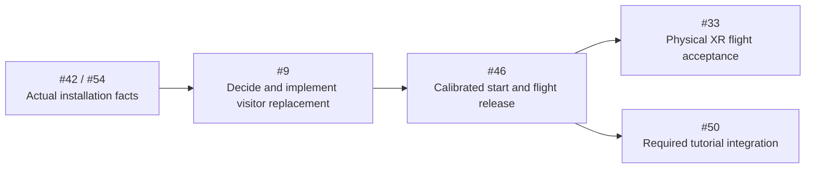

# Refactor Roadmap

This is the execution order and resume checkpoint. The [target architecture](target-architecture.md)
owns responsibilities and diagrams; the [Engineering Standards](engineering-standards.md)
own names, contracts and styling. The [workflow](refactor-workflow.md) and
[test plan](refactor-test-plan.md) own implementation and verification cadence.
Live issues own acceptance. Do not create a second implementation plan.

## Resume Checkpoint — 2026-09-07

| Field | Current state |
| --- | --- |
| Branch | `david_refactor` only. Commit/push completed, tested blocks to `origin/david_refactor` and verify success; no main, force-push or additional branches. |
| Current request | Implement the prepared architecture and ready software issues so the next Start level can use clear existing owners. Product/physical decisions stay open. |
| Source checkpoint | `a213243` implements #36; `2e626b9` fixes repeat audio wake. #84/#11 complete central styling and import/type enforcement in this block. |
| Next implementation | #36 is committed/pushed at `a213243`; #84 styling and final #11 boundary checks complete the immediate architecture path. Continue at the next Start-level definition and remaining explicit decisions, not another architecture inventory. |
| Confirmed direction | Conductor is UI only; Entry connects UI to the existing browser Engine. Show owns transport/language, Run owns lifetime, World owns rendering, M5 owns validity. Backend remains Station delivery/config/health. Affected role filenames and `src/app.css` are implemented. |
| Existing software | Direct startup, complete child/source cleanup, entry diagnostics, explicit literal levels, legacy Grass retirement, shared zone influences, approved bank clearance and shared Rocks/Vegetation lifecycle are implemented. Their distinct remaining issue acceptance is preserved. |
| Current visitor behavior | New visitor remains time/position reset and hold. Complete replacement operation and calibration/start interaction remain #9/#46 decisions. |
| Unresolved evidence | #73 Motion clock-progress failure, #78 exact reference approval and real Windows-PCVR USB-C 90 Hz/transport/headset/M5/venue acceptance remain open. CSS fixes do not resolve them. |

The previous detailed checkpoint, source identities and historical counts remain
in [the pre-plan roadmap](https://github.com/Strehk/becoming-many/blob/ee2692b9d7511b360b369c20e66bcda87c74e064/docs/roadmap.md).
Use [current status](current-status.md), live issue results and the
[evidence index](evidence/README.md) for current software and measurement facts.
The older checkpoint's issue order is superseded by the order below.

## Immediate UI and Engine Migration

This architecture workstream is implemented and locally verified. No new UI framework,
remote Show transport, command bus, global store or CoreEngine coordinator is needed.
A source move alone is not code reduction; remove the replaced implementation and
its exclusive paths in the same coherent block.

| Order | Existing issue | Scope and required removal | Dependency / completion boundary |
| --- | --- | --- | --- |
| 1 | [#36](https://github.com/Strehk/becoming-many/issues/36) | Separate Entry from Conductor UI; put transport/language in Show and existing reset operation in Run; delete `show-actions.ts`, duplicate pauses, stale-state decisions and unused scrub flag. Narrow M5/XR capabilities, move shared XR button to UI, migrate actual affected role filenames and all consumers. | Implemented and closed at `a213243`; local UI/lifetime checks pass. Complete visitor replacement remains #9; preserve and name the interim reset honestly. |
| 2 | [#84](https://github.com/Strehk/becoming-many/issues/84) | Central `src/app.css`, shared visual rules and scoped layouts; remove four old stylesheets/imports and authored DOM inline styling. Fix known transport cascade and hidden M5 preview defects; preserve dynamic geometry and accessible interaction. | Implemented; four surfaces, responsive gestures/focus and simulated M5 geometry pass. New visual/product redesign is outside this cleanup. |
| 3 | [#11](https://github.com/Strehk/becoming-many/issues/11) | Update existing Fallow zones/rules for Entry, UI, browser Engine, Station and migrated roles; verify real allowed/forbidden imports and narrow type capabilities. | Implemented after #36/#84: real graph clean, forbidden imports/types rejected; zero imports alone proves neither lifecycle nor 90 Hz. |

Each issue must name the current problem, target owner, replaced path, real
consumers, prerequisite and smallest useful acceptance check. Naming migration
includes imports, HTML/Vite entry references, tooling paths, tests and documents;
keep stable browser routes and remove old aliases. Role-bearing files outside the
affected owners migrate with their later coherent refactor, not a mass-rename task.

## Start-level handoff

The implementation path is documented in [Levels](../src/levels/README.md#implementing-the-next-start-level):
a literal `start.level.ts`, stable route/catalog registration and existing Run /
Composition / Show owners. UI contains no experience sequencing. A standalone
Start scene needs no new architecture owner; the calibrated visitor/tutorial
handoff still requires #9/#46/#50 decisions. The actual next level is intentionally
left for the user's next content implementation step.

#20's completed shader-contract implementation is closed under the current
workflow; its old three-issue review gate no longer blocks source work. Other
issues with remaining physical, content, numerical-reference or unexplained
failure criteria remain open, even when their source refactor is implemented.

## Independent Operating and Verification Work

- **#9:** awaited Run/child/source cleanup already exists. Preserve that evidence;
  decide the concrete replacement sequence and retained operator choices, then
  integrate it at existing owners. UI invokes the operation, never its sequence.
- **#42/#54:** collect the actual Windows/GPU/driver/browser/XR/USB/headset matrix
  early, including XR re-entry, audio wake, controller and station recovery.
  A page reload is a candidate requiring real operating evidence.
- **#46/#33:** fresh calibration, hold/play and flight release require the actual
  installation. Preserve local head pose and floor-relative height; no automatic
  immersive re-entry or unapproved start behavior is assumed.
- **#73:** startup/Composition flattening is implemented. Investigate the retained
  Motion failure separately: about 0.725 Show seconds advanced over ten seconds
  while 599 frames continued. Later passes have not explained it.
- **#78:** bounded reference investigation and explicit approval of the exact
  proposed counters remain required; do not change the reference to pass checks.

These remaining gates do not invalidate the completed UI/Engine software boundary. They remain
required for actual visitor/installation acceptance and must not be reported as
complete after a UI, CSS or naming change.

## Existing Work to Preserve

| Work | Current software facts and remaining scope |
| --- | --- |
| #73, #9, #16, #14/#35 | Startup forwarding, child/source cleanup, renderer preparation and entry-owned diagnostics have implementation evidence. Preserve the one loop and existing sampler timing; #73 clock, #9 visitor operation and issue-specific physical/performance gates remain. |
| #85, #25 | Explicit independent literal levels and active-state naming are implemented; #85/#25 are closed. Connections constructs the Show once; Show states control presentation. |
| #17/#18/#38 | Host lifetime, eligibility and axis-boundary software is implemented; physical calibration/polarity acceptance remains. Do not change flight equations during interface narrowing. |
| #80 | Moving-animal Connections path is retired. Preserve vegetation including bushes, rocks, fixed forest-clearing anchors and soil; animal motion and Scent/Thermal body facts remain. Physical acceptance stays open. |
| #13/#72/#71 | Legacy Grass is retired; conservative Clipmap bounds and shared continuous World Surface influences are implemented. Integrated visual and Windows-PCVR acceptance remain separate. |
| #81/#41/#28 | Approved 1 m analytic-bank clearance, shared Rocks/Vegetation lifecycle and surviving wind checks are complete. Do not rebuild their removed alternatives. |
| #27/#26/#32 | Scent source typing and bounded queue path and Thermal corrections have evidence. Preserve remaining measured/physical acceptance and unexplained replay findings. |
| #50/#51 | Tutorial and credits are required; content, timing, rights and start/movement details remain explicitly scoped decisions. No second timeline, tutorial runtime or credits renderer. |
| #29/#47–#49 | Reconcile current animal motion/passages against each real issue before changing timing, gaze or content. No parallel encounter implementation. |
| #79/#83 | Existing audio scheduling and automated pointer-lock findings retain their exact evidence and limits. UI migration does not resolve them. |

## Milestones

| Milestone | Remaining focus |
| --- | --- |
| M0 | Retain early boundary/tooling evidence; #78 exact reference and complete milestone acceptance remain open. |
| M1 | Preserve completed startup/content/material work and its outstanding acceptance; #73 uncertainty remains separate. |
| M2 | #36/#84/#11 architecture software implemented; retained #9/#16 software and complete visitor operation; early #42/#54 commissioning. |
| M3 | Physical input/calibration/flight: #18/#38, #9 → #46 → #33. |
| M4 | Remaining integrated rendering and performance acceptance: #13/#71/#72/#80, #26/#32. |
| M5 | Required #50/#51 and decision-bound encounter work. |
| M6 | Complete #42/#54, repeated visitors, both stations, recovery and exact integration handover. |

## Remaining Decision Gates

| Decision | Required evidence / affected work |
| --- | --- |
| Visitor replacement mechanism | Compare the smallest complete sequence, including page reload if suitable, on actual Windows-PCVR: XR exit/re-entry, audio wake, retained settings and staff actions. #9/#46 own implementation after the decision. |
| Exact benchmark reference | Defined workload/pose/assets, repeatable counters and explained differences; #78 candidate remains unapproved. |
| Tutorial/credits details | Content, duration, rights, start behavior and movement during credits; #50/#51. |
| Physical flow and encounters | Calibration, hold/play, flight, safety/see-through and existing motion/gaze/timing choices; their respective issues only. |

Windows-PCVR over USB-C is settled; standalone PICO is a later separate project.
No new engine owner, unexplained performance regression or unplanned product
change is approved by this documentation update. Relevant comparisons keep their
source/build identities and limitations. Never replace failed evidence with a
successful rerun without explaining the failure.

## Baseline Findings Without Dedicated Issues

Previously recorded Fallow findings include unused `BAT_PASSAGE`, unused
`STEP_LOOKAHEAD_SECONDS` and duplicate export name `ReadSwarmCrossing`. Reconfirm
them before implementation and associate an actual finding with a matching issue
or one focused new issue; do not fold unrelated work into the UI block.

## Integration Coordination

Open PRs previously listed in the checkpoint may target `main` from other
branches. Re-read their status and overlap before handover; they are not included
by this plan. Never check out, merge or modify main. All work stays on
`david_refactor`; no extra worktree/branch and no force-push. Tracker
[#76](https://github.com/Strehk/becoming-many/issues/76) mirrors this roadmap.
