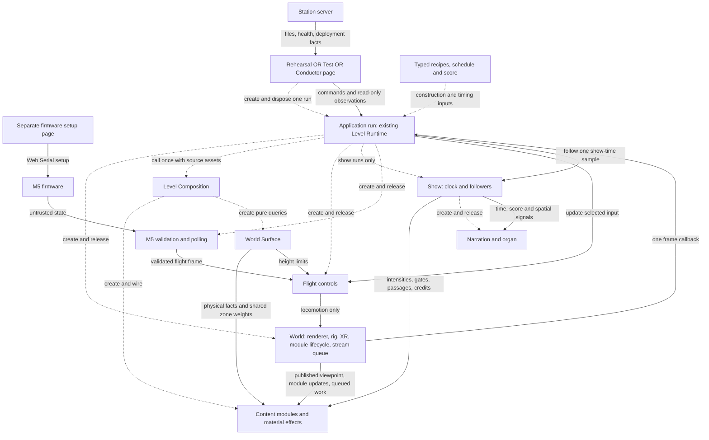

# Target Architecture — First Strategic Draft

## 1. Status and scope

**Authority update, 2026-09-05:** the user has made this document binding for
the refactor. Its explicitly open decisions remain open, and existing roadmap,
verification and human acceptance gates still apply. The draft labels below
preserve the distinction between observed implementation, target direction and
approval still required; this update does not record M0 acceptance.

First discussion draft, 2026-09-05, based on `david_refactor` at
`9bfb84b5699a210e78ec81a295a2b028907af726` **plus the existing local M0 changes**:
workflow, standards, roadmap/status/performance documentation, Fallow rules,
package commands, benchmark/browser tooling and retained issue-75 evidence.
Those changes are preserved. This document authorizes no implementation or Git
operation; the [roadmap checkpoint](roadmap.md) and pending human M0 review remain.

**Observed** identifies code or dated evidence; **Recommend** identifies this
target; **Open** identifies required decisions or measurements. Current
[architecture decisions](architecture-decisions.md) remain binding until their
explicit replacement is approved. **Confirmed by the user on 2026-09-05:**
Clipmap is the only target Grass renderer; World Surface owns zone conditions,
thresholds and continuous transition weights shared by Grass, Vegetation and
Rocks. D5 records this decision and its full legacy removal. Renderer selection
is settled; performance/PICO acceptance and implementation remain outstanding.
The original draft investigation updated only this document and left the
confirmed-decisions file unchanged. The subsequent binding reconciliation
updated [architecture decisions](architecture-decisions.md), the
[workflow](refactor-workflow.md) and [roadmap](roadmap.md) to match confirmed
direction while preserving open choices. The objective is to remove ownership
gaps and unused capabilities while retaining the mechanisms that bound one world.

The live investigation read all **52 issues (41 open, 11 closed), all 17
comments**, the five user-authored PRs and six relevant open PRs. This corrects
the roadmap's older 36-open count for this investigation only. Section 10
synthesizes these inputs; neither an issue nor an unmerged PR proves the current
implementation. That original investigation changed no GitHub records; the
subsequent binding reconciliation updated the affected issues and tracker and
recorded the focused follow-ups #80 and #81.

## 2. Necessary capabilities and non-goals

The application must support:

- One independently configured static level, including the diagnostic Test
  level and deterministic benchmark entry.
- One complete 8:41 show with accumulated senses, scheduled animal passages,
  English/German narration, organ and closing credits in one preloaded world.
- Rehearsal controls or an in-process Conductor, with pause, seek, language
  selection and a deliberate, paused start for the next visitor.
- Desktop flight or validated M5 flight through the same locomotion rig,
  while WebXR or desktop look retains ownership of local head pose.
- Failure recovery and complete disposal, including partially completed
  starts, asynchronous assets, audio, workers, input and XR.
- Independent station operation: static delivery, health and deployment
  facts; separate technician firmware setup.

No plugin system, editor, multiplayer, remote command broker, generic service
container, automatic quality governor or second runtime is needed. Two stations
do not share show state. Passthrough, tutorial, encounter retiming and delivery
platform remain [product decisions](direction/open-decisions.md), not implicit
architecture requirements. Existing diagnostic routes remain real consumers.

## 3. Target structure

Dashed arrows describe construction or immutable inputs; solid arrows describe
runtime calls or facts. The entry box means **one alternative per application**.
Boxes name responsibilities, not mandatory new classes, folders or files.
Composition is a construction function; it is not another live coordinator.



World renders the composed scene once after the work shown. Module gate changes
use World's existing `ModuleRuntime`; the Show never owns a competing module
state list. The Run owns loaded source assets outside the scene until every
borrower has ended. Show owns the native timebase; the organ schedules its
output against a separate Tone context. Entry-owned DOM refresh is not rendering.

## 4. Responsibilities and contracts

### Implementation footprint: remove indirection inside existing owners

**“Run” is the existing `startLevel` invocation and returned handle, not a new
ApplicationRun file, class or coordinator.** The target adds no runtime owner.
Keep start, its frame function, reset and end together in `level-runtime.ts`;
keep concrete construction and its return mapping together in
`level-composition.ts`. Arrange private functions below the public story, in
reading order. A private function is not a reason for another file.

The necessary new capability is cancellation/complete disposal on existing
handles. World also exposes its existing preparation work and small diagnostic
reads directly. These replace callbacks and oversized arguments; they do not
justify Lifecycle, Asset, Preparation, Diagnostics or FramePipeline services.
M5 host replacement stays inside its existing adapter.

The deletion ledger in §8 is the implementation boundary: a new wrapper that
preserves the old chain fails this design. Moving code or renaming a type is
not counted as deleting its capability.

| Existing responsibility | Owned state/resources | Inputs and actual consumers | Calls, end and exclusion |
| --- | --- | --- | --- |
| **Entry** (`main.ts`, `test-main.ts`, Conductor) | DOM, bindings, drag/render caches, optional sampler, pending-start cancellation | Request/deployment facts; commands and observations for panels | Starts/cancels/ends one Run; releases its own UI. No show-time or reset policy. |
| **Run** (`level-runtime.ts`) | Child references, startup/closing state, source GLTF assets | Discriminated request; commands, cancellation and complete `dispose()` for Entry | Direct startup, input selection, local frame/reset/end. No concrete content algorithms or second loop. |
| **Composition** (`level-composition.ts`) | No persistent owner state | Recipes, World, borrowed assets → Surface, ordered modules and ShowWorldReach | Called once by Run; factories clean partial failure. No transport, registry or coordinator object. |
| **World** (`world-runtime.ts`) | Renderer/context, scene, rig/camera, Timer, XR/resize listeners, ModuleRuntime and StreamQueue | Run's frame function; viewpoint and execution for modules; optional benchmark FrameControl | Run starts it last/stops it first. Owns preparation, render and final release. No level policy or show clock. |
| **Flight controls** (`control/`) | Desktop capture and input-specific navigation state | Selected desktop/M5 input → rig locomotion; Surface-based limits | Created/reset/disposed by Run; capture and movement math remain local. No protocol parsing or headset-pose overwrite. |
| **M5** (`m5/`) | Host-bound poll/sample/filter/calibration/button state | Untrusted HTTP → flight ControlFrame and observational UI status | Existing adapter replaces host state and invalidates late work. Run owns its lifetime. No show commands or transforms. |
| **Show** (`show-runtime.ts`, `dramaturgy/`) | Clock origins/rate/play state, language, native timebase, audio followers, bounded scratch | Authored schedule/state/score and composed ports → current commands/observations | Run creates/ticks/ends it. Pure lookups remain calculations. No content construction or rig movement. |
| **Audio** (`sound/`) | Narration media; organ nodes, scheduling cursors and Tone context | One Show sample, strengths and spatial signals → sound/status | Show owns follower lifetime; organ releases nodes/context including late imports. No independent show clock. |
| **World Surface** (`world-surface/`) | Physical conditions, zone thresholds and continuous transition weights | Height/zone facts for content and flight; identical weights for Clipmap, Vegetation and Rocks | Created in Composition; pure queries, no render lifecycle. Content owns derived coverage/density and placement, never parallel zone rules. |
| **Content** (`modules/`) | Own CPU/GPU pools, derivatives, slot assignments and worker where needed | Borrowed sources, Surface/viewpoint/ports → scene and specific provider facts | Composition constructs; ModuleRuntime runs lifecycle. No sibling imports or private schedule. |
| **Station / Flash / firmware** | Existing independent process, serial UI or device sensing lifetime | Files/config/health, setup commands, controller protocol | Outside Run; setup releases bindings and transient credentials. No broker, shared show state or new supervisor. |

`WorldModule` separates active updates from resource lifetime; `ShowWorldReach`
connects real composed setters/providers to Show. Plant scent and root anchors
have different output contracts but one plant-placement owner. Animal body
observations still feed scent/heat; only the additional live-root-web contract
is proposed for retirement. No universal module or provider API replaces them.

## 5. Complete target flows

### Read the Test level like a short chapter

For `/test.html?level=test`, [test.level.ts](../src/levels/test.level.ts) directly
states white background, 180 m view range, 50 m maximum ground clearance and
Test UI. It includes Air Particles (80 per chunk), zone-colored Terrain, legacy
Grass, Vegetation, Rocks, Animals and Magnetic sky. It does not request Scent,
Echo Depth, Motion, Thermal or Connections. These are observed diagnostic
choices, not new defaults. **Confirmed target change:** Test and Design Test
replace legacy Grass with Clipmap using the same construction path as the Show.
The seven-module explanation below remains; the Grass implementation changes.

A reader can therefore explain the result: load the vegetation/rock/animal
models, establish the view before allocating spatial pools, construct those
seven content modules, then fly and render them. There is no show clock,
narration, organ, passage or credit panel. A configured M5 selects glider
control; otherwise desktop input is available. That explanation should not
require opening each module's resource implementation.

**Observed detour:** `startLevel → startWorld → setupWorld → setupLevel →
prepareLevelComposition → composeLevel → createConfiguredModules →
composeShowReach`, followed by result forwarding back through `{running,
update}`. `createOptionalShow`, `createLevelControls` and `createLevelUpdate`
then repackage the same local variables. The problem is this reading order,
not simply the number of source files.

**Target reading order in existing files** (schematic, not a new API):

```text
test.level.ts                 What exists and its authored values.
test-main.ts                  Select this recipe and explicit entry tools.
level-runtime.ts / startLevel Load sources; create a stopped World.
                              Apply initial presentation before allocation.
                              composeLevel(...); load/activate in order.
                              Prepare World when this is a show.
                              Construct input and the optional Show directly.
                              Start World's one loop.
                              Return commands and the complete end path.
level-runtime.ts / frame      Benchmark placement OR one M5/desktop update.
                              Update Show once; apply flight height limits.
world-runtime.ts / frame      Publish viewpoint; update active modules.
                              Drain bounded stream work; render once.
level-runtime.ts / dispose    Stop work; end children; release sources and World.
```

Within `composeLevel`, show construction order and `reach` mapping together.
Open its local `createTerrain` or a concrete module only when inspecting its
materials or algorithm. The control-flow story lives in `startLevel`; World
and Show are named technical chapters, not places the reader must visit to
recover hidden startup decisions. The cancellation/failure sequence below
belongs beside that story, not behind an unexplained `cleanupEverything()`.

**Human check:** read the recipe and startup/frame/end section aloud. Explain
why assets load, what is absent, where input is selected, what runs next, who
owns every allocation and what a failed start releases. If an answer requires
following forwarding-only functions, remove those functions and their argument
packages. Keep catalog/name resolution and lazy Test factories: they serve
actual routes and bundle boundaries.

### Show start and one frame

Use the same Run path with the complete `ShowComposition`, not a runtime union
of static presets. Apply schedule time zero before pool allocation, load once,
retain World's preparation operation, create Show/audio followers and apply initial
gates before the first visible frame. Rehearsal requests play; Conductor holds.
Audio suspension still prevents Show's timebase from advancing.

Preserve the current dependency order:

1. World obtains delta; Run advances the selected flight source.
2. Show samples its clock once; narration, presentation, gates, passages,
   credits and organ follow that sample.
3. Run applies active flight limits; World publishes viewpoint, updates active
   modules, drains bounded stream steps and renders once.
4. Optional measurement observes the finished frame. Conductor refreshes DOM
   independently and adds no second XR stage render.

Organ currently reads the previously published viewpoint/actor centres, and XR
pose is updated by Three's rendering path. Changing that latency/order is a
separate fix. Pause/seek synchronizes authored followers; it does not freeze
flight or turn every ambient simulation into a show-time replay.

### Conductor command and new visitor

Buttons/keys call owner commands. Playback toggles read current Show state,
not a rendered snapshot. Seek changes the one clock; next update derives fades
and passage position without replaying events. Language change pauses once,
unloads old narration and rearms the selected language at the same time.

Run's `restartExperience` pauses, seeks zero, resets rig locomotion and
reconciles followers before rendering. Retain world, language, rehearsal rate,
M5 connection/calibration as today. Clearing transient desktop input is a
proposed reset bug fix. Fresh headset calibration (#46) needs a separate
approved rule; it cannot be achieved by overwriting local camera pose.

### End, cancelled start and failed start

Entry can cancel **before a Run handle exists**. Start then publishes no Run
and cleans acquired/late resources. For a running application, Entry disables
commands and cancels UI callbacks; Run marks closing, stops the loop, stops
input/polling/audio scheduling and invalidates asynchronous publication. End XR,
unload content in reverse dependency order, release source assets after all
borrowers have ended, then release World and canvas. Individual cleanup
failures must not prevent remaining cleanup or conceal the original error.
Disposal is idempotent and awaited before restarting.

Asset loaders clean successful siblings and late successes on batch failure.
A failing factory cleans its partial construction; Composition releases earlier
handles if a later factory fails. A failing module `load()` cleans allocations
not yet registered in ModuleRuntime. Failure during preparation or Show creation
uses Run's same reverse cleanup. Late workers, XR adoption and audio imports
cannot reattach to a closed Run. Reload remains a technician action, not cleanup.

## 6. Strategic decisions

### D1 — Direct construction and one complete Run lifetime

**Need/owner:** all entries need predictable start, failure and end. Level
Runtime owns the sequence; World owns rendering; Run owns loaded GLTF sources.

**Observed:** [startWorld](../src/world/world-runtime.ts) returns `Promise<void>`
and calls `setupWorld`; [startLevel](../src/levels/level-runtime.ts) captures its
result in `let running`. Neither offers disposal. `9abde94` separated concrete
construction and introduced asynchronous preparation; neither requires this
return-channel inversion.

**Recommend:** World returns a stopped handle. `startLevel` directly constructs,
prepares, starts and releases it. Its adjacent local frame and end functions
use those resources directly. Delete the setup/optional-show/frame option
packages and return-channel helpers listed in §8. `composeLevel` likewise owns
the construction sequence and final mapping without intermediate wrappers.

Select benchmark, M5 or desktop directly in that frame function; retain capture
and movement math in their current control files. Put the two-instruction rig
reset beside the existing reset command. Move compile/offscreen/restore/dispose
operations unchanged into World, where the renderer lives. This removes three
one-consumer files without removing their behavior or creating new services.
Frame arbitration moves from its control wrapper to existing Run coordination;
this boundary choice requires approval. Composition and ModuleRuntime retain
their different construction/lifecycle responsibilities.

Run owns the source assets it loads; modules borrow them and own their
derivatives. Remove module-side `disposeGltfAssets` in the same ownership
transfer. Shared source geometry must outlive all borrowers, consistent with
[Three.js disposal](https://threejs.org/manual/en/how-to-dispose-of-objects.html).
Audit actual image/decoder resources too; moving the existing disposer is not
proof of completeness. No reference counter is needed for one Run lifetime.

**Approval/risk/proof:** approve this public startup and asset-ownership change.
Verify the complete start/cancel/failure/dispose/restart flow in §5, including
late loads and audio. No partially implemented end contract counts as disposal.

### D2 — Commands and device state belong to their operational owners

**Need/owner:** Show owns transport/language, Run owns combined visitor reset,
M5 owns device validity, and entries own presentation, gestures and reload.

**Observed:** [createShowActions](../src/conductor/show-actions.ts) forwards clock
methods but uniquely defines reset. UI repeats the pause already performed by
Show's language setter. Conductor and
[rehearsal transport](../src/dev/rehearsal-transport.ts) duplicate scrub mechanics;
DOM/snapshot state can determine commands. `9982d18` already removed the remote
broker; `fd48b27` deliberately changed visitor reset to hold at zero.

**Recommend:** expose commands on Show/Run and let UI types select those methods.
Remove the forwarding adapter, UI reset sequences, repeated pause and stale-state
command decisions. Migrate the real `window.showClock` headset-console consumer
before removing mutable-clock exposure. Keep the fullscreen/headset rehearsal
workflow explicitly retained in [PR #59](https://github.com/Strehk/becoming-many/pull/59#issuecomment-5537091887).
Remove `ConductorState.isScrubbing`, which has no reader. Preserve pointer
preview and `wasPlaying`. A shared scrub function is allowed only if it replaces
both implementations outright without a configurable gesture controller;
otherwise fix authoritative state locally and defer that extraction. Evaluate
existing audio-seek throttling before removal.
No command bus, UI store or generic input strategy is needed.

For M5 (#17/#18/#38), host change invalidates sample, smoothing, neutralization,
sequence and button history together. Wrong/stale input yields neither steering
nor edges; one flight reader consumes edges, status views only observe. Remove
old-host publication and single-valued `controllerType`; consolidate axis
meaning at flight conversion after physical polarity is confirmed. Neutral
steering still means glide, not automatic keyboard takeover or a safety hold.

**Approval/risk/proof:** approve command/console ownership changes; test both
entries through scrub/cancel, language and visitor reset. Device policy needs
wrong-host/late-response checks and physical evidence. Input clearing and XR
calibration are identified behavior changes, not consequences of renaming.

### D3 — Prefer explicit recipes over layer spreads; an independent choice

**Need/owner:** recipes should show module membership directly while shared
`authored/` blocks own tuning once. [test.level.ts](../src/levels/test.level.ts)
achieves direct typed configuration; its 180 m range, colors/densities and
legacy Grass are diagnostic choices, not target defaults.

**Observed:** `35b13e6` introduced inheritance; `9abde94` replaced it with copied
recipes; `8119bea` correctly restored single-copy values through authored blocks
and [sense-layers.ts](../src/levels/sense-layers.ts). The named Thermal motion
variant remains selected by spread order; shared values are not mutated.

**Recommend:** explicit properties such as `motion: HEAT_MOTION_SENSE`; remove
layer objects, spread-order dependencies and their tests. Repeated membership
is preferable here to indirect membership; do not repeat tuning values. Retain
separate `LevelPreset`, `ShowComposition` and `ShowLevelState` lifecycles.

**Approval/risk/proof:** this replaces a confirmed convention and adds repeated
property/import lines. Keeping layers is a viable alternative; D3 does not gate
ownership work. If approved, compare all resolved recipes, including invisible
plants and the heat variant, before deleting every layer consumer.

### D4 — Retire the unauthored moving-animal Connections capability

**Need/owner:** current Mycelium is a static root web. Animals still feed scent
and heat through body observations.

**Observed:** `a7d148e` added live animal links; `88a2179` removed them from
content but reserved the machinery for hypothetical levels.
[Authored Connections](../src/levels/authored/connections.ts) and
[preset tests](../tests/levels/level-presets.test.ts) confirm absence today.
The additional Animals position projection, `ConnectionActorSource`, composition
branch, `updateAnimalLinks`, hysteresis and reserved edge rows remain.

**Recommend:** delete this entire producer-to-consumer capability (exact list
in §8), preserving static topology, worker and `AnimalBodiesObserver`. Keeping
an unused port also keeps its buffers, algorithms and tests without serving a
current requirement.

**Approval/risk/proof:** explicitly approve retirement; it was a deliberate
reserve, not an accidental dead export. Prove static topology/edge indexing and
Connections output survive the changed pool layout. This is the preferred
bounded pilot after existing gates. Smaller capacity is no speedup claim.

### D5 — Clipmap only; World Surface owns all zone transitions

**Confirmed decision:** Grass Clipmap is the sole renderer for Show and every
Grass-bearing diagnostic level. Remove legacy Grass completely. World Surface
owns zone conditions, thresholds and continuous transition weights. Clipmap
owns only its derived coverage and rendering resources; Vegetation and Rocks
consume those same weights for their own density/coverage. No module owns a
second zone classifier, transition width or smoothing calculation.

**Observed:** `4807c0d` selected Clipmap for narrative Grass but retained legacy
Grass for diagnostics. `test.level.ts` and `designTest.level.ts` still author
`grass`; Composition and the Test loader support both paths.
[World Surface](../src/world-surface/world-surface.ts) currently exposes
`zoneConditionsAt` and hard `zoneAt`, not continuous weights.
[getGrassZoneCoverage](../src/modules/grass-clipmap/grass-height-field.ts) uses
that hard classification; `selectStaticPlacement` in
[static-population.ts](../src/modules/static-population.ts) similarly selects
Vegetation/Rocks density by hard zone. Texture filtering is not shared zone
semantics and does not replace the missing continuous query.

**Target and rejected alternative:** extend the existing pure `zone-field.ts`,
`zone-settings.ts` and `WorldSurface` contract with one continuous-weight query.
Grass maps these weights to authored per-zone coverage; Vegetation/Rocks map
them to their population density. Those content responses remain local.
Retain hard classification for genuine habitat exclusions, separate from visual
transition weights; both derive from the same World Surface conditions and
thresholds. Remove hard-zone switches used solely for density/coverage and any
consumer-local threshold or transition reconstruction. Do not create a zone
service, a Grass-specific smoothing pass or a universal population runtime.
The CPU/GPU representation may differ; it must transport or evaluate the same
centrally owned rules, never become another authored zone authority.

**Concrete removal:** delete `src/modules/grass/`, `GrassPreset` and
`WorldComposition.grass`; migrate the two diagnostic recipes to `grassClipmap`.
Delete Composition's `createGrass`, `CreateLegacyGrass` and
`TestLevelModules.createLegacyGrass`, the Test loader's legacy dynamic import,
and `tests/modules/grass.test.ts`. Remove legacy-only assertions/load cases from
`tests/test-ui/test-level-modules.test.ts` and affected preset tests. Keep the
Zone Visualizer's lazy loader, Clipmap tests, shared material effects and the
still-used `thermal.grass` response. No legacy fallback, compatibility config or
second renderer remains; #40's legacy-only cleanup becomes unnecessary.

**Separate cause-level fixes:** #71 replaces jagged density/coverage boundaries
with the shared continuous weights. #72 fixes false grass rejection in the
existing `grass-clipmap-field.ts`: use conservative bounds covering shader-
displaced terrain height, blade extent and animation, or disable the incorrect
CPU frustum culling on those meshes. Do not add a culling layer. Transition
smoothing cannot fix missing meshes, and culling changes cannot fix zone seams.
The bounds-versus-disabled-culling choice needs a focused correctness/cost
comparison; it does not reopen the renderer choice.

**Remaining placement recommendation:** Vegetation should also own one accepted
placement projected into rendering, scent and Connections. Its
[vegetation-scent.ts](../src/modules/vegetation/vegetation-scent.ts) and
[vegetation-nodes.ts](../src/modules/vegetation/vegetation-nodes.ts) repeat a
2.5 m river-footprint stand-in while rendering uses scaled model footprints.
Remove these competing acceptance approximations through one pure Vegetation
function. Compare a common conservative radius first; if visually unsuitable,
use verified model-specific facts with Vegetation-owned provenance. This
footprint choice is separate from the now-confirmed zone-weight ownership.

**Acceptance and remaining decisions:** no further approval or renderer contest
is needed for Clipmap ownership, central zone weights or legacy retirement.
Validate all migrated entries and the Test-level reading flow. Compare weights
at identical world coordinates and coverage/density across meadow/forest/slope/
water boundaries; retain intended habitat exclusions. Check #72 separately at
fixed grazing views, terrain extrema and changing XR viewpoints. Record changed
appearance/counters explicitly, then obtain performance and physical PICO 90 Hz
acceptance. Measurements can require corrections or explicit regression
acceptance; they do not authorize legacy reintroduction. Vegetation footprint
representation remains open. This decision does not authorize implementation
in this documentation task.

### D6 — Keep demonstrated technical boundaries; remove owner-level bypasses

**Need/owner:** World owns one renderer/loop and shared work queue; modules own
bounded resources; Show owns time; entries own diagnostics.

**Recommend:** retain ModuleRuntime, rig/camera separation, fixed slots and the
Mycelium worker. Resource existence, intensity and active updates are different
facts. Retain the operations in [renderer preparation](../src/levels/show-renderer-preparation.ts),
colocated inside World;
all-modules-always-active, cue-by-cue rebuilding and a universal intensity
lifecycle are not simpler equivalent alternatives.

Keep both audio contexts: `61cbf79` records silent voice rooms/32 errors with the
shared native context; `d6b7303` already removed Tone.Transport's second timeline.
[Tone guidance](https://github.com/tonejs/tone.js/wiki/AudioContext) supports custom
contexts generally, so this is local compatibility evidence. The organ must
own its Tone-created context, including import side effects. Installed 14.8.49
supports creating/replacing/disposing contexts; release nodes/ticker and await
closure, then establish a fresh context before next-run nodes. Late imports
must release acquired resources. Actual restart/worklet behavior remains unproved.

Remove the additional GPU probe in
[headset-diagnostics.ts](../src/dev/headset-diagnostics.ts) and restore hooks on
end. Test entry constructs its overlay; remove `LevelTestOverlay`,
`TestOverlayFactory` and `createOptionalTestOverlay` from Run. World supplies
read-only draw-call/triangle counters and a capability report for those two
actual consumers, not renderer mutation access. Preserve the lazy Test-module
loader. Test/Conductor already own their samplers: they should read them directly.
Remove `RunningLevel.readFrameMetrics`, its closure and `FrameMetricsRecorder.read`;
keep only the optional frame input. Put the metrics type with its existing
sampler. No new observation contract file is needed. The root has no sampler;
Conductor already reads every 500 ms.

**Approval/risk/proof:** approve the diagnostic/lifecycle boundary changes.
Keep pre-renderer startup errors visible. Measure preparation, audio and Scent's
queue-bypass removal as specified below; diagnostic relocation promises no
unmeasured frame improvement.

## 7. Performance conditions and evidence limits

- Fixed module capacities and recyclable spatial slots bound memory. Shared
  geometries/materials/buffers are reused; an owner invalidates stream jobs and
  worker results before releasing their destinations. Mycelium retains its
  module-owned worker and bounded publication pools, not a worker service.
- StreamQueue budgets cooperative steps; it cannot interrupt a long JavaScript
  step. Expensive generation, buffer uploads and worker publication therefore
  need small bounded units. In `scent-particles.ts`, enqueue failure currently
  calls `writeScentSlotSynchronously` (#26). Remove that bypass: Scent retains
  valid content or marks the slot unavailable and retries within bounded work;
  it must never publish old content under a new assignment. This is a concrete
  owner-level correction, not a reason for another scheduler. Plant fields and
  animal trail rings retain their different lifecycles.
- Apply opening view distance before allocation. Compile material variants and
  perform the existing bounded offscreen upload pass before Show time moves.
  [Three.js compileAsync](https://threejs.org/docs/pages/WebGLRenderer.html)
  documents shader preparation, not complete future buffer/texture residency.
  New worker content and views can still incur first-use work.
- Ordinary playback must not load diagnostic-only modules, create probe
  contexts or collect detailed profiles. Operator status remains useful;
  expensive measurements stay explicit and outside timing runs.

[Retained evidence](evidence/issue-75/README.md) has passing static/smoke checks,
inherited Fallow findings, seven failing quick references and large deterministic
Scent maxima. Deterministic runs replace clock/stream deadlines and exclude audio.
Real-time Echo reaches 132.4 ms on first crossing versus 17.7 ms on repeat;
English full playback failed with an audio scheduling exception, and German
was not run. [Earlier upload comparisons](performance.md) support preparation,
not completeness. No physical PICO acceptance is recorded.

| Decision requiring evidence | Smallest later experiment before broad acceptance |
| --- | --- |
| Preparation or stream-step changes | Fresh versus repeated Echo crossing; isolate upload/link diagnosis separately. For Scent, force enqueue rejection and verify bounded retry, valid slot revisions and no synchronous fill. Then compare relevant counters and repeated timings under the test plan. |
| Confirmed Clipmap migration; #71/#72 | Compare migrated Show/Test/Design Test at fixed routes and authored conditions. For #71, sample shared weights and derived coverage/density at the same boundary coordinates. For #72, compare conservative bounds versus disabled incorrect CPU culling at grazing/extreme-height views, then measure cost. Repeated performance and physical PICO acceptance remain required; renderer ownership is settled. |
| Vegetation placement facts | Compare accepted candidate IDs, scales and river margins for a small riverbank region across renderer, Scent and Connections. Verify model changes cannot stale the facts. |
| Organ context lifetime and #79 | Start → gesture → audible rooms → seek/rate/pause → dispose → start, plus dispose during dynamic import. Investigate the scheduling exception separately; then complete EN/DE and PICO audio/frame acceptance. |
| Scrub throttling / diagnostics | Repeated pointer drag with audio, or diagnostics off/on at the same route; compare useful behavior and work. Do not delete a throttle based only on its old transport origin. |

No automatic quality reduction or unmeasured speedup is proposed. A 72 Hz
fallback, rendering-path change or measured regression needs explicit acceptance.

## 8. Deletion ledger

These are concrete proposed deletions, not work already performed. Whole-file
removal, behavior retirement and local simplification are distinguished. No
line/file quota justifies deleting needed behavior. Each implementation must
remove old consumers, obsolete tests and documentation with the replaced path.

### Whole files and the confirmed legacy Grass removal

| Current structure | Proven problem | Action | Target owner | Old path eliminated | Dependency / proof |
| --- | --- | --- | --- | --- | --- |
| `src/conductor/show-actions.ts` | One adapter forwards commands and uniquely owns reset | Delete file | Existing Show/Run commands; entry reload | `createShowActions`, UI reset sequences, second command route | D2; migrate panels, keys and rehearsal console |
| `src/control/flight-control-source.ts` | Only Run consumes this stateless `readFrame → if → delegate` factory | Delete file, retain behavior | Run's local frame selects; existing controls perform movement | Factory plus `FlightControlSource`, `DesktopFlightSource`, `M5FlightSource` | D1; preserve benchmark/no-device/stale-device semantics in caller tests |
| `src/control/flight-reset.ts` | Only Run uses its two transform assignments | Delete file, retain behavior | Existing Run reset command/private function | Imported reset wrapper | D1/D2; reset preserves local head pose |
| `src/levels/show-renderer-preparation.ts` | Only Run passes World resources through `ShowRenderWorld` | Delete file, retain operations | Existing World closure | `ShowRenderWorld`, separate preparation wrapper/import | D1/D6; same compile, offscreen render, target restoration and release |
| `src/levels/sense-layers.ts` | Recipe membership and named heat variant depend on spreads | Delete after convention decision | Explicit recipe properties referencing authored blocks | Layer objects, imports and spread-order dependency | D3; equal resolved recipes, no copied tuning |
| `src/modules/grass/`, `GrassPreset`, `WorldComposition.grass`, two diagnostic `grass` recipes; Composition/Test loader legacy factory and import; `tests/modules/grass.test.ts` | Duplicate renderer and diagnostic-only construction path | Confirmed: delete legacy implementation and exclusive consumers; migrate recipes | Existing Grass Clipmap for Show/Test/Design Test | `createGrass`, `CreateLegacyGrass`, `createLegacyGrass`, legacy shaders/config/loading and exclusive test cases | D5/#13: owner decided; preserve shared effects and Zone Visualizer loading. #40 becomes unnecessary; #71/#72 and PICO acceptance remain |

### Functions, contracts and state removed inside retained files

| Current structure | Proven problem | Action | Target owner | Old path eliminated | Dependency / proof |
| --- | --- | --- | --- | --- | --- |
| `level-runtime.ts`: `setupLevel`, `LevelUpdate`, `prepareLevelComposition`, its private `LevelCompositionOptions`, `PreparedLevelComposition` | Packages and returns one start's existing variables through callbacks | Delete local chain | Direct `startLevel` sequence | `{running, update}`, captured `running`, skipped-setup guard; World `SetupWorld`/`setupWorld` | D1; cancellation, partial failure and all entries |
| Same file: `createOptionalShow`/`OptionalShowOptions`, `createLevelControls`/`LevelControls`, `createLevelUpdate`/`LevelFrameOptions` | Repeated optional checks and one-consumer option packages obscure order | Inline choices; delete packages | Adjacent startup and named local frame | Repeated Show/benchmark checks, control factory wrapping and copied frame dependencies | D1; input/show order stays explicit |
| `level-composition.ts`: `createConfiguredModules`, `ComposedWorld`, `composeShowReach`, `ComposedSenseHandles` | Each helper has only its preceding local caller | Consolidate in existing function | `composeLevel` | Intermediate construction results and handle repackaging | Keep real `ComposedLevel`/`ShowWorldReach` contracts and local material/provider algorithms |
| `RunningLevel.readFrameMetrics`, closure, `FrameMetricsRecorder.read`, Run's metrics type export | Entry sends its own sampler in and reads it back through Run | Delete round trip | Existing entry sampler | Run metrics getter and duplicate type ownership | Test/Conductor read `sampler.read()` directly; frame input remains |
| `LevelTestOverlay`, `TestOverlayFactory`, `OptionalTestOverlayOptions`, `createOptionalTestOverlay`, `request.testOverlay`, Run's overlay update | UI creation/lifetime hidden inside runtime setup | Delete runtime path | Test entry | Factory injection and UI frame forwarding | Existing World provides counters; entry owns DOM and cleanup |
| `ConductorState.isScrubbing` and its assignment | No reader; type and writing only | Delete without replacement | No owner needed | Unused flag | Keep used `scrubSeconds`, gesture `wasPlaying` and UI render caches |
| Animals `getVisibleWorldPositions`/`getVisibleActorPositions`/`packedPositions`; `ConnectionActorSource`; composition `animalSource`; Mycelium `ANIMAL_CLASS_INDEX`, `updateAnimalLinks`, `animalTargetNodes`, animal link capacities/hysteresis/source settings/offsets | No authored moving-animal root-web consumer | Retire complete capability | Static Mycelium; Animals body observations for scent/heat | Extra position projection through dynamic links, reserved rows and tests | D4; `88a2179`, preset absence, static topology/edge-range evidence |
| Module-side `disposeGltfAssets` and lost successful parallel loads | Source acquisition and release have different owners | Remove old release path atomically | Run sources; module derivatives | Consumer source disposal and leaked successful siblings | D1; source release follows all borrowers |
| Diagnostic probe context, unbounded hooks; duplicated scrub/DOM playing state | Extra resource or redundant/stale UI mechanics | Remove probe/hooks; replace duplicate gesture only when simpler | Entry diagnostics; current Show commands | Throwaway context, unrestored hooks, dataset-based command decisions | D6/D2; startup-error reporting survives; no generic gesture service |
| Old-host M5 source state, late polling publication, `controllerType` and compensating axis mappings | Device state survives its valid lifetime | Replace/reset at existing owner | Existing M5 adapter and flight conversion | Superseded device state and discriminator | #17/#18/#38; one edge consumer, physical polarity |
| Hard density/coverage branches in `getGrassZoneCoverage` and `selectStaticPlacement`; any module-local zone thresholds/transition math | Consumers derive abrupt visual responses independently; continuous weights absent from WorldSurface | Replace with shared continuous query; delete superseded visual branches | Existing World Surface owns conditions/thresholds/weights; Grass/Vegetation/Rocks own derived content responses | Parallel transition calculation and hard switches used only for coverage/density | Confirmed D5/#71; identical-coordinate agreement, genuine habitat exclusions retained |
| Clipmap `createLevel` bounding sphere in `grass-clipmap-field.ts` | Bounds do not establish conservative coverage of shader-displaced grass | Replace incorrect bounds or disable incorrect CPU mesh culling | Existing Clipmap geometry/mesh owner | False rejection path; no culling wrapper or service | D5/#72; fixed-view correctness and cost comparison, separate from #71 |
| Vegetation river-footprint stand-ins and separate acceptance predicates | Rendered plants, scent and anchors disagree | Consolidate after comparison | Pure Vegetation acceptance | Independent placement approximations | D5; common radius first, otherwise verified model facts |
| Scent `writeScentSlotSynchronously` after enqueue failure | Queue exhaustion bypasses bounded work | Delete fallback | Scent retry/slot validity; existing queue | Synchronous frame fill on queue rejection | #26; bounded retry and no stale publication |
| Terrain's old `TerrainMaterialEffect` export/import route | Mycelium imports a sibling implementation | Relocate unchanged; delete old route | Existing shared effect boundary | Old export and imports, no shim | #77; this type move alone is not strategic deletion |

### Additions must earn their place

Keep ModuleRuntime, StreamQueue, ChunkWindow, rig, ShowClock, audio and the
module-owned worker: they own different existing resources. Keep level names
separate from the preset catalog so Vite/Station do not import all presets.
Keep the lazy Test loader and used Conductor observation contract.

No new runtime/coordinator file is required. Extend existing handles for end,
cancellation, preparation and direct diagnostic reads. A shared pure placement
or scrub function must replace actual duplicated implementations without adding
a configurable framework. #77's narrow contract relocation removes its old
export. List actual additions beside deletions at implementation review;
wrapping retained old paths is not completion.

## 9. Migration and architectural acceptance

These are candidate change units, **not a replacement roadmap or permission to
start them**. Existing M0 review, #77/#79/#78 and issue prerequisites remain.
Every implemented unit removes its replaced paths in the same change; no
parallel runtime or permanent compatibility adapter is proposed.

1. **Pilot D4:** retire the live-animal web path end to end. Verify current
   authored absence, remove producer/contract/pool branches together, preserve
   static topology and body observers. Test edge slot indexing and fixed
   Connections output; explain counter changes rather than updating baselines
   automatically. Obtain a scoped issue before implementation.
2. **Direct-start unit (#73):** replace the callback return channel for all
   entries together. Flatten the local setup/optional-show/frame chain and
   Composition's result packaging; remove the one-consumer input-selection,
   reset and preparation files by placing their behavior at the named owners.
   Retain frame order. This limited change
   alone makes no new disposal/restart guarantee and introduces no second API.
3. **Prepare child lifetimes:** in bounded owner-specific changes, make World,
   modules, Show/audio, input, XR and entry listeners internally releasable,
   including constructor/load failures and late completions. Do not expose an
   incomplete Run disposal as successful application termination.
4. **Complete the vertical Run lifetime:** adopt Run-owned source assets,
   remove consumer source disposal, connect every prepared child end path and
   pending-start cancellation. Publish `dispose()` only with this complete
   chain. Verify static and Show failure/dispose/restart across all entries;
   source ownership transfers atomically, never through two disposal owners.
5. **D2/D6 entry unit:** move commands/reset to their owners, migrate both UIs
   and the rehearsal console, remove the forwarding adapter and unused UI flag.
   Share scrub only if it removes both implementations without another
   controller. Move diagnostics to entries, remove the sampler round trip and their
   obsolete Run contracts after their observation consumers are connected.
6. **D5 bounded units:** migrate Test/Design Test to the already-selected
   Clipmap and remove the whole legacy path and exclusive tests in that change.
   Implement #71 at existing World Surface, migrate Grass/Vegetation/Rocks to
   shared weights and delete their superseded density/coverage branches together.
   Fix #72 independently inside Clipmap; compare conservative bounds with
   disabling incorrect CPU culling. Each unit receives its own visual/performance
   evidence; integrated physical PICO acceptance remains required. Separately
   settle Vegetation footprint acceptance and consolidate its projections.
   Reassess shared Rocks/Vegetation mechanics afterward; no generic runtime.

D3 is an independent optional unit after approval: replace every layer consumer
with explicit references, compare resolved recipes and remove `sense-layers.ts`
in the same change. It does not block the pilot or lifecycle work. No temporary
compatibility bridge is needed for these same-repository consumers.

M5 host-lifetime invalidation, sample validity and axis conversion remain the
separate #17/#18/#38 units, removing each replaced state/mapping path with its
consumers. Scent's queue bypass is a separate measured #26 unit: remove the
synchronous fallback together with bounded retry and slot-validity handling.
Neither belongs inside a UI cleanup or waits on optional recipe changes.

The Test-level reading check in §5 is a gate: the reviewer must explain startup,
one frame and end from the main story without chasing forwarding-only helpers.
Keep owner-local operations together; measure success by deleted dependencies,
state and alternate paths, not by multiplying smaller files.

Human acceptance walks a static start/end, a Show frame/seek and a language/
visitor reset. For each, identify acquisitions, one authority per state,
retained behavior and every deleted consumer path. Inspect D4's full deletion
and D5's producer agreement; compare diagram, contracts and migration with the
candidate. A new generic abstraction must not merely replace the removed one.

Apply the [test plan](refactor-test-plan.md) by risk: recipe equivalence,
late-failure/repeated-start lifecycle coverage, affected UI flows, comparative
render/audio measurements and required physical acceptance. Tests and Fallow
supplement this walkthrough; they cannot prove that a capability is needed.

## 10. Decisions, issue/PR evidence and critical review

Human approval is required for D1/D2's startup, asset and command ownership,
D3's optional replacement of the confirmed layer convention, and D4's explicit
capability retirement/pilot. D5's Clipmap-only ownership, complete legacy removal
and central zone-weight ownership are now approved. Vegetation footprint
representation, #72's precise correction and performance/PICO acceptance remain
open; they do not reopen the Grass owner decision. D6's diagnostic API changes follow those
lifecycle decisions; performance-dependent changes remain measured proposals.
The newer deletion-ledger proposal also explicitly moves frame input selection
to Run and GPU preparation into World. It is a design recommendation, not
approval to change the currently confirmed boundaries.

### What the complete issue review changes

Bodies and comments were read for #9–#42, #46–#51, #54, #56–#57 and #71–#79;
number gaps are not omitted issues. This is a synthesis, not another backlog.

| Issue group | Consequence for the target |
| --- | --- |
| #9, #14, #17, #18, #35, #36, #38, #73 | D1/D2/D6 close actual lifetime and state ownership gaps. Keep one device lifetime and one command definition; no UI store, new runtime or input framework. |
| #13, #16, #26, #28, #32, #39, #40, #41, #71, #72 | D5/D6 retain measured preparation and remove queue bypasses. Reuse World wind/random/modulo; first skip Thermal body-heat work with zero response before inventing shader infrastructure. Confirmed D5 retires legacy Grass (#13; #40 unnecessary). World Surface owns the shared continuous weights for Grass/Vegetation/Rocks (#71), with genuine habitat exclusions kept separate. Fix Clipmap bounds or disable incorrect CPU culling at its owner (#72); no extra culling layer. |
| #20, #27, #77 | Tighten existing boundaries: shader-patch owner rejects missing anchors instead of silent replacement; use domain-specific scent/species IDs and exclude simultaneous visible/invisible vegetation. Keep Terrain and Unlit effects distinct where their sampling/update contracts differ. A type move alone is not a strategic refactor. |
| #12, #22, #54, #74 | Setup owns transient credentials; remove password persistence/unredacted logging. Retain the actually consumed Material Web override pending reconciliation. Remove unnecessary development Station proxy; existing station/watchdog/setup remain separate. #54's claim of missing watchdog is stale. No secret or supervisor service is needed. |
| #10, #15, #19, #23, #24, #30, #31, #34, #37, #56, #57 | Closed work already removed transport, split entries/composition/contracts and corrected opening allocation. Do not recreate BroadcastChannel or relabel deleted exports as remaining work. #34's copied recipes were superseded by shared authored blocks. |
| #29, #33 | Animal arc/lookahead and the XR rig already exist. Confirm current motion and physical flight; do not implement a stale immediate-turn fix or another locomotion layer. |
| #11, #21, #75, #76, #78, #79 | Local tooling exists, acceptance does not. Resolve known boundary, baseline and audio failures; do not invent a second harness or preselect an epsilon/catch/retry workaround for an undiagnosed audio exception. |
| #42, #46–#51 | These expose real unresolved product/hardware choices below. They must not silently expand the current architecture. |

Three unresolved flow choices deserve explicit human decisions:

- **Visitor start (#46):** fresh app-local horizontal/yaw calibration before
  every visitor, preserving floor height and head pitch/roll, differs from
  today's rig reset. Decide whether calibration ends in operator-controlled
  hold or automatic play, and when flight is allowed. Implement at XR/Run only
  after physical validation; resetting a clock is insufficient.
- **Encounters (#47–#49):** current course-relative passages overlap cue starts;
  issues request a 25-degree gaze guarantee and completion before narration.
  Choose to adapt/replace the existing passages or reject those requirements.
  Never retain two encounter systems. Bat meshes and swarm trails still need
  different render mechanisms.
- **Tutorial/credits (#50/#51):** a tutorial requiring neutral input and no
  timeout conflicts with the conditional tutorial direction. Credits already
  exist, but current 516-second onset precedes the longest Return ending around
  519.8 seconds; holding locomotion while keeping head tracking is also open.
  Decide these semantics and platform/passthrough (#42) before adding phases.

### Lessons from the user's PRs and pending integration

The five user-authored PRs are identified through the authenticated `dweigend`
account. Final diffs and discussion take precedence over stale descriptions.

| PR and live status | Solution or constraint used here |
| --- | --- |
| [#52](https://github.com/Strehk/becoming-many/pull/52), merged | Consolidated documentation and removed obsolete direction documents. Already present; it does not justify new runtime blocks. |
| [#55](https://github.com/Strehk/becoming-many/pull/55), merged | Final diff tests existing arc/lookahead motion across frame rates; it did not retain a second 2.2-rad/s implementation. Preserve one motion owner, verify behavior. |
| [#59](https://github.com/Strehk/becoming-many/pull/59), closed unmerged | Rehearsal removal was explicitly rejected and withdrawn. D2 retains the workflow and shares only duplicate mechanics. |
| [#60](https://github.com/Strehk/becoming-many/pull/60), merged | Construction/live-state separation, opening preparation and shared authored values are present. D1/D3 challenge remaining return-channel and layer-spread costs without undoing these gains. |
| [#61](https://github.com/Strehk/becoming-many/pull/61), merged | Entry-owned optional diagnostics and lazy Test factories already isolate bundles. Preserve this purpose; do not generalize factories into plugins. |

The six open PRs below are by `E-Mus`, **not the user**, and none of these
extensions is part of the inspected baseline. They offer alternatives, not
approved target requirements:

| Open PR | Architectural assessment |
| --- | --- |
| [#62](https://github.com/Strehk/becoming-many/pull/62) | A `warming` state in existing ModuleRuntime and same-clock lookahead offer a concrete alternative to a preparation manager. Do not adopt blanket 20-second hidden updates without affected-module measurements; direct seek still skips preparation. Separate bundled fades and the 8:41→8:45 duration change for product approval. |
| [#63](https://github.com/Strehk/becoming-many/pull/63) | Bird bodies can use the same BirdFlocks simulation as trails. Keep that owner if approved; resolve extra body-presence state, missing source-asset release and duplicate bird asset before integration. No universal entity layer. |
| [#64](https://github.com/Strehk/becoming-many/pull/64) | Larger animal population/visibility is capacity tuning, not architectural simplification. Measure movement/selection as well as rendered bodies. |
| [#65](https://github.com/Strehk/becoming-many/pull/65) | Snake instancing is cheap geometry, but the diff rebuilds resident cells synchronously and allocates frame scratch. It also authors Snakes in both Echo and Thermal while show-gating Thermal. Resolve membership and reuse bounded streaming before any approved integration. |
| [#68](https://github.com/Strehk/becoming-many/pull/68) | Passage-local exit fading has the right owner; transparent route fades need not become the same mechanism as opaque World Fade. Verify sorting/cost and the actual exit. |
| [#70](https://github.com/Strehk/becoming-many/pull/70) | If Bird passage removal is approved, also remove its now-unused approach/compass-exit options and unreferenced assets. Keep route retiming, which Bat still uses. Removing only the schedule row leaves the old capability behind. |

### Independent critical review

The independent review tested a smaller alternative retaining the current
layers and small World/Composition/ModuleRuntime mechanisms while removing only
unused capability and lifetime/command indirection. Those retained mechanisms
have distinct current responsibilities; collapsing them into one large loop or
adding a universal intensity/module API was rejected.

| Critical objection | Resolution in this draft |
| --- | --- |
| Migration promised World restart before audio/input/assets could end | Direct-start simplification now makes no disposal promise. The first public Run disposal is a complete vertical lifetime; child preparation precedes it. |
| No way to stop startup before its handle returned | Entry owns cancellation from the start; late resources cannot publish a Run and must be released. |
| Asset borrowing and cleanup guarantees were ambiguous | Run owns sources; modules own their allocations. Constructor failure, load failure and source-resource audit are separate obligations. |
| Footprint metadata could create another truth | Compare one shared conservative radius first; model-specific facts need Vegetation-owned provenance and consistency checks. |
| M5 invalidation left old button/state behavior unspecified | Whole device-lifetime reset, no edges from invalid samples, one edge-consuming flight reader are explicit. |
| Layer deletion was presented as necessary ownership work | D3 remains the recommended readability option, but is independent and can be declined without weakening lifecycle/command/retirement decisions. |

D4 survived the counterproposal: keeping a port for a hypothetical level also
keeps its packed buffer, dynamic links, capacities and tests without serving
current content. Retirement still needs a human decision; it is not an already
approved deletion. The review did not constitute product or implementation
acceptance.

A second independent review applied the Test-level reading check. It confirmed
the local setup/result/metrics detours and rejected new M5-lifetime, diagnostics
and gesture controllers. The deletion ledger now names whole one-consumer files
and exact local contracts. World, Composition, input math and content algorithms
retain their meaningful boundaries; the narrative sequence is made local.
Shared scrub remains conditional on replacing both implementations simply.

Document-only verification: repository `bun run lint` passed without fixes.
Local links, Markdown table/fence structure, Mermaid node/edge structure and
whitespace were checked without new files or dependencies. No local Mermaid
parser was available, so rendered diagram validation remains unclaimed. Existing
application evidence was reused; no build, browser, benchmark or show was run
for this draft.
