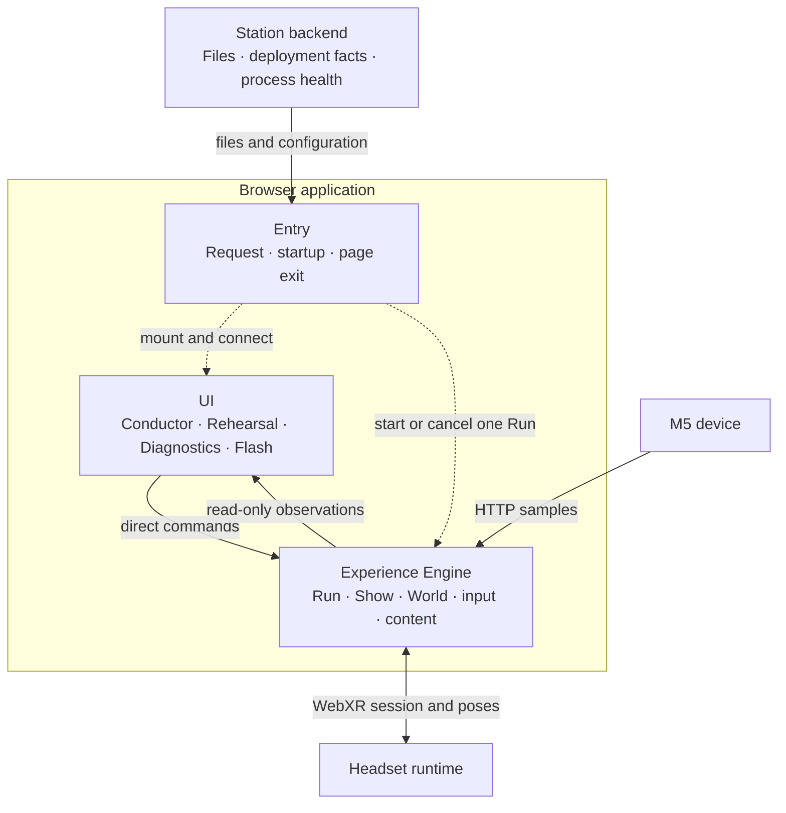
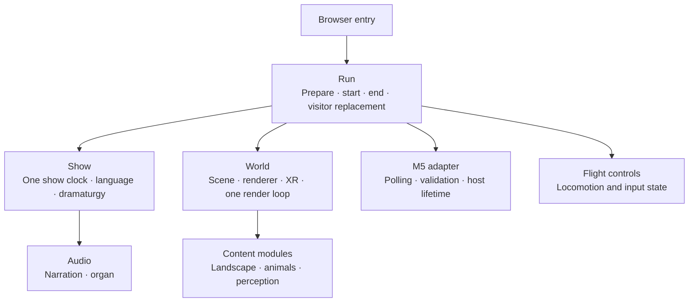
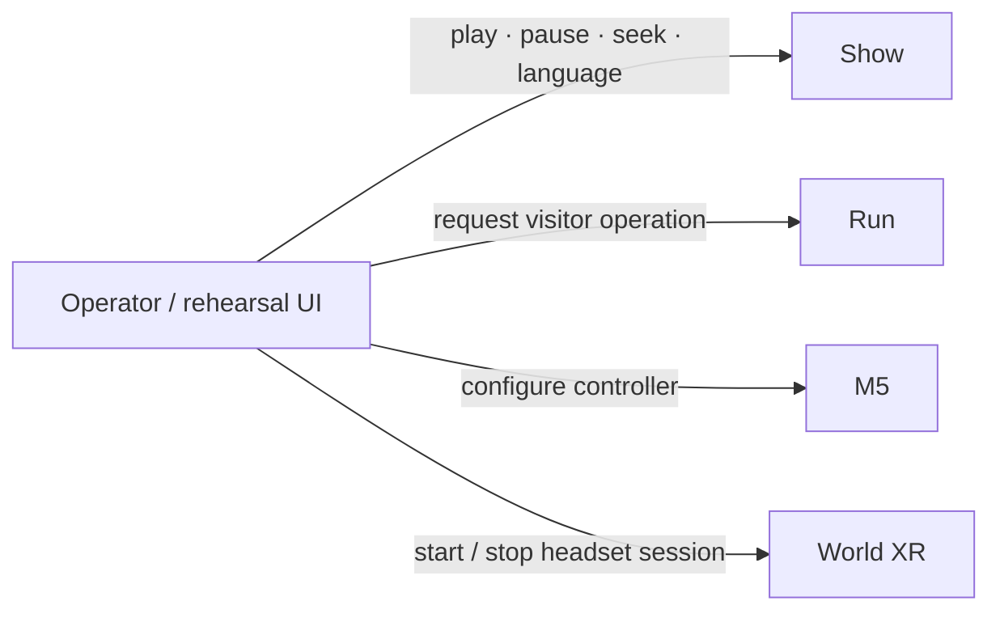
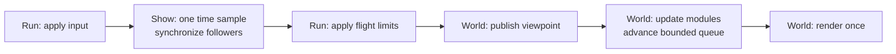

# Target Architecture

## 1. Status and scope

**Binding decisions, 2026-09-06:** D1/D2/D3/D4/D6 direction, Vegetation's shared
placement ownership, required tutorial/credits and Windows-PCVR over USB-C are
confirmed. D5's Clipmap-only renderer and central World Surface zone weights
remain confirmed. These decisions replace the earlier optional directions;
implementation and acceptance follow the [roadmap](roadmap.md), not this
historical investigation's issue order.

The target is a readable, smaller system at existing owners: fewer production
paths, dependencies, states and necessary file jumps. Remove replaced code,
contracts, configuration and exclusive tests together. Moving or compressing
code is not removal. No extra coordinator, forwarding layer or audit system.

**Confirmed** names direction; **Observed** names code or dated evidence;
**Open** names a concrete remaining choice, never permission to silently choose.
Restart operation (including a possible page reload), tutorial audio-content
acceptance and credits details need their specific decisions before dependent
changes. The four-goal tutorial flow is confirmed below. None of these gates
reopens the confirmed owner decisions. The [workflow](refactor-workflow.md) and
[test plan](refactor-test-plan.md) own implementation and verification cadence:
finish a coherent issue before targeted testing; no fixed milestone review loop.

The original 2026-09-05 investigation used `9bfb84b` plus local M0 work and read
52 issues, 17 comments and relevant PRs. Its implementation observations and
measurements below remain historical evidence, not today's issue status or
proof of acceptance. Current state belongs in the roadmap and live issues.
Branch protection remains `david_refactor` only; no additional branch or implied
Git authorization. See [confirmed decisions](architecture-decisions.md).

## 2. Necessary capabilities and non-goals

The application must support:

- One independently configured static level, including the diagnostic level and
  deterministic benchmark entry.
- One show with accumulated senses, scheduled animal passages, English/German
  narration, organ, tutorial and closing credits in one prepared world per visit.
  The main score remains 8:41. Integrated tutorial practice lasts at most 60 seconds;
  a success reached before that cutoff may finish its closing voice (about 74 seconds total).
  Credits timing remains a separate decision.
- Rehearsal controls or an in-process Conductor, with pause, seek, language
  selection and a complete end followed by a fresh run for the next visitor.
  The concrete restart/start interaction is still to be approved.
- Desktop flight or validated M5 flight through the same locomotion rig,
  while WebXR or desktop look retains ownership of local head pose.
- Failure recovery and complete disposal, including partially completed
  starts, asynchronous assets, audio, workers, input and XR.
- Independent station operation: static delivery, health and deployment
  facts; separate technician firmware setup.

No plugin system, editor, multiplayer, remote command broker, generic service
container, automatic quality governor or second runtime is needed. Two stations
do not share show state. The platform is a Windows PC transmitting VR over
USB-C, targeting stable 90 Hz on the actual PC/transport/headset installation.
Standalone PICO belongs to a separate later project: add no speculative path.
Mac browser runs detect development regressions, not platform acceptance.
Passthrough, encounter retiming, tutorial audio-content acceptance and credits
semantics remain separate product decisions. The approved tutorial sequence and
handoff do not approve passthrough or encounter changes.
Existing diagnostic routes remain real consumers.

## 3. Target structure

Confirmed 2026-09-07: separate UI, browser Entry and experience Engine. The
Engine is the existing Run/Show/World/input/content code running in the same
browser as the UI. **Backend** means the separate Bun Station process. This
is an ownership refactor, not a network split or a new CoreEngine service.
The diagrams below show the target; current paths and remaining debt are in
[Architecture](architecture.md). Boxes are responsibilities, not required classes.

### Deployment and application boundaries

Dashed arrows create/connect lifetimes; solid arrows carry calls or facts.



The root Experience document mounts Rehearsal for the complete show or the
unified Diagnostics overlay for a standalone level; it has no separate
diagnostics document. Conductor and Flash are separate pages. Flash uses Web Serial and
does not start a Show or Run.
The Station backend never receives transport commands or owns visitor state.
`src/entry/deployment-config.ts` fetches browser deployment facts; `shared/`
owns their platform-neutral contract and public routes. `station/` is the backend
and imports no browser source. Flash Entry owns serial connection lifetime;
its page owns form binding and display.

### Lifetime ownership

Arrows here mean **owns or coordinates the lifetime below**, not per-frame
messages. Composition constructs content once; World coordinates its module
lifecycle, and each concrete module releases the resources it creates.



Run owns source GLTF assets until every borrower ends. Module/resource owners
release their own derivatives. Show owns the native timebase and follower policy;
Run owns the separate Tone-created spatial context/listener and closes it after
its borrowers end. Organ and training own their nodes, with no second Show clock.
The concrete next-visitor operation still requires the operating decision.

### Direct commands and observations

An interface is a TypeScript contract at an existing owner, not a forwarding
object or message broker. UI receives only the capabilities its controls need.



UI reads state from these same owners and may assemble a local `ViewState` for
consistent drawing. It owns drag preview, confirmation timers and render caches.
It does not derive calibration, device validity, playback or restart rules.
The page's DOM refresh is not a second scene render. UI reads M5 through one
non-consuming `readObservation()` snapshot; validity stays at M5. Only Run
consumes frame/button input. Child `unload()` methods stay with their owners.

### One-time construction and one frame

Composition receives the explicit level preset, loaded assets and required
World capabilities. It creates World Surface and concrete modules and wires
neutral sources/effects to their real consumers. World Surface supplies shared
physical facts to content and flight. Concrete modules never import siblings.



World supplies the frame callback. The optional entry delta sampler runs at its
existing frame-start position; benchmark finished-frame observations run after
render. Naming or UI migration must not silently move either hook. The organ's
previously published spatial observations and Three.js XR-pose timing stay
unchanged; changing those latencies is a separate measured fix.

### Target placement and migration map

The #36 migration applies role names to the affected owners and removes aliases.
HTML routes stay stable. Remaining owner names migrate with their scoped refactor.

| Responsibility | Current placement | Contract or remaining work |
| --- | --- | --- |
| Browser bootstrap | `src/entry/` and its four `.entry.ts` files | Flash owns independent device setup; other entries connect one Run |
| Conductor UI | `src/ui/conductor/conductor.page.ts` and actual `.panel.ts` regions | Central `src/ui/app.css` |
| Show commands / internal clock | `src/levels/show.runtime.ts` | Preserved by UI contracts |
| Run start/frame/end and scoped reset | `src/levels/level.runtime.ts` | Full visitor operation #9 |
| Shared XR button | `src/ui/shared/xr-entry-button.ts`; mechanics in World | Central `src/ui/app.css` |
| One-time content construction | `src/levels/level-composition.ts` | `.composition.ts` on next construction refactor |
| Renderer/resource owner | `src/world/world-runtime.ts` | `.runtime.ts` on next resource refactor |
| Styles | `src/ui/app.css`, linked by all three HTML pages | Shared tokens and controls; scoped page layouts |

`show-actions.ts` is removed. Its commands belong to Show and Run.

All browser surfaces live under `src/ui/`, grouped by surface. HTML owns authored
page/control/SVG structure; TypeScript binds behavior and projects observations.
`src/ui/shared/` contains only currently reused UI mechanics. Browser bootstrap
lives under `src/entry/`; backend/tool entry conventions remain separate.
Domain algorithms retain descriptive plain names. The
[Engineering Standards](engineering-standards.md#file-names-and-architectural-roles)
own role semantics, contract vocabulary, file reading order and central styling.

## 4. Responsibilities and contracts

### Implementation footprint: remove indirection inside existing owners

**“Run” is the existing `startLevel` invocation and returned handle, not a new
ApplicationRun file, class or coordinator.** The target adds no runtime owner.
Keep start, its frame function, restart and end together in `level.runtime.ts`;
keep concrete construction and its return mapping together in
`level-composition.ts`. Arrange private functions below the public story, in
reading order. A private function is not a reason for another file.

Confirmed 2026-09-07: role-bearing target filenames follow
`<domain-name>.<role>.ts`. The [Engineering Standards](engineering-standards.md#file-names-and-architectural-roles)
own the role vocabulary and migration rules. Paths in this document identify
existing owners until their scoped migration; adopting names such as
`level.composition.ts` does not create another owner. Entry connects browser
startup and UI to Run; page/panel code owns only presentation and input, while
Show and Run retain playback and experience lifecycle policy.

Cancellation and complete child/source cleanup on existing handles are now
implemented, as are World preparation and small diagnostic reads. Preserve this
foundation; #9 still owns the concrete complete visitor replacement operation.
These boundaries require no Lifecycle, Asset, Preparation, Diagnostics or
FramePipeline services. M5 host replacement stays inside its existing adapter.

The deletion ledger in §8 is the implementation boundary: a new wrapper that
preserves the old chain fails this design. Moving code or renaming a type is
not counted as deleting its capability.

| Existing responsibility | Owned state/resources | Inputs and actual consumers | Calls, end and exclusion |
| --- | --- | --- | --- |
| **Entry** (browser `.entry.ts` targets) | Request/deployment resolution, pending-start cancellation, UI/Run references, optional diagnostic sampler | Browser inputs → Run request and UI bindings | Starts/cancels/ends one Run, mounts/unmounts UI. No experience policy. |
| **UI** (Conductor, Rehearsal, Diagnostics, Flash) | DOM, input bindings, drag preview, confirmation timers, display caches | Narrow commands and observations → operator interaction | Releases UI listeners and subscriptions only. No child-resource disposal, device validation or Show/reset policy. |
| **Run** (`level.runtime.ts`) | Child references, startup/closing state, source GLTF assets | Discriminated request; commands, cancellation and complete `unload()` for Entry | Direct startup, input selection, local frame/restart/end. No concrete content algorithms or second loop. |
| **Composition** (`level-composition.ts`) | No persistent owner state | Recipes, World, borrowed assets → Surface, ordered modules and ShowWorldReach | Called once by Run; factories clean partial failure. No transport, registry or coordinator object. |
| **World** (`world-runtime.ts`) | Renderer/context, scene, rig/camera, Timer, XR/resize listeners, ModuleRuntime and StreamQueue; borrowed declared canvas/viewport | Run's frame function; viewpoint and execution for modules; optional benchmark FrameControl | Run starts it last/stops it first. Owns preparation, render and final release. No level policy or show clock. |
| **Flight controls** (`control/`) | Desktop capture and input-specific navigation state | Selected desktop/M5 input → rig locomotion; Surface-based limits | Created/reset/disposed by Run; capture and movement math remain local. No protocol parsing or headset-pose overwrite. |
| **M5** (`m5/`) | Host-bound poll/sample/filter/calibration/button state | Untrusted HTTP → flight ControlFrame and observational UI status | Existing adapter replaces host state and invalidates late work. Run owns its lifetime. No show commands or transforms. |
| **Show** (`show.runtime.ts`, `dramaturgy/`) | Clock origins/rate/play state, language, native timebase, audio followers, bounded scratch | Authored schedule/state/score and composed ports → current commands/observations | Run creates/ticks/ends it. Pure lookups remain calculations. No content construction or rig movement. |
| **Audio** (`sound/`) | Narration media; organ/training nodes and scheduling cursors; Run-owned Tone context and one spatial listener | One Show sample, strengths and spatial signals → sound/status | Followers end their nodes; Run closes shared spatial context after borrowers, including late imports. Show retains separate native timebase. No independent show clock. |
| **World Surface** (`world-surface/`) | Physical conditions, zone thresholds and continuous transition weights | Height/zone facts for content and flight; identical weights for Clipmap, Vegetation and Rocks | Created in Composition; pure queries, no render lifecycle. Content owns derived coverage/density and placement, never parallel zone rules. |
| **Content** (`modules/`) | Own CPU/GPU pools, derivatives, slot assignments and worker where needed | Borrowed sources, Surface/viewpoint/ports → scene and specific provider facts | Composition constructs; ModuleRuntime runs lifecycle. No sibling imports or private schedule. |
| **Station / Flash / firmware** | Independent backend, Entry-owned serial connection, UI bindings, device sensing | Files/config/health, typed setup commands and responses | Outside Run; serial adapter awaits port release, UI clears transient credentials. Writes do not confirm application. No broker or shared Show state. |

`WorldModule` separates active updates from resource lifetime; `ShowWorldReach`
connects real composed setters/providers to Show. Plant scent and root anchors
have different output contracts but one plant-placement owner. Animal body
observations still feed scent/heat; only the additional live-root-web contract
is confirmed for complete retirement. No universal module or provider API
replaces them.

## 5. Complete target flows

### Read the diagnostic level like a short chapter

For the Experience page in standalone mode at `/?level=diagnostic`,
[diagnostic.level.ts](../src/levels/diagnostic.level.ts) directly states white background,
180 m view range and 50 m maximum ground clearance. `?diagnostics=1` adds the
same browser diagnostics overlay to every standalone level. It includes
Air Particles (80 per chunk), zone-colored Terrain, Grass
Clipmap, Vegetation, Rocks, Animals and Magnetic sky. It does not request Scent,
Echo Depth, Motion, Thermal or Connections. These are observed diagnostic
choices, not new defaults. Diagnostic and Visual Integration now use the same Grass Clipmap
construction path as the Show (#13), preserving the seven-module explanation.

A reader can therefore explain the result: load the vegetation/rock/animal
models, establish the view before allocating spatial pools, construct those
seven content modules, then fly and render them. There is no show clock,
narration, organ, passage or credit panel. A configured M5 selects glider
control; otherwise desktop input is available. That explanation should not
require opening each module's resource implementation.

**Removed in #73 (technical verification unresolved; presented browser accepted):** `startLevel → startWorld → setupWorld → setupLevel →
prepareLevelComposition → composeLevel → createConfiguredModules →
composeShowReach`, followed by result forwarding back through `{running,
update}`. `createOptionalShow`, `createLevelControls` and `createLevelUpdate`
then repackage the same local variables. The problem is this reading order,
not simply the number of source files.

**Target reading order in existing files** (schematic, not a new API):

```text
diagnostic.level.ts           What exists and its authored values.
standalone-level.entry.ts      Select this recipe and explicit entry tools.
level.runtime.ts / startLevel Load sources; create a stopped World.
                              Apply initial presentation before allocation.
                              composeLevel(...); load/activate in order.
                              Prepare World when this is a show.
                              Construct input and the optional Show directly.
                              Start World's one loop.
                              Return commands and the complete end path.
level.runtime.ts / frame      Benchmark placement OR one M5/desktop update.
                              Update Show once; apply flight height limits.
world-runtime.ts / frame      Publish viewpoint; update active modules.
                              Drain bounded stream work; render once.
level.runtime.ts / dispose    Stop work; end children; release sources and World.
```

Within `composeLevel`, show construction order and `reach` mapping together.
Open its local `createTerrain` or a concrete module only when inspecting its
materials or algorithm. The control-flow story lives in `startLevel`; World
and Show are named technical chapters, not places the reader must visit to
recover hidden startup decisions. The cancellation/failure sequence below
belongs beside that story, not behind an unexplained `cleanupEverything()`.

**Readability check:** read the recipe and startup/frame/end section in order. Explain
why assets load, what is absent, where input is selected, what runs next, who
owns every allocation and what a failed start releases. If an answer requires
following forwarding-only functions, remove those functions and their argument
packages. Keep catalog/name resolution and lazy Test factories: they serve
actual routes and bundle boundaries.

### Show start and one frame

Use one Run and one prepared world throughout the visit. Confirmed 2026-09-07:
use the explicit Connections preset as the Show construction input; remove the
second Show recipe. Show states retain presentation and timing, including the
opening state before pool allocation. Preserve effective settings and never
reconstruct the world at cues.

Preparation, first use and bounded background work follow one strategy at the
existing World/Run owners. No per-level transition workaround or uncontrolled
rebuild; measure first/repeated transitions. Confirmed for #50 on 2026-09-08:
Rehearsal, Conductor and standalone training initially hold for explicit Play.
Four spatial goals run right/left/up/down within Show’s integrated practice budget. The user revision
on 2026-09-09 supersedes persistent missed targets: missed or spatially abandoned
sections dissolve and recycle ahead of the current flight pose, repeating the same
lesson until an actual passage succeeds. Confirmed in the subsequent placement review: Start
generates each goal from bounded ranges in the literal recipe, samples a fresh
course on reset, and retains each placed world target independently of the
visitor. Rendering and sound borrow that generated geometry. Pause holds
training and flight, seek/rate changes
are blocked, and language changes repeat the current instruction. A current
recording finishes before the next goal is presented; its duration does not
complete a spatial goal. The 2026-09-09 timing revision gives integrated practice
60 playing seconds. Four successful passages before that cutoff play the complete
closing recording, then automatically enter the experience (at most about 74 seconds).
Without success, the cutoff enters the experience without a false success recording.
The existing UI command may enter directly whenever preparation is ready. The same
Show clock serves practice, the closing voice and main playback. Its public timeline
retains the actual tutorial span before the unchanged relative main score. Standalone
Start remains an independently exercisable level without a prepared main handoff.
Run unloads/removes training registrations and references while retaining the
prepared main world. This does not decide complete visitor replacement or fresh
headset calibration. Reset after handoff stays held until configured sample
preparation succeeds; failure remains visible and retryable. The current Start
recipe enables user-provided granular excerpts through the existing training
audio owner. Start supplies physical particle-body anchors; spatial audio owns
listener/distance, Show supplies playback/speech facts, and Run awaits sample/room
preparation and cleanup. The five original German tutorial recordings are
installed at the existing narration owner following the user request. The 2026-09-09 gaze revision forms each section at the authored spoken
instruction onset in the current published view, then keeps it world-fixed. Run
selects 2 m/s tutorial translation through existing controls, restoring main
defaults on handoff. EN voice policy remains open. Native timebase suspension still prevents Show time from advancing. The subsequent
2026-09-09 user review requires continuous near-field particles through the
existing world chunk mechanism, large volumetric particle arrows and curved
particle tunnels with overlapping local formation/dissolution. World positions
stay anchored; only residency is viewer-centered. This changes spatial content,
not locomotion or lifecycle ownership. The researched implementation sequence
and the distinction between decorative previews and the four counted disks are in the
[roadmap](roadmap.md#procedural-flight-world--2026-09-09).

Preserve the current dependency order:

1. World obtains delta; Run advances the selected flight source.
2. Show samples its clock once; narration, presentation, gates, passages,
   credits and organ follow that sample.
3. Run applies active flight limits; World publishes viewpoint, updates active
   modules, drains bounded stream steps and renders once.
4. Benchmark finished-frame measurement observes the completed render. The
   optional entry delta sampler retains its existing frame-start position.
   Conductor refreshes DOM independently and adds no second XR stage render.

Organ currently reads the previously published viewpoint/actor centres, and XR
pose is updated by Three's rendering path. Changing that latency/order is a
separate fix. Pause/seek synchronizes authored followers; it does not freeze
flight or turn every ambient simulation into a show-time replay.

### Conductor command and new visitor

Buttons/keys call owner commands. Playback toggles read current Show state,
not a rendered snapshot. Seek changes the one clock; next update derives fades
and passage position without replaying events. Language change preserves playback state,
unloads old narration and rearms the selected language at the current show time.

The existing Runtime owns the complete visitor restart: end the old run and
prepare a fresh run. Retaining the old world by seeking zero and resetting
position is insufficient. UI invokes that same command rather than defining
its own sequence. The world remains prepared only within one visit.

**Open before implementation:** present the concrete restart operation,
including retained operator choices, input/calibration handling and the next
start gesture. Compare full page reload as the simple alternative on actual
Windows-PCVR: XR end, re-entry, audio permission and operator flow must work.
Never assume XR automatically resumes after reload. Fresh headset calibration
(#46) remains a concrete physical decision; do not overwrite local head pose.

### End, cancelled start and failed start

Entry can cancel **before a Run handle exists**. Start then publishes no Run
and cleans acquired/late resources. For a running application, Entry disables
commands and cancels UI callbacks; Run marks closing, stops the loop, stops
input/polling/audio scheduling and invalidates asynchronous publication. End XR,
unload content in reverse dependency order, release source assets after all
borrowers have ended, then release World and its WebGL context. The page retains its declared canvas. Individual cleanup
failures must not prevent remaining cleanup or conceal the original error.
Disposal is idempotent and awaited before restarting.

Asset loaders clean successful siblings and late successes on batch failure.
A failing factory cleans its partial construction; Composition releases earlier
handles if a later factory fails. A failing module `load()` cleans allocations
not yet registered in ModuleRuntime. Failure during preparation or Show creation
uses Run's same reverse cleanup. Late workers, XR adoption and audio imports
cannot reattach to a closed Run. Full page reload is an allowed restart candidate,
not evidence that these ownership and physical operation obligations are met.

## 6. Strategic decisions

### D1 — Direct construction and one complete Run lifetime

**Need/owner:** all entries need predictable start, failure and end. Level
Runtime owns the sequence; World owns rendering; Run owns loaded GLTF sources.

**As implemented in #73:** [startLevel](../src/levels/level.runtime.ts)
loads sources, creates a stopped World, composes and prepares it, then starts
its loop and directly returns the running level. The old callback/captured-result
channel is gone. #9 now connects awaited Run/child/source termination and
failed/cancelled starts at these owners. The concrete visitor operation remains
open; technical evidence and remaining acceptance stay in the issue.

**Confirmed direction:** `startLevel` directly constructs, prepares, starts and
releases World through a stopped handle. Its adjacent local frame and end functions
use those resources directly. Delete the setup/optional-show/frame option
packages and return-channel helpers listed in §8. `composeLevel` likewise owns
the construction sequence and final mapping without intermediate wrappers.

Select benchmark, M5 or desktop directly in that frame function; retain capture
and movement math in their current control files. Any necessary rig initialization
belongs locally in the reviewed fresh-run sequence; preserving the old reset
command is not a target requirement. Move compile/offscreen/restore/dispose
operations unchanged into World, where the renderer lives. This removes three
one-consumer files without removing their behavior or creating new services.
Frame arbitration belongs to existing Run coordination; preparation belongs to
World. These owner directions are confirmed. Composition and ModuleRuntime
retain their different construction/lifecycle responsibilities.

Run owns the source assets it loads; modules borrow them and own their
derivatives. Remove module-side `disposeGltfAssets` in the same ownership
transfer. Shared source geometry must outlive all borrowers, consistent with
[Three.js disposal](https://threejs.org/manual/en/how-to-dispose-of-objects.html).
Audit actual image/decoder resources too; moving the existing disposer is not
proof of completeness. No reference counter is needed for one Run lifetime.

**Remaining gate/proof:** approve the small concrete visitor-restart operation
before implementing it, with early Windows-PCVR/USB-C evidence for reload, XR
re-entry and audio wake. Verify §5's complete start/cancel/failure/dispose/restart
flow, late loads and repeated visitors. No partial end contract counts as
complete disposal; no reset-only shortcut or transition-specific workaround.

### D2 — Commands and device state belong to their operational owners

**Need/owner:** Show owns transport/language, Run owns complete visitor restart,
M5 owns device validity, and entries own presentation and gestures.

**Historical debt, removed by #36:** `createShowActions` forwarded clock
methods and defined reset; UI repeated Show's language pause. Conductor and
[rehearsal transport](../src/ui/rehearsal/transport.panel.ts) duplicate scrub mechanics;
DOM/snapshot state can determine commands. `9982d18` already removed the remote
broker; `fd48b27` deliberately changed visitor reset to hold at zero.

**Confirmed:** expose commands on Show/Run and let UI types select those methods.
Remove the forwarding adapter, UI reset sequences, repeated pause and stale-state
command decisions. #36 also separates browser entry wiring from page/panel UI
and narrows public M5/XR capabilities. Preserve the current soft reset as an
explicitly named existing Run operation until #9 replaces it with the approved
complete visitor operation; this is not completed visitor-lifecycle acceptance. The retained headset-console surface is now `window.show`, using the same
direct owner commands as UI; the former `window.showClock` is removed. Keep the fullscreen/headset rehearsal
workflow explicitly retained in [PR #59](https://github.com/Strehk/becoming-many/pull/59#issuecomment-5537091887).
Remove `ConductorState.isScrubbing`, which has no reader. Preserve pointer
preview and `wasPlaying`. A shared scrub function is allowed only if it replaces
both implementations outright without a configurable gesture controller;
otherwise fix authoritative state locally and defer that extraction. Evaluate
existing audio-seek throttling before removal.
No command bus, UI store or generic input strategy is needed.

For M5 (#17/#18/#38), host change invalidates sample, smoothing, neutralization,
sequence and button history together. Wrong/stale input yields neither steering
nor edges; one flight reader consumes edges, status views only observe. Remove
old-host publication and single-valued `controllerType`; consolidate axis
meaning at flight conversion after physical polarity is confirmed. Neutral
steering still means glide, not automatic keyboard takeover or a safety hold.

**Proof:** migrate every UI and console consumer to those same commands; test
scrub/cancel, language and the approved complete visitor restart. Device policy
needs wrong-host/late-response checks and physical evidence. Input clearing and
XR calibration remain explicit parts of the restart proposal, not renaming.

### D3 — Explicit, independently readable TypeScript levels

**Confirmed, [#85](https://github.com/Strehk/becoming-many/issues/85):** each level
states its modules and desired settings directly,
following [diagnostic.level.ts](../src/levels/diagnostic.level.ts). Confirmed 2026-09-07:
one level equals one file containing literal parameter values. Only type-only
imports are allowed; remove imported parameter blocks, functions, spreads,
inheritance and hidden overrides. Extra explicit configuration lines are approved
for direct reading and editing; no replacement parameter registry.
Technical defaults live once with each module; independent levels must not
require tracing a layer catalog to understand the intended result.

- An absent module is not part of that level.
- A present module with an omitted optional setting uses its documented default.
- A missing required setting or invalid setting fails clearly during preparation,
  before the visit. No silent repair or generic deep merge.

**Observed history:** `35b13e6` introduced inheritance; `9abde94` replaced it with
copied recipes; `8119bea` introduced shared authored blocks and
`sense-layers.ts`. These historical conventions no
longer constrain the confirmed target. Retain independent contracts only when
they have actual different consumers/lifetimes, not to preserve old indirection.

**Confirmed 2026-09-07:** the [concrete proposal](https://github.com/Strehk/becoming-many/issues/85#issuecomment-5562660919) uses `connectionsLevel` through the common `preset` request.
Show keeps its schedule/states and prepares that world once; delete the separate
Show composition file/type/request field. Shared module edits affect both runs.
Compare all effective settings, including invisible plants and Thermal motion,
then remove every replaced layer consumer and exclusive tests atomically.
More explicit configuration lines are allowed when they improve reading and
replace helpers, hidden relationships and logic. Report that category separately
from production logic; preserving needless indirection to save literals fails D3.

### D4 — Retire the unauthored moving-animal Connections capability

**Need/owner:** current Mycelium is a static root web. Animals still feed scent
and heat through body observations.

**Observed:** `a7d148e` added live animal links; `88a2179` removed them from
content but reserved the machinery for hypothetical levels.
[Connections recipe](../src/levels/connections.level.ts) and
[preset tests](../tests/levels/level-presets.test.ts) confirm absence today.
The additional Animals position projection, `ConnectionActorSource`, composition
branch, `updateAnimalLinks`, hysteresis and reserved edge rows remain.

**Confirmed:** delete this entire producer-to-consumer capability (exact list
in §8), preserving static topology, worker and `AnimalBodiesObserver`. Keeping
an unused port also keeps its buffers, algorithms and tests without serving a
current requirement.

**Scope/proof:** retirement is approved. Before any further content removal,
briefly identify which current fixed anchor classes constitute trees and fixed
world points. Animal animation/movement and body observations for scent/heat
remain. Prove static topology, edge indexing and Connections output survive the
changed pool layout. Do not hide other content changes inside this retirement.
Smaller reserved capacity alone is no measured speedup.

### D5 — Clipmap only; World Surface owns all zone transitions

**Confirmed decision:** Grass Clipmap is the sole renderer for Show and every
Grass-bearing diagnostic level. Remove legacy Grass completely. World Surface
owns zone conditions, thresholds and continuous transition weights. Clipmap
owns only its derived coverage and rendering resources; Vegetation and Rocks
consume those same weights for their own density/coverage. No module owns a
second zone classifier, transition width or smoothing calculation.

**Observed:** `4807c0d` selected Clipmap for narrative Grass but retained legacy
Grass for diagnostics. #13 migrated the diagnostic and visual-integration presets
to `grassClipmap` and removed the former standalone loader path.
#71 adds `zoneInfluencesAt` to [World Surface](../src/world-surface/world-surface.ts).
[getGrassZoneCoverage](../src/modules/grass-clipmap/grass-height-field.ts) weights
its own coverage; `selectStaticPlacement` weights authored population densities
and selects deterministic variants. Their hard visual zone branches are removed.
The hard `zoneAt` and `zoneConditionsAt` remain for habitats and diagnostic
Terrain. Water has no land influence. Texture filtering is not zone semantics.

**Implemented ownership:** the existing pure `zone-field.ts`, `zone-settings.ts`
and `WorldSurface` own one continuous-weight query.
Grass maps these weights to authored per-zone coverage; Vegetation/Rocks map
them to their population density. Those content responses remain local.
Retain hard classification for genuine habitat exclusions, separate from visual
transition weights; both derive from the same World Surface conditions and
thresholds. Remove hard-zone switches used solely for density/coverage and any
consumer-local threshold or transition reconstruction. Do not create a zone
service, a Grass-specific smoothing pass or a universal population runtime.
The CPU/GPU representation may differ; it must transport or evaluate the same
centrally owned rules, never become another authored zone authority.

**Removed in #13:** `src/modules/grass/`, `GrassPreset`, `WorldComposition.grass`,
Composition's legacy factory/contract, the former standalone loader's legacy import and
`tests/modules/grass.test.ts`, including exclusive loader/preset cases. Both
diagnostic presets directly author `grassClipmap`. Zone Visualizer's direct lazy import,
Clipmap tests, shared material effects and `thermal.grass` remain. No legacy
fallback, compatibility config or second renderer replaces the deleted path.
Diagnostic meadow density/height and palettes remain authored; Clipmap's common
height/coverage replaces the old separate shrub setting. #71 owns shared zone
weights; #72 and integrated visual/physical acceptance remain open.

**Separate cause-level fixes:** #71 replaces jagged density/coverage boundaries
with the shared continuous weights. #72 fixes false grass rejection in the
existing `grass-clipmap-field.ts`. The #72 comparison selects one conservative
sphere from the existing height range, blade/wind extent and shader scatter.
It saves six draws per measured view compared with disabling CPU culling,
with identical images and no established timing advantage. No new culling layer
is needed. The original visible hole was not reproduced in those two views;
geometric containment and physical acceptance remain distinct. Transition
smoothing cannot fix missing meshes, and culling changes cannot fix zone seams.

**Confirmed Vegetation placement ownership:** Vegetation owns one decision
about which plant exists at which position. Rendering, scent and Mycelium use
that same decision. World Surface supplies terrain, river and zone facts;
there is no second plant inventory or world-object manager.

**Confirmed 2026-09-07 (#81):** use 1 m lateral clearance from the existing
analytic river-channel boundary; canopy overhang is allowed. Vegetation owns
one model-independent acceptance rule shared by rendering, Scent and Mycelium.
Delete scaled model footprints and the separate 2.5 m projection stand-ins
together. No new distance algorithm or species-specific footprint rule. The
[compared bank views](evidence/README.md) support this approved choice; they do
not establish a global placement or physical-device guarantee.

**Acceptance and remaining decisions:** no further approval or renderer contest
is needed for Clipmap ownership, central zone weights or legacy retirement.
Validate all migrated entries and the diagnostic-level reading flow. Compare weights
at identical world coordinates and coverage/density across meadow/forest/slope/
water boundaries; retain intended habitat exclusions. Check #72 separately at
fixed grazing views, terrain extrema and changing XR viewpoints. Record changed
appearance/counters explicitly, then obtain stable 90 Hz evidence on the actual
Windows-PCVR/USB-C/headset installation. Measurements can require corrections or explicit regression
acceptance; they do not authorize legacy reintroduction. Apply the confirmed
#81 ground-clearance rule and verify agreement across its three consumers.

### D6 — Keep demonstrated technical boundaries; remove owner-level bypasses

**Need/owner:** World owns one renderer/loop and shared work queue; modules own
bounded resources; Show owns time; entries own diagnostics.

**Confirmed:** retain ModuleRuntime, rig/camera separation, fixed slots and the
Mycelium worker. Resource existence, intensity and active updates are different
facts. Retain the operations in [renderer preparation](../src/world/world-runtime.ts),
now colocated inside World by #73;
all-modules-always-active, cue-by-cue rebuilding and a universal intensity
lifecycle are not simpler equivalent alternatives.

Keep both audio contexts: `61cbf79` records silent voice rooms/32 errors with the
shared native context; `d6b7303` already removed Tone.Transport's second timeline.
[Tone guidance](https://github.com/tonejs/tone.js/wiki/AudioContext) supports custom
contexts generally, so this is local compatibility evidence. Run's spatial-audio
owner now owns the Tone-created context, including import side effects, and lends
it to organ and training. One Three.js listener outside the rendered scene graph
keeps the existing three-frame pose-write cadence; stationary poses write nothing.
The organ owns its nodes and does not write/close the shared listener/context.
Installed 14.8.49
supports creating/replacing/disposing contexts; release nodes/ticker and await
closure, then establish a fresh context before next-run nodes. Late imports
must release acquired resources. Actual restart/worklet behavior remains unproved.

#14 removes the additional GPU probe in the standalone
[diagnostics overlay](../src/ui/diagnostics/diagnostics-overlay.panel.ts); the
standalone-level entry owns its bounded diagnostic handle and restores hooks on
end. World supplies the actual capability report on demand; startup errors stay
visible. #35 makes the standalone-level entry own its diagnostics UI and sampler,
with Conductor reading its own sampler directly. Run keeps only an optional
`onFrame` input; the metrics type lives beside the sampler. World exposes
read-only live draw counters without renderer mutation access. The complete-show
root has no sampler; Conductor still reads every 500 ms; Level Composition
imports Zone Visualizer lazily when requested. No observation contract file or additional loop was
introduced.

**Confirmed diagnostic separation:** ordinary Experience operation has no extra
GPU probes, probe renderers or expensive diagnostic measurements. Diagnostic
entries own measurement/display and read only necessary existing World facts.
Remove UI-metrics round trips through Run. Keep necessary operator state and
pre-renderer startup errors visible. Measure preparation, audio and Scent's
queue-bypass removal as specified below; diagnostic relocation promises no
unmeasured frame improvement.

## 7. Performance conditions and evidence limits

- Fixed module capacities and recyclable spatial slots bound memory. Shared
  geometries/materials/buffers are reused; an owner invalidates stream jobs and
  worker results before releasing their destinations. Mycelium retains its
  module-owned worker and bounded publication pools, not a worker service.
- StreamQueue budgets cooperative steps; it cannot interrupt a long JavaScript
  step. Expensive generation, buffer uploads and worker publication therefore
  need small bounded units. In `scent-particles.ts`, enqueue failure currently
  calls `writeScentSlotSynchronously` (#26). Remove that bypass: Scent retains
  valid content or marks the slot unavailable and retries within bounded work;
  it must never publish old content under a new assignment. This is a concrete
  owner-level correction, not a reason for another scheduler. Plant fields and
  animal trail rings retain their different lifecycles.
- Apply opening view distance before allocation. Compile material variants and
  perform the existing bounded offscreen upload pass before Show time moves.
  [Three.js compileAsync](https://threejs.org/docs/pages/WebGLRenderer.html)
  documents shader preparation, not complete future buffer/texture residency.
  New worker content and views can still incur first-use work.
- Ordinary playback must not load diagnostic-only modules, create probe
  contexts or collect detailed profiles. Operator status remains useful;
  expensive measurements stay explicit and outside timing runs.

**Historical initial M0 evidence:** [issue-75](evidence/issue-75/README.md) recorded
passing static/smoke checks,
inherited Fallow findings, seven failing quick references and large deterministic
Scent maxima. Deterministic runs replace clock/stream deadlines and exclude audio.
Real-time Echo reaches 132.4 ms on first crossing versus 17.7 ms on repeat;
English full playback failed with an audio scheduling exception, and German
was not run. [Earlier upload comparisons](performance.md) support preparation,
not completeness. Later evidence and acceptance status live in the roadmap;
these old failures are not erased. Physical Windows-PCVR acceptance is separate.

| Decision requiring evidence | Smallest later experiment before broad acceptance |
| --- | --- |
| Preparation or stream-step changes | Fresh versus repeated Echo crossing; isolate upload/link diagnosis separately. For Scent, force enqueue rejection and verify bounded retry, valid slot revisions and no synchronous fill. Then compare relevant counters and repeated timings under the test plan. |
| Confirmed Clipmap migration; #71/#72 | Compare migrated Show, Diagnostic and Visual Integration at fixed routes and authored conditions. For #71, sample shared weights and derived coverage/density at the same boundary coordinates. For #72, compare conservative bounds versus disabled incorrect CPU culling at grazing/extreme-height views, then measure cost. Repeated performance and actual Windows-PCVR/USB-C acceptance remain required; renderer ownership is settled. |
| Vegetation placement facts | Compare accepted candidate IDs, scales and river margins for a small riverbank region across renderer, Scent and Connections. Verify the confirmed 1 m analytic-channel clearance with canopy overhang allowed. |
| Organ context lifetime and #79 | Start → gesture → audible rooms → seek/rate/pause → dispose → start, plus dispose during dynamic import. Investigate the scheduling exception separately; then complete EN/DE and actual Windows-PCVR audio/frame acceptance. |
| Scrub throttling / diagnostics | Repeated pointer drag with audio, or diagnostics off/on at the same route; compare useful behavior and work. Do not delete a throttle based only on its old transport origin. |

Stable 90 Hz on actual Windows-PCVR over USB-C is the target; Mac measurements
are regression evidence only. No automatic quality reduction, standalone path
or lower-rate substitute is authorized.

For #78, use a bounded investigation: fixed camera/conditions, intended scene
and available content, repeatable counters and an understandable explanation
of relevant differences. Do not reconstruct every historical triangle. Propose
the actually checked scene as the replacement reference afterward; the existing
numeric candidate is not approved. Preserve old failure/comparison evidence and
never overwrite a reference merely to turn a check green.

## 8. Deletion ledger

These are concrete removal obligations; consult live issues for completion.
Whole-file removal, behavior retirement and local simplification are distinguished. No
line/file quota justifies deleting needed behavior. Each implementation must
remove old consumers, obsolete tests and documentation with the replaced path.

### Whole files and the confirmed legacy Grass removal

| Current structure | Proven problem | Action | Target owner | Old path eliminated | Dependency / proof |
| --- | --- | --- | --- | --- | --- |
| `src/ui/conductor/show-actions.ts` | One adapter forwards commands and uniquely owns reset | Delete file | Existing Show commands and Run visitor restart | `createShowActions`, UI reset sequences, second command route | D2; migrate panels, keys and rehearsal console |
| `src/control/flight-control-source.ts` | Only Run consumes this stateless `readFrame → if → delegate` factory | Delete file, retain behavior | Run's local frame selects; existing controls perform movement | Factory plus `FlightControlSource`, `DesktopFlightSource`, `M5FlightSource` | #73 implemented; input/benchmark probes pass; presented browser accepted |
| `src/control/flight-reset.ts` | Only Run uses its two transform assignments | Remove wrapper when the fresh-run sequence establishes required initialization | Existing Run startup/restart | Imported reset wrapper; reset-only visitor semantics | D1/D2; concrete restart gate first, preserve local head pose |
| `src/levels/show-renderer-preparation.ts` | Only Run passes World resources through `ShowRenderWorld` | Delete file, retain operations | Existing World closure | `ShowRenderWorld`, separate preparation wrapper/import | #73 implemented; unchanged preparation and failure restoration verified |
| `sense-layers.ts`, `show-composition.ts`, authored Terrain/Connections forwarding files | Layer membership, hidden warm variant and duplicate Show recipe | Removed in #85 | Explicit module keys and the Connections preset for Show | Layer objects, spreads, duplicate Show type/request and exclusive test | All nine effective presets and Show settings preserved; shared content parameters retained |
| `src/modules/grass/`, `GrassPreset`, `WorldComposition.grass`, two diagnostic `grass` recipes; former standalone loader factory and import; `tests/modules/grass.test.ts` | Duplicate renderer and diagnostic-only construction path | Removed in #13; both diagnostics use `grassClipmap` | Existing Grass Clipmap for Show, Diagnostic and Visual Integration | `createGrass`, `CreateLegacyGrass`, `createLegacyGrass`, legacy shaders/config/loading and exclusive test cases | D5/#13: owner decided; preserve shared effects and Zone Visualizer loading. #40 becomes unnecessary; #71/#72 and Windows-PCVR acceptance remain |

### Functions, contracts and state removed inside retained files

| Current structure | Proven problem | Action | Target owner | Old path eliminated | Dependency / proof |
| --- | --- | --- | --- | --- | --- |
| `level.runtime.ts`: `setupLevel`, `LevelUpdate`, `prepareLevelComposition`, its private `LevelCompositionOptions`, `PreparedLevelComposition` | Packages and returns one start's existing variables through callbacks | Delete local chain | Direct `startLevel` sequence | `{running, update}`, captured `running`, skipped-setup guard; World `SetupWorld`/`setupWorld` | #73 implemented; preparation failure blocks start; complete visitor replacement remains #9 |
| Same file: `createOptionalShow`/`OptionalShowOptions`, `createLevelControls`/`LevelControls`, `createLevelUpdate`/`LevelFrameOptions` | Repeated optional checks and one-consumer option packages obscure order | Inline choices; delete packages | Adjacent startup and named local frame | Repeated Show/benchmark checks, control factory wrapping and copied frame dependencies | #73 implemented; input/show order preserved |
| `level-composition.ts`: `createConfiguredModules`, `ComposedWorld`, `composeShowReach`, `ComposedSenseHandles` | Each helper has only its preceding local caller | Consolidate in existing function | `composeLevel` | Intermediate construction results and handle repackaging | #73 implemented; real contracts and local domain algorithms retained |
| `Run.readFrameMetrics`, closure, `FrameMetricsRecorder.read`, Run's metrics type export | Entry sends its own sampler in and reads it back through Run | Removed in #35 | Existing entry sampler | Run metrics getter and duplicate type ownership | Test/Conductor read `sampler.read()` directly; frame input remains |
| `LevelTestOverlay`, `TestOverlayFactory`, `OptionalTestOverlayOptions`, `createOptionalTestOverlay`, `request.testOverlay`, Run's overlay update | UI creation/lifetime hidden inside runtime setup | Delete runtime path | Standalone-level entry | Factory injection and UI frame forwarding | Existing World provides counters; entry owns DOM and cleanup |
| `ConductorState.isScrubbing` and its assignment | No reader; type and writing only | Delete without replacement | No owner needed | Unused flag | Keep used `scrubSeconds`, gesture `wasPlaying` and UI render caches |
| Animals `getVisibleWorldPositions`/`getVisibleActorPositions`/`packedPositions`; `ConnectionActorSource`; composition `animalSource`; Mycelium `ANIMAL_CLASS_INDEX`, `updateAnimalLinks`, `animalTargetNodes`, animal link capacities/hysteresis/source settings/offsets | No authored moving-animal root-web consumer | Retire complete capability | Static Mycelium; Animals body observations for scent/heat | Extra position projection through dynamic links, reserved rows and tests | D4/#80 implemented; `88a2179`, preset absence, identical normalized static attributes; cumulative visual acceptance pending |
| Module-side `disposeGltfAssets` and lost successful parallel loads | Source acquisition and release have different owners | Remove old release path atomically | Run sources; module derivatives | Consumer source disposal and leaked successful siblings | #9 implemented: Run releases sources after borrowers; cancellation collects late successes |
| Diagnostic probe context, unbounded hooks; duplicated scrub/DOM playing state | Extra resource or redundant/stale UI mechanics | Remove probe/hooks; replace duplicate gesture only when simpler | Entry diagnostics; current Show commands | Throwaway context, unrestored hooks, dataset-based command decisions | D6/D2; startup-error reporting survives; no generic gesture service |
| Old-host M5 source state, late polling publication, `controllerType` and compensating axis mappings | Device state survives its valid lifetime | Replace/reset at existing owner | Existing M5 adapter and flight conversion | Superseded device state and discriminator | #17/#18/#38; one edge consumer, physical polarity |
| Hard density/coverage branches in `getGrassZoneCoverage` and `selectStaticPlacement`; any module-local zone thresholds/transition math | Consumers derive abrupt visual responses independently; continuous weights absent from WorldSurface | Replace with shared continuous query; delete superseded visual branches | Existing World Surface owns conditions/thresholds/weights; Grass/Vegetation/Rocks own derived content responses | Parallel transition calculation and hard switches used only for coverage/density | Confirmed D5/#71; identical-coordinate agreement, genuine habitat exclusions retained |
| Clipmap `createLevel` bounding sphere in `grass-clipmap-field.ts` | Bounds do not establish conservative coverage of shader-displaced grass | Replace flat bounds with one conservative sphere derived at construction | Existing Clipmap geometry/mesh owner | False rejection path; no culling wrapper or service | D5/#72; fixed-view correctness and cost comparison, separate from #71 |
| Vegetation river-footprint stand-ins and separate acceptance predicates | Rendered plants, scent and anchors disagree | Consolidate after comparison | Pure Vegetation acceptance | Independent placement approximations | D5/#81; approved 1 m analytic-channel clearance, canopy overhang allowed |
| Scent `writeScentSlotSynchronously` after enqueue failure | Queue exhaustion bypasses bounded work | Delete fallback | Scent retry/slot validity; existing queue | Synchronous frame fill on queue rejection | #26; bounded retry and no stale publication |
| Terrain's old `TerrainMaterialEffect` export/import route | Mycelium imports a sibling implementation | Relocate unchanged; delete old route | Existing shared effect boundary | Old export and imports, no shim | #77; this type move alone is not strategic deletion |

### Additions must earn their place

Keep ModuleRuntime, StreamQueue, ChunkWindow, rig, ShowClock, audio and the
module-owned worker: they own different existing resources. Keep level names
separate from the preset catalog so Vite/Station do not import all presets.
Keep the direct lazy Zone Visualizer import and the used Conductor observation contract.

No new runtime/coordinator file is required. Extend existing handles for end,
cancellation, preparation and direct diagnostic reads. A shared pure placement
or scrub function must replace actual duplicated implementations without adding
a configurable framework. #77's narrow contract relocation removes its old
export. List actual additions beside deletions at implementation review;
wrapping retained old paths is not completion.

## 9. Migration and architectural acceptance

The [roadmap](roadmap.md#immediate-ui-and-engine-migration) owns the ordered next
work. The 2026-09-07 request is documentation/issue preparation; it does not
claim that these source migrations are implemented. Existing source work under
#73, #9, #14/#35 and #85 is retained, including its recorded acceptance limits.
Do not repeat removed callback chains, diagnostic round trips or authored layers.

| Unit | Complete change and removal | Retained boundary |
| --- | --- | --- |
| #36 | Move transport/language policy to Show, interim reset operation to Run, bootstrap to Entry; remove `show-actions.ts`, duplicate pause and unread flag; narrow public capabilities and migrate real UI/console consumers and affected filenames together. | One browser Engine, one loop/clock; legitimate UI gestures remain; complete visitor replacement stays #9. |
| #84 | Consolidate DOM styling into `src/ui/app.css`; migrate dynamic UI geometry; delete old stylesheets/imports/inline blocks and fix demonstrated cascade/hidden defects. | Existing surfaces and semantics; no UI framework or engine behavior change. |
| #11 | Align existing Fallow rules with real Entry/UI/Engine/backend boundaries and migrated filenames; verify forbidden imports are rejected. | No second analyzer, generated file-role framework or blanket ban on browser resource APIs. |
| #9 + #46 | Confirm and implement complete visitor replacement and start/calibration behavior using existing Run/Show/World/input owners. | #42/#54 physical operating facts and explicit restart decision; no automatic XR re-entry assumption. |
| #73 | Resolve the retained clock-progress uncertainty with relevant evidence. | Naming, CSS or short successful replays do not explain the original failure. |

Shared-command, Entry/UI and styling work can proceed without choosing the
physical visitor sequence. Keep #42/#54 commissioning early and the physical
acceptance branch visible. #84 now belongs to this workstream; it is no longer
unscheduled. The live issues own exact acceptance; the test plan owns cadence.

Every block removes replaced implementations, imports, contracts, aliases and
exclusive tests. Renaming or moving files alone is clarity work, not production
reduction. Keep public start/frame/end readable; measure deleted responsibilities
and paths as well as actual source/configuration/test/documentation deltas.

Existing content obligations remain independent: #80 fixed-anchor preservation,
#13/#71/#72 integrated visuals, #18/#38 physical control acceptance, #26/#32
performance, #78 reference approval and required #50/#51 content. Their evidence
and decisions are not waived or absorbed into the UI migration. Never rebuild a
world at each cue, introduce a second clock, or change shader/input timing as a
side effect of naming or presentation cleanup.

## 10. Decisions, issue/PR evidence and critical review

D1/D2/D3/D4/D6 and D5 direction are confirmed. Remaining gates attach only to
their actual dependent work:

| Remaining decision | Before which change | Concrete proposal/evidence |
| --- | --- | --- |
| Visitor restart, including page reload | Complete restart implementation in existing Run | Early Windows-PCVR/USB-C test of XR end/re-entry, audio wake and next-visitor operation; no automatic-XR assumption |
| Exact benchmark reference | #78 update | Bounded fixed-scene investigation, repeatable counters and explained differences; current numeric candidate remains unapproved |
| Tutorial audio / credits | Audio-content integration and credits changes | Tutorial flow is approved; resolve EN voice policy and physical mix acceptance, plus separate credits timing/movement using existing owners |
| Clipmap culling correction | #72 selects conservative construction-time bounds | Two fixed views match disabled culling with six fewer draws each; geometric and physical acceptance remain separate |

Routine implementation choices are autonomous. Additional owners/abstractions,
unplanned content changes or unexplained production-logic growth need a
conscious decision. The existing issue review records what becomes simpler,
what disappears, which current owner retains responsibility and why any extra
structure is necessary. After each issue separate production logic, explicit
configuration, tests/tooling and documentation/measurement artifacts. Structural
simplification normally reduces logic and concepts; otherwise revise it or
present the concrete exception. Explicit configuration is the allowed exception
only with actual removal and effective-setting comparison. Keep relevant tests;
retire temporary/replaced tests after preserving essential findings, never to
conceal a failed result. No new audit infrastructure.

### What the complete issue review changes

Bodies and comments were read for #9–#42, #46–#51, #54, #56–#57 and #71–#79;
number gaps are not omitted issues. This is a synthesis, not another backlog.

| Issue group | Consequence for the target |
| --- | --- |
| #9, #14, #17, #18, #35, #36, #38, #73 | D1/D2/D6 close actual lifetime and state ownership gaps. Keep one device lifetime and one command definition; no UI store, new runtime or input framework. |
| #13, #16, #26, #28, #32, #39, #40, #41, #71, #72 | D5/D6 retain measured preparation and remove queue bypasses. Reuse World wind/random/modulo; first skip Thermal body-heat work with zero response before inventing shader infrastructure. Confirmed D5 retires legacy Grass (#13; #40 unnecessary). World Surface owns the shared continuous weights for Grass/Vegetation/Rocks (#71), with genuine habitat exclusions kept separate. Fix Clipmap bounds or disable incorrect CPU culling at its owner (#72); no extra culling layer. |
| #20, #27, #77 | Tighten existing boundaries: shader-patch owner rejects missing anchors instead of silent replacement; use domain-specific scent/species IDs and exclude simultaneous visible/invisible vegetation. Keep Terrain and Unlit effects distinct where their sampling/update contracts differ. A type move alone is not a strategic refactor. |
| #12, #22, #54, #74 | Setup owns transient credentials; remove password persistence/unredacted logging. Retain the actually consumed Material Web override pending reconciliation. Remove unnecessary development Station proxy; existing station/watchdog/setup remain separate. #54's claim of missing watchdog is stale. No secret or supervisor service is needed. |
| #10, #15, #19, #23, #24, #30, #31, #34, #37, #56, #57 | Closed work already removed transport, split entries/composition/contracts and corrected opening allocation. Do not recreate BroadcastChannel or relabel deleted exports as remaining work. #34's copied recipes were superseded by shared authored blocks. |
| #29, #33 | Animal arc/lookahead and the XR rig already exist. Confirm current motion and physical flight; do not implement a stale immediate-turn fix or another locomotion layer. |
| #11, #21, #75, #76, #78, #79 | Local tooling exists, acceptance does not. Resolve known boundary, baseline and audio failures; do not invent a second harness or preselect an epsilon/catch/retry workaround for an undiagnosed audio exception. |
| #42, #46–#51 | These expose real unresolved product/hardware choices below. They must not silently expand the current architecture. |

Three unresolved flow choices deserve explicit human decisions:

- **Visitor start (#46):** fresh app-local horizontal/yaw calibration before
  every visitor, preserving floor height and head pitch/roll, differs from
  today's rig reset. Decide whether calibration ends in operator-controlled
  hold or automatic play, and when flight is allowed. Implement at XR/Run only
  after physical validation; resetting a clock is insufficient.
- **Encounters (#47–#49):** current course-relative passages overlap cue starts;
  issues request a 25-degree gaze guarantee and completion before narration.
  Choose to adapt/replace the existing passages or reject those requirements.
  Never retain two encounter systems. Bat meshes and swarm trails still need
  different render mechanisms.
- **Tutorial audio / credits (#50/#51):** both features are required. The four-goal
  tutorial, timed/automatic handoff and direct UI transition are confirmed and use the existing owners/clock.
  German tutorial voice use is requested and implemented. EN voice policy and
  physical mix acceptance remain distinct from credits content/timing/movement. Current credits
  start at 516 seconds before the longest Return ending around 519.8 seconds;
  resolve that overlap explicitly. Platform is Windows-PCVR over USB-C;
  passthrough and the concrete experience semantics remain separate decisions.

### Lessons from the user's PRs and pending integration

The five user-authored PRs are identified through the authenticated `dweigend`
account. Final diffs and discussion take precedence over stale descriptions.

| PR and live status | Solution or constraint used here |
| --- | --- |
| [#52](https://github.com/Strehk/becoming-many/pull/52), merged | Consolidated documentation and removed obsolete direction documents. Already present; it does not justify new runtime blocks. |
| [#55](https://github.com/Strehk/becoming-many/pull/55), merged | Final diff tests existing arc/lookahead motion across frame rates; it did not retain a second 2.2-rad/s implementation. Preserve one motion owner, verify behavior. |
| [#59](https://github.com/Strehk/becoming-many/pull/59), closed unmerged | Rehearsal removal was explicitly rejected and withdrawn. D2 retains the workflow and shares only duplicate mechanics. |
| [#60](https://github.com/Strehk/becoming-many/pull/60), merged | Construction/live-state separation, opening preparation and shared authored values are present. D1/D3 challenge remaining return-channel and layer-spread costs without undoing these gains. |
| [#61](https://github.com/Strehk/becoming-many/pull/61), merged | Optional diagnostics and lazy Zone Visualizer loading isolate bundles. Preserve this purpose; do not generalize it into plugins. |

The six open PRs below are by `E-Mus`, **not the user**, and none of these
extensions is part of the inspected baseline. They offer alternatives, not
approved target requirements:

| Open PR | Architectural assessment |
| --- | --- |
| [#62](https://github.com/Strehk/becoming-many/pull/62) | A `warming` state in existing ModuleRuntime and same-clock lookahead offer a concrete alternative to a preparation manager. Do not adopt blanket 20-second hidden updates without affected-module measurements; direct seek still skips preparation. Separate bundled fades and the 8:41→8:45 duration change for product approval. |
| [#63](https://github.com/Strehk/becoming-many/pull/63) | Bird bodies can use the same BirdFlocks simulation as trails. Keep that owner if approved; resolve extra body-presence state, missing source-asset release and duplicate bird asset before integration. No universal entity layer. |
| [#64](https://github.com/Strehk/becoming-many/pull/64) | Larger animal population/visibility is capacity tuning, not architectural simplification. Measure movement/selection as well as rendered bodies. |
| [#65](https://github.com/Strehk/becoming-many/pull/65) | Snake instancing is cheap geometry, but the diff rebuilds resident cells synchronously and allocates frame scratch. It also authors Snakes in both Echo and Thermal while show-gating Thermal. Resolve membership and reuse bounded streaming before any approved integration. |
| [#68](https://github.com/Strehk/becoming-many/pull/68) | Passage-local exit fading has the right owner; transparent route fades need not become the same mechanism as opaque World Fade. Verify sorting/cost and the actual exit. |
| [#70](https://github.com/Strehk/becoming-many/pull/70) | If Bird passage removal is approved, also remove its now-unused approach/compass-exit options and unreferenced assets. Keep route retiming, which Bat still uses. Removing only the schedule row leaves the old capability behind. |

### Historical independent critical review

The independent review tested a smaller alternative retaining the current
layers and small World/Composition/ModuleRuntime mechanisms while removing only
unused capability and lifetime/command indirection. Those retained mechanisms
have distinct current responsibilities; collapsing them into one large loop or
adding a universal intensity/module API was rejected.

| Historical objection | Resolution / superseding decision |
| --- | --- |
| Migration promised World restart before audio/input/assets could end | Direct-start simplification now makes no disposal promise. The first public Run disposal is a complete vertical lifetime; child preparation precedes it. |
| No way to stop startup before its handle returned | Entry owns cancellation from the start; late resources cannot publish a Run and must be released. |
| Asset borrowing and cleanup guarantees were ambiguous | Run owns sources; modules own their allocations. Constructor failure, load failure and source-resource audit are separate obligations. |
| Footprint metadata could create another truth | Vegetation owns the approved model-independent 1 m clearance from the existing analytic channel boundary; canopy overhang is allowed. |
| M5 invalidation left old button/state behavior unspecified | Whole device-lifetime reset, no edges from invalid samples, one edge-consuming flight reader are explicit. |
| Layer deletion was presented as necessary ownership work | Historically optional; superseded by the confirmed D3 decision above. Concrete level-to-show construction still precedes the rewrite. |

D4 survived the counterproposal: keeping a port for a hypothetical level also
keeps its packed buffer, dynamic links, capacities and tests without serving
current content. The 2026-09-06 D4 decision now authorizes its retirement;
the historical review itself did not constitute implementation acceptance.

A second independent review applied the diagnostic-level reading check. It confirmed
the local setup/result/metrics detours and rejected new M5-lifetime, diagnostics
and gesture controllers. The deletion ledger now names whole one-consumer files
and exact local contracts. World, Composition, input math and content algorithms
retain their meaningful boundaries; the narrative sequence is made local.
Shared scrub remains conditional on replacing both implementations simply.

Original draft verification (historical): repository `bun run lint` passed
without fixes.
Local links, Markdown table/fence structure, Mermaid node/edge structure and
whitespace were checked without new files or dependencies. No local Mermaid
parser was available, so rendered diagram validation remains unclaimed. Existing
application evidence was reused; no build, browser, benchmark or show was run
for this draft.
